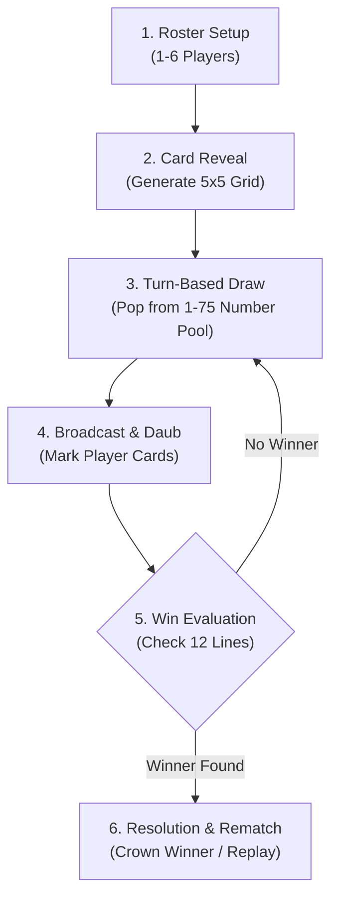
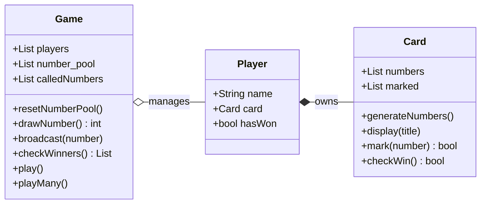

<u>**PROJECT 1 (Intermediate)**</u>

# Bingo Game

Build an intermediate Bingo game: generate randomized cards, run an interactive turn-by-turn number-calling loop, detect line wins across multiple players, and add replay in a clean CLI game. Language-agnostic — code it in **Python**, **C++**, or **Java**.

---

### Curriculum Outline & Learning Roadmap

- **Chapter 1: Introduction**
  - `1.1 Getting Started`
    - `[CONCEPT]` Meet Your Project
    - `[CONCEPT]` What You Will Learn
    - `[CONCEPT]` What You Need
  - `1.2 Starting with Small Steps`
    - `[CONCEPT]` First Steps into Code
    - `[TASK 1]` Create the entry file and print welcome message
    - `[CHECKPOINT]` Milestone Checkpoint: Environment Operational & Greeting Verified
    - `[CONCEPT]` Defining the Rules: Winning Geometry
    - `[TASK 2]` Define the 12 winning lines and FREE center index
    - `[CHECKPOINT]` Milestone Checkpoint: Winning Geometry & Lookup Tables Verified

- **Chapter 2: Rules & Design Plan**
  - `2.1 Understanding the Game`
    - `[CONCEPT]` Game Overview & How the Card Works
    - `[CONCEPT]` How a Win Is Detected
  - `2.2 Planning the Game`
    - `[CONCEPT]` Chronological Game Flow (6 Stages)
    - `[CONCEPT]` Thinking in OOP (Component Responsibility Table)

- **Chapter 3: Building the Card**
  - `3.1 Setting Up the Card`
    - `[CONCEPT]` Card Overview & Grid Coordinates
    - `[CONCEPT]` Think Like a Dev: Flat 1D Array vs 2D Matrix
    - `[TASK 3]` Create the Card class and generate numbers
    - `[CHECKPOINT]` Milestone Checkpoint: Card Generation & FREE Center Verified
    - `[CONCEPT]` Visualizing the 5x5 Grid
    - `[TASK 4]` Display the card
    - `[CHECKPOINT]` Milestone Checkpoint: Formatted Card Grid Verified
  - `3.2 Marking and Checking the Card`
    - `[CONCEPT]` Mutating Card State: Searching and Daubing
    - `[TASK 5]` Implement `mark(number)`
    - `[CHECKPOINT]` Milestone Checkpoint: Single-Pass Cell Daubing Verified
    - `[CONCEPT]` Evaluating Victory Conditions
    - `[TASK 6]` Implement `checkWin()`
    - `[CHECKPOINT]` Milestone Checkpoint: The Card Engine is Complete!

- **Chapter 4: Making the Game Smarter**
  - `4.1 Adding Players`
    - `[CONCEPT]` Who's Playing? Multi-Participant Coordination
    - `[TASK 7]` Create the Player class
    - `[CHECKPOINT]` Milestone Checkpoint: Player Entity & Card Ownership Verified
    - `[CONCEPT]` Gathering the Participants: Input Validation
    - `[TASK 8]` Build a list of players
    - `[CHECKPOINT]` Milestone Checkpoint: Multiplayer Roster Ready!
  - `4.2 Game Framework`
    - `[CONCEPT]` The Caller Engine Architecture
    - `[TASK 9]` Create the Game class skeleton
    - `[CHECKPOINT]` Milestone Checkpoint: Game Controller & Caller Pool Initialized
    - `[CONCEPT]` Calling Numbers from the Shuffled Pool
    - `[TASK 10]` Implement `drawNumber()`
    - `[CHECKPOINT]` Milestone Checkpoint: Caller Engine Assembled!

- **Chapter 5: Playing a Full Match**
  - `5.1 The Call-and-Mark Loop`
    - `[CONCEPT]` Broadcasting Numbers to the Room
    - `[TASK 11]` Broadcast a drawn number to every player
    - `[CHECKPOINT]` Milestone Checkpoint: Multi-Player Broadcast Notification Verified
    - `[CONCEPT]` Checking for Simultaneous Winners
    - `[TASK 12]` Check every player for a win, every round
    - `[CHECKPOINT]` Milestone Checkpoint: Simultaneous Victory Detection Verified
    - `[CONCEPT]` Orchestrating the Interactive Match
    - `[TASK 13]` Write the interactive `play()` loop
    - `[CHECKPOINT]` Milestone Checkpoint: Interactive Match Loop & Paced Turns Verified
    - `[CONCEPT]` Crown the Winner or Announce a Draw
    - `[TASK 14]` Announce the result
    - `[CHECKPOINT]` Milestone Checkpoint: Full Match Experience Achieved!

- **Chapter 6: Adding Replayability & Full Application Execution**
  - `6.1 Rematch & Session Control`
    - `[CONCEPT]` Continuing the Excitement
    - `[TASK 15]` Implement `askReplay()`
    - `[CHECKPOINT]` Milestone Checkpoint: Defensive Replay Prompting Verified
    - `[CONCEPT]` The Multi-Match Loop
    - `[TASK 16]` Implement `playMany()`
    - `[CHECKPOINT]` Milestone Checkpoint: Multi-Match Session Management Verified
    - `[CONCEPT]` Putting It All Together: The Main Entry Point
    - `[TASK 17]` Assemble the `main()` entry point
    - `[CHECKPOINT]` Milestone Checkpoint: Project Complete!

- **Chapter 7: Reflect & Expand**
  - `7.1 What You Have Built` (Feature Summary & Skills Practiced Matrix)
  - `7.2 Extension Ideas`
  - `7.3 Share What You Built! Time to Showcase Your Game!`
- **Appendix: Full Pseudocode Reference**
  - `[REFERENCE]` Complete Tri-Language Algorithmic Logic

---
## Chapter 1: Introduction

### 1.1 Getting Started

**Meet Your Project**

You are about to build a **Bingo** game — the classic multiplayer number-calling game — as an interactive command-line application.

This project strengthens your core programming skills (classes, collections, loops, randomization, and user input) while producing something genuinely fun to play with friends.

Once finished, you will have a fully playable multiplayer Bingo engine where each player interactively draws their own card, takes turns drawing numbers from the caller pool, watches cards update live, and checks for winners.

**What You Will Learn**

You will build a complete Bingo game from start to finish, supporting 1 to 6 players. By the end, you will have a game you can run, play, and share.

You will learn how to:


1. Generate a randomized 5x5 Bingo card following standard column ranges (B-I-N-G-O)

2. Represent and update card state as numbers are marked

3. Prompt players interactively to draw their cards and view their layouts

4. Run a turn-based caller loop where players take turns drawing numbers without repetition

5. Detect a winning line (row, column, or diagonal) across multiple players at once

6. Handle ties and draw scenarios gracefully

7. Restart the game so players can play again without closing the program

You will also practice breaking a real-world system into small, testable steps — exactly how professional projects get built.

**What You Need**

Before you begin, make sure you are comfortable with:


- Printing output and reading user input

- Variables, loops, and conditionals

- Writing functions and methods

- Working with arrays or lists

- Creating classes and objects

- Basic use of your language's random-number utilities

If these feel solid, you are ready to go. Otherwise, review them first — this project assumes you can write basic OOP code already.

---

### 1.2 Starting with Small Steps

**First Steps into Code**

Every software project begins with a single step. Before constructing complex game loops or card-marking logic, we first establish our project entry file and verify that our execution environment is properly wired.

To do this, we create the entry point and print a clean welcome banner to confirm the environment is operational.

#### Task 1 — Create the entry file and print welcome message

Create your project entry file and implement `print_welcome()` (or `printWelcome()`):

Think of laying down the welcome mat at the front door of a game parlor.  
*Goal*: Establish the execution root and prepare the script environment.

<div class="step-card">
  <div class="step-header">
    <span class="step-badge">STEP 1</span>
    <span class="step-title">Entry File Setup</span>
  </div>
  <ul>
    <li>[ ] Create your project file (<code>bingo.py</code>, <code>bingo.cpp</code>, or <code>bingo.java</code>) and import required system modules.</li>
  </ul>
</div>

Think of illuminated signage above the arena announcing the start of the event.  
*Goal*: Provide immediate visual feedback confirming the program is running.

<div class="step-card">
  <div class="step-header">
    <span class="step-badge">STEP 2</span>
    <span class="step-title">Welcome Banner Output</span>
  </div>
  <ul>
    <li>[ ] Print <code>"Welcome to Bingo!"</code> to the terminal.</li>
  </ul>
</div>

**Expected Terminal Interaction & Output:**
```text
Welcome to Bingo!
```

---

### Milestone Checkpoint: Environment Operational & Greeting Verified

Well done! You have laid the initial groundwork for your project:

- [x] **Created Entry File**: `bingo.py`, `bingo.cpp`, or `bingo.java` initialized with required system modules.

- [x] **Welcome Displayed**: Verified console greeting outputs `"Welcome to Bingo!"` cleanly.

**Driver Verification Test**:
Run your entry file directly in the terminal to verify the greeting banner appears cleanly before continuing.

---

**Defining the Rules: Winning Geometry**

In standard 75-ball Bingo, a card has 25 cells arranged in a 5x5 grid. A player wins by marking a complete line of 5 cells in any direction: 5 horizontal rows, 5 vertical columns, or 2 corner-to-corner diagonals.

Rather than writing repetitive nested loops throughout our code to check each direction, professional developers pre-compute and store these winning coordinate sets in an immutable lookup table.

Here is the exact coordinate map of our 25-cell card, indexed from `0` to `24`:

| Col B (1–15) | Col I (16–30) | Col N (31–45) | Col G (46–60) | Col O (61–75) |
|:---:|:---:|:---:|:---:|:---:|
| `0` | `1` | `2` | `3` | `4` |
| `5` | `6` | `7` | `8` | `9` |
| `10` | `11` | **FREE (`12`)** | `13` | `14` |
| `15` | `16` | `17` | `18` | `19` |
| `20` | `21` | `22` | `23` | `24` |

Every winning 5-in-a-row combination maps directly to a set of 5 indices across this grid: the 5 horizontal rows, the 5 vertical columns, and the 2 corner-to-corner diagonals. Center cell `12` sits dead-center and is always pre-marked as FREE.

#### Task 2 — Define the 12 winning lines and FREE center index

Declare the constant lookup structures representing the center space and winning patterns on a 5x5 Bingo card:

Think of the bullseye on a dartboard: an immutable anchor point that never shifts.  
*Goal*: Provide a fixed constant identifying the center cell coordinate.

<div class="step-card">
  <div class="step-header">
    <span class="step-badge">STEP 1</span>
    <span class="step-title">Center Index Constant</span>
  </div>
  <ul>
    <li>[ ] Declare integer constant <code>FREE_INDEX = 12</code> representing the center cell of the 5x5 grid.</li>
  </ul>
</div>

Think of a referee consult table detailing all 12 valid straight lines across the grid.  
*Goal*: Pre-compute all winning 5-cell coordinate combinations so victory checks require zero redundant calculations.

<div class="step-card">
  <div class="step-header">
    <span class="step-badge">STEP 2</span>
    <span class="step-title">Winning Lines Matrix</span>
  </div>
  <ul>
    <li>[ ] Declare constant collection <code>WIN_LINES</code> containing all 12 distinct 5-cell line index groupings:
      <ul>
        <li>5 Horizontal Rows:
          <ul>
            <li><code>(0, 1, 2, 3, 4)</code></li>
            <li><code>(5, 6, 7, 8, 9)</code></li>
            <li><code>(10, 11, 12, 13, 14)</code></li>
            <li><code>(15, 16, 17, 18, 19)</code></li>
            <li><code>(20, 21, 22, 23, 24)</code></li>
          </ul>
        </li>
        <li>5 Vertical Columns:
          <ul>
            <li><code>(0, 5, 10, 15, 20)</code></li>
            <li><code>(1, 6, 11, 16, 21)</code></li>
            <li><code>(2, 7, 12, 17, 22)</code></li>
            <li><code>(3, 8, 13, 18, 23)</code></li>
            <li><code>(4, 9, 14, 19, 24)</code></li>
          </ul>
        </li>
        <li>2 Corner Diagonals:
          <ul>
            <li><code>(0, 6, 12, 18, 24)</code></li>
            <li><code>(4, 8, 12, 16, 20)</code></li>
          </ul>
        </li>
      </ul>
    </li>
  </ul>
</div>

---

### Milestone Checkpoint: Winning Geometry & Lookup Tables Verified

Excellent! Your mathematical model of the 5x5 board is defined and immutable:

- [x] **Center Space Constant**: `FREE_INDEX = 12` designates the center cell.

- [x] **Winning Lines Matrix Initialized**: `WIN_LINES` encapsulates all 12 distinct 5-cell line index groupings (5 rows, 5 columns, 2 diagonals).

These early steps give us the mathematical foundation required to generate cards and evaluate lines with ease.

**Driver Verification Test**:
Verify `FREE_INDEX` and the length of `WIN_LINES` (should equal 12) from your entry file to confirm correct setup.

---

## Chapter 2: Rules & Design Plan

### 2.1 Understanding the Game

**Game Overview**

Before writing the card logic, let us review how a game of Bingo operates from start to finish.

Standard **75-ball Bingo** is played with players holding unique 5x5 cards. A caller pool contains numbers from 1 to 75, drawn one at a time with no repeats. Every player inspects their card and marks the number if it appears.

The complete interactive cycle looks like this:


1. Each player is prompted to press Enter to draw and inspect their generated 5x5 card.

2. Players take turns pressing Enter to draw the next number from the pool.

3. The drawn number is announced.

4. Every player's card is checked, and matching numbers are marked.

5. The game checks whether any player has completed a winning line.

6. If nobody has won yet, the next player draws.

7. Once a winner is found (or all numbers are exhausted), final cards are shown and players can choose to play again.

**How the Card Works**

A Bingo card is a 5x5 grid. Each column holds numbers strictly from a fixed range:

| Column | Range | Description |
|---|---|---|
| **B** | 1-15 | Leftmost column |
| **I** | 16-30 | Second column |
| **N** | 31-45 | Middle column (center cell is FREE) |
| **G** | 46-60 | Fourth column |
| **O** | 61-75 | Rightmost column |

The center cell (row 3, column N, index 12) is a **FREE** space — it starts already marked before any numbers are called.

**How a Win Is Detected**

A player wins the moment **any full line** — a row, a column, or one of the two diagonals — is entirely marked. On a 5x5 grid there are exactly **12 winning lines**: 5 rows, 5 columns, and 2 diagonals.

Because every player shares the same sequence of called numbers, more than one player can complete a line on the very same draw — so our design must support **shared wins / ties**, not just a single winner.

---

### 2.2 Planning the Game

**Game Flow**

Chronologically, one full match flows through these six stages:



1. **Roster Setup**: Ask how many players are joining (1 to 6) and collect each player's name.

2. **Card Reveal**: For each player, prompt them with `"<Name>, press Enter to draw your card:"` and print their card.

3. **Turn-Based Drawing**: In a loop, prompt the active player with `"<Name>, press Enter to draw the next number:"`.

4. **Broadcast & Daub**: Draw a unique number from the pool, announce it, and mark the number on every card that contains it.

5. **Win Evaluation**: Check every player's card for a completed line. If no one has won, advance to the next turn and repeat.

6. **Resolution & Rematch**: If one or more players have won, show all final cards, announce the winners, and ask if they want to play again.

**Thinking in OOP**

Splitting the system into objects keeps each responsibility isolated and easy to test:



| Component | Responsibility |
|---|---|
| **Card** | Holds 25 cells (numbers + FREE), tracks which are marked, checks for winning lines, and displays the grid. |
| **Player** | Stores the player name, owns a Card instance, and tracks win status. |
| **Game** | Stores players, manages the 1-75 number pool, coordinates interactive card draws, drives the turn loop, and manages replay. |

---

## Chapter 3: Building the Card

### 3.1 Setting Up the Card

**Card Overview & Grid Coordinates**

Everything in Bingo happens on the card. It is a 5x5 grid of 25 cells total, indexed 0 to 24 (left-to-right, top-to-bottom).

Cell **12** (row 2, column 2 in zero-indexing) is the exact center FREE space.

**Think Like a Dev: Flat 1D Array vs 2D Matrix**

While a grid looks like a 2D table, storing it as a flat 1D array of 25 items offers significant advantages in CLI games:

- Sequential iteration and searching for a called number requires only a single loop rather than nested loops.

- Coordinate transformation is mathematically simple: cell at row `r` and column `c` is located at `r * 5 + c`.

- Win line definitions can be expressed as simple lists of 5 integers.

#### Task 3 — Create the Card class and generate numbers

Create the `Card` class:

Think of a fresh blank lottery ticket waiting to be stamped with numbers.  
*Goal*: Initialize state containers for the 25 cell values and their daub status flags.

<div class="step-card">
  <div class="step-header">
    <span class="step-badge">STEP 1</span>
    <span class="step-title">State Initialization</span>
  </div>
  <ul>
    <li>[ ] In the constructor, initialize <code>numbers</code> (25-element collection) and <code>marked</code> (25 boolean flags, with index 12 set to <code>true</code> and all other 24 set to <code>false</code>).</li>
  </ul>
</div>

Think of 5 separate bingo hopper cages, each rolling numbers within its designated column range.  
*Goal*: Pick 5 unique random integers per column adhering to standard B-I-N-G-O boundaries.

<div class="step-card">
  <div class="step-header">
    <span class="step-badge">STEP 2</span>
    <span class="step-title">Column-Wise Number Generation</span>
  </div>
  <ul>
    <li>[ ] Iterate through the 5 columns (B: 1-15, I: 16-30, N: 31-45, G: 46-60, O: 61-75) and select 5 unique random numbers for each column.</li>
  </ul>
</div>

Think of placing numbered tiles into a 5x5 physical board and locking the center tile as a free space.  
*Goal*: Map column values into a 1D index using <code>row * 5 + col</code> and set the center cell to FREE.

<div class="step-card">
  <div class="step-header">
    <span class="step-badge">STEP 3</span>
    <span class="step-title">1D Grid Coordinate Mapping & Center FREE Placement</span>
  </div>
  <ul>
    <li>[ ] Store generated numbers into the 25-element grid by column position (<code>row * 5 + col</code>) and assign index 12 to <code>"FREE"</code> (or <code>-1</code>).</li>
  </ul>
</div>

---

### Milestone Checkpoint: Card Generation & FREE Center Verified

Awesome job! You have established the core `Card` entity:

- [x] **Card Class Initialized**: Flat 25-element collection structured with integer values.

- [x] **B-I-N-G-O Column Ranges Enforced**: Numbers sampled strictly from columns B (1-15), I (16-30), N (31-45), G (46-60), and O (61-75) without duplicate values per column.

- [x] **FREE Center Space Configured**: Index 12 is initialized and marked by default.

**Driver Verification Test**:
Instantiate a new `Card` and verify that index 12 is marked and the remaining 24 cells contain distinct column-bounded numbers.

---

**Visualizing the 5x5 Grid**

A data structure is only as good as its visualization. In a CLI game, players need to clearly see their numbers and immediately spot which cells have been marked.

We will format the card into 5 centered columns separated by vertical pipes `|` and dashed row dividers. Whenever a cell is marked, we will enclose it in asterisks (for example, `*23*` or `*FREE*`).

#### Task 4 — Display the card

Add `display(title)` to `Card` to print the 5x5 grid with clean column alignment:

Think of framing a certificate with an official header before drawing the table borders.  
*Goal*: Display the card title and iterate through the 5 horizontal rows.

<div class="step-card">
  <div class="step-header">
    <span class="step-badge">STEP 1</span>
    <span class="step-title">Header Title & Row Iteration</span>
  </div>
  <ul>
    <li>[ ] Accept title parameter (defaulting to <code>"Your Card"</code>), print it with a leading newline, and loop through row indices 0 to 4.</li>
  </ul>
</div>

Think of stamping an ink circle around marked numbers on paper while leaving unmarked numbers plain.  
*Goal*: Enclose marked numbers in asterisks (e.g. <code>*12*</code> or <code>*FREE*</code>) and center all text within a 6-character width.

<div class="step-card">
  <div class="step-header">
    <span class="step-badge">STEP 2</span>
    <span class="step-title">Cell Formatting & Daub Indicator</span>
  </div>
  <ul>
    <li>[ ] Format marked values with surrounding asterisks (<code>*value*</code>) and center every cell within a 6-character width.</li>
  </ul>
</div>

Think of drawing neat grid lines so columns line up like a clean ledger spreadsheet.  
*Goal*: Separate columns with vertical pipe characters and rows with dashed divider lines.

<div class="step-card">
  <div class="step-header">
    <span class="step-badge">STEP 3</span>
    <span class="step-title">Pipe Separators & Horizontal Dividers</span>
  </div>
  <ul>
    <li>[ ] Join row cells with vertical pipes (<code>|</code>) and print horizontal divider <code>----------------------------------</code> between rows.</li>
  </ul>
</div>

**Expected Terminal Interaction & Output:**
```text
Your Card
  12  |  24  |  41  |  57  |  71  
----------------------------------
  3   |  16  |  34  |  48  |  63  
----------------------------------
  8   |  19  |*FREE*|  52  |  68  
----------------------------------
  5   |  29  |  38  |  50  |  75  
----------------------------------
  14  |  22  |  44  |  59  |  69  
```

---

### Milestone Checkpoint: Formatted Card Grid Verified

Fantastic! The visual representation of the Bingo card is now complete:

- [x] **Cell Rendering Logic Complete**: Numbers formatted with clean padding, marked numbers highlighted with asterisks, and center space displayed as `*FREE*`.

- [x] **5x5 Matrix Printed**: All 25 cells rendered across 5 formatted rows with clean pipe dividers.

**Driver Verification Test**:
Call `card.display("Your Card")` on a freshly generated card and verify it prints as a neatly aligned 5x5 grid.

---

### 3.2 Marking and Checking the Card

**Mutating Card State: Searching and Daubing**

When the caller calls out a number, every card in play must check if that number exists on its grid. If present and not yet daubed, the card marks the cell and notifies the engine.

#### Task 5 — Implement `mark(number)`

Add `mark(number)` to the `Card` class:

Think of scanning your eyes across all 25 squares looking for the called number.  
*Goal*: Search through the flat card array to locate any cell matching the target value.

<div class="step-card">
  <div class="step-header">
    <span class="step-badge">STEP 1</span>
    <span class="step-title">Linear Search for Target Value</span>
  </div>
  <ul>
    <li>[ ] Iterate through indices 0 to 24 comparing each cell value with <code>number</code>.</li>
  </ul>
</div>

Think of pressing your ink stamper onto the square and signaling that a daub was made.  
*Goal*: Mutate the marked flag to true and return true on a new daub, or false if not found.

<div class="step-card">
  <div class="step-header">
    <span class="step-badge">STEP 2</span>
    <span class="step-title">Daub & Confirmation Return</span>
  </div>
  <ul>
    <li>[ ] If a matching cell is found and currently unmarked, set <code>marked[i] = true</code> and return <code>true</code>. If not found or already marked, return <code>false</code>.</li>
  </ul>
</div>

---

### Milestone Checkpoint: Single-Pass Cell Daubing Verified

Great work! Dynamic state mutation for numbers is fully operational:

- [x] **Search & Daub Implemented**: Linear scan identifies if a called number is present on the card.

- [x] **Marking State Transition**: Found number cell is marked in-place.

- [x] **Early Return Optimization**: Search stops immediately upon finding the number, returning `True` (or `true`) if found, `False` (or `false`) if absent.

**Driver Verification Test**:
Call `card.mark(number)` on a known card number and verify it marks the cell and returns true.

---

**Evaluating Victory Conditions**

In Bingo, a player does not need to fill the entire card to win. Completing any one of the 12 pre-defined lines constitutes a win.

Because we pre-computed `WIN_LINES` in Task 2, checking for victory requires iterating over our list of 12 lines and checking if all 5 cell indices in any line have `marked[i] == true`.

#### Task 6 — Implement `checkWin()`

Add `check_win()` (or `checkWin()`) to `Card`:

Think of a judge laying down transparent stencils over the card to inspect each possible line.  
*Goal*: Test each of the 12 pre-computed winning combinations against the card state.

<div class="step-card">
  <div class="step-header">
    <span class="step-badge">STEP 1</span>
    <span class="step-title">Iterate Winning Line Definitions</span>
  </div>
  <ul>
    <li>[ ] Iterate over each 5-index tuple in <code>WIN_LINES</code>.</li>
  </ul>
</div>

Think of a string of holiday lights: if even one bulb is unlit, the line is incomplete.  
*Goal*: Confirm that all 5 cells in a line are marked; exit immediately on the first completed line.

<div class="step-card">
  <div class="step-header">
    <span class="step-badge">STEP 2</span>
    <span class="step-title">Line Verification & Early Exit</span>
  </div>
  <ul>
    <li>[ ] If all 5 indices in any line have <code>marked == true</code>, immediately return <code>true</code>. If no line is complete after checking all 12, return <code>false</code>.</li>
  </ul>
</div>

---

### Milestone Checkpoint: The Card Engine is Complete!

You have successfully built the complete core data model for Bingo:

- [x] **Column-Balanced Generation**: 5x5 random layout obeying standard B-I-N-G-O ranges.

- [x] **FREE Center Space**: Index 12 initialized and marked by default.

- [x] **Formatted Display**: Clean terminal grid with `*asterisks*` around daubed numbers.

- [x] **State Mutation**: Efficient single-pass marking via `mark()`.

- [x] **Victory Evaluation**: 12-line geometric win detection via `checkWin()`.

**Driver Verification Test**:
Instantiate a card, mark all 5 numbers along row 0, and verify `card.check_win()` returns true.

With the foundational `Card` object fully built and tested, we can now add real players and assemble the multiplayer game engine.

---

## Chapter 4: Making the Game Smarter

### 4.1 Adding Players

**Who's Playing? Multi-Participant Coordination**

A game without players is just a simulation. In our Bingo game, 1 to 6 people can sit around the terminal together.

Each participant will have:

- A personalized name (e.g. Alice, Bob) so prompts feel human.

- Their own unique `Card` instance.

- A status flag tracking whether they have completed a winning line in the current match.

#### Task 7 — Create the Player class

Create the `Player` class:

Think of a badge printer at a tournament registration desk giving each participant a clean name tag.  
*Goal*: Sanitize user input by trimming whitespace and providing a reliable default fallback if left blank.

<div class="step-card">
  <div class="step-header">
    <span class="step-badge">STEP 1</span>
    <span class="step-title">Name Sanitization & Default Assignment</span>
  </div>
  <ul>
    <li>[ ] In the constructor, accept <code>raw_name</code>, strip leading/trailing whitespace, and default to <code>"Player"</code> if blank.</li>
  </ul>
</div>

Think of handing each player their personal game card and resetting their score to zero.  
*Goal*: Assign an independent Card instance to the player and track their victory status.

<div class="step-card">
  <div class="step-header">
    <span class="step-badge">STEP 2</span>
    <span class="step-title">Card Ownership & Victory Flag</span>
  </div>
  <ul>
    <li>[ ] Instantiate a new <code>Card</code> object for <code>self.card</code> and initialize boolean <code>has_won = false</code>.</li>
  </ul>
</div>

---

### Milestone Checkpoint: Player Entity & Card Ownership Verified

Well done! You have created the primary participant entity for the game:

- [x] **Player Class Defined**: Encapsulates `name` (string) and an owned `card` (`Card` instance).

- [x] **Independent Card Generation**: Each instantiated `Player` automatically receives its own randomized 5x5 card upon creation.

**Driver Verification Test**:
Instantiate two players and confirm that each player possesses an independent card with unique numbers.

---

**Gathering the Participants: Input Validation**

Now we need a robust way to set up the game roster. What if someone enters `"abc"`, `0`, or `10` when asked for the player count? Our system must guard against invalid inputs and politely reprompt until valid data is provided.

#### Task 8 — Build a list of players

Implement `build_players()` (or `buildPlayers()`):

Think of a restaurant host checking party size and ensuring it fits available seating (1-6).  
*Goal*: Interactively capture the participant count and defensively reprompt until valid.

<div class="step-card">
  <div class="step-header">
    <span class="step-badge">STEP 1</span>
    <span class="step-title">Player Count Prompt & Defensive Validation</span>
  </div>
  <ul>
    <li>[ ] Run an indefinite loop prompting <code>"How many players (1-6)? "</code>. If input is not an integer between 1 and 6, print <code>"Please enter a number from 1 to 6."</code> and repeat.</li>
  </ul>
</div>

Think of calling each participant to the registration desk one by one to register their names.  
*Goal*: Collect each player name, instantiate their Player object, and return the populated roster.

<div class="step-card">
  <div class="step-header">
    <span class="step-badge">STEP 2</span>
    <span class="step-title">Roster Instantiation Loop</span>
  </div>
  <ul>
    <li>[ ] Loop from 1 to <code>num_players</code>, prompt <code>"Enter name for Player &lt;N&gt;: "</code>, instantiate <code>Player(name)</code>, and return the complete roster list.</li>
  </ul>
</div>

**Expected Terminal Interaction & Output:**
```text
How many players (1-6)? 9
Please enter a number from 1 to 6.
How many players (1-6)? 2
Enter name for Player 1: Alice
Enter name for Player 2: Bob
```

---

### Milestone Checkpoint: Multiplayer Roster Ready!

You have established personal player tracking and validation:

- [x] **Player Entity**: Defined `Player` class with name and personal `Card` ownership.

- [x] **Fallback Handling**: Graceful default names for empty or whitespace entries.

- [x] **Roster Validation**: Verified player counts strictly between 1 and 6.

**Driver Verification Test**:
Run `build_players()` with test entries (including invalid inputs like 0 or 7) to verify validation and default fallback naming.

Next, we create the overarching `Game` controller that manages the caller pool and coordinates the matches.

---

### 4.2 Game Framework

**The Caller Engine Architecture**

In Bingo, the caller holds a container with 75 balls numbered 1 through 75. Each draw must be random, and once a ball is drawn, it cannot be drawn again in the same match.

Instead of generating a random number between 1 and 75 on every turn and checking whether it was already called (which gets slower and slower as the pool empties), we generate the numbers 1 to 75 once, shuffle the collection, and simply `pop` numbers off the end in O(1) constant time.

#### Task 9 — Create the Game class skeleton

Create the `Game` class:

Think of the tournament master taking custody of the official player roster before opening the room.  
*Goal*: Bind the roster to the game instance and prepare tracking structures.

<div class="step-card">
  <div class="step-header">
    <span class="step-badge">STEP 1</span>
    <span class="step-title">State Binding</span>
  </div>
  <ul>
    <li>[ ] Accept and store <code>players</code>, initialize <code>number_pool = []</code>, and initialize <code>called_numbers = []</code>.</li>
  </ul>
</div>

Think of pouring 75 numbered wooden balls into a bingo hopper cage and giving it a vigorous spin.  
*Goal*: Generate numbers 1 to 75, shuffle them uniformly, and reset the call history.

<div class="step-card">
  <div class="step-header">
    <span class="step-badge">STEP 2</span>
    <span class="step-title">Number Pool Generation & Shuffling</span>
  </div>
  <ul>
    <li>[ ] Implement <code>reset_number_pool()</code> (or <code>resetNumberPool()</code>) to populate <code>number_pool</code> with 1 through 75, shuffle randomly, clear <code>called_numbers</code>, and call it inside the constructor.</li>
  </ul>
</div>

---

### Milestone Checkpoint: Game Controller & Caller Pool Initialized

Excellent! The central game engine coordinator is operational:

- [x] **Game Class Created**: Stores `players` roster and generates the 75-ball caller pool (integers 1 through 75).

- [x] **Roster Assigned**: Ingests the validated list of participants.

- [x] **Deterministic Caller Pool**: Pool contains exactly 75 unique numbers without duplicates or missing values.

**Driver Verification Test**:
Instantiate `Game(players)` and verify that the caller number pool (`game.number_pool`) contains all 75 numbers.

---

**Calling Numbers from the Shuffled Pool**

Every turn requires removing the next number from the pool, storing it in the match history, and returning it so cards can be marked.

#### Task 10 — Implement `drawNumber()`

Add `draw_number()` (or `drawNumber()`) to `Game`:

Think of reaching your hand into the bingo cage and pulling out the next ball.  
*Goal*: Extract the next number from the pool in O(1) constant time without replacement.

<div class="step-card">
  <div class="step-header">
    <span class="step-badge">STEP 1</span>
    <span class="step-title">Draw from Pool</span>
  </div>
  <ul>
    <li>[ ] Remove and retrieve the last number from <code>number_pool</code> using <code>pop()</code>.</li>
  </ul>
</div>

Think of placing the drawn ball into the caller master board tray for permanent match logging.  
*Goal*: Append the number to history tracking and return the integer value.

<div class="step-card">
  <div class="step-header">
    <span class="step-badge">STEP 2</span>
    <span class="step-title">History Logging & Return</span>
  </div>
  <ul>
    <li>[ ] Append the drawn integer to <code>called_numbers</code> and return it.</li>
  </ul>
</div>

---

### Milestone Checkpoint: Caller Engine Assembled!

The foundational mechanics of the caller are now operational:

- [x] **Randomized Pool**: Initialized the 75-ball randomized caller pool.

- [x] **Constant-Time Drawing**: Implemented O(1) draw-without-replacement via list popping.

- [x] **Audit History**: Tracked called numbers in a sequential list for match reviews.

**Driver Verification Test**:
Call `draw_number()` 5 times and confirm that each drawn number is appended to `called_numbers` and removed from `number_pool`.

Now, we will connect the cards, players, and caller together into a live, turn-based CLI match loop!

---

## Chapter 5: Playing a Full Match

### 5.1 The Call-and-Mark Loop

**Broadcasting Numbers to the Room**

In an actual Bingo hall, when a number is called out, every player checks their card. If they have the number, they daub it.

In code, the `Game` broadcasts the drawn number to every `Player` in the roster. If a player's card successfully marks that number, the program prints a notification.

#### Task 11 — Broadcast a drawn number to every player

Implement `broadcast(number)` inside `Game`:

Think of announcing the drawn number over the hall loudspeaker so everyone checks their cards.  
*Goal*: Deliver the drawn number to every player in the roster.

<div class="step-card">
  <div class="step-header">
    <span class="step-badge">STEP 1</span>
    <span class="step-title">Roster Broadcast Loop</span>
  </div>
  <ul>
    <li>[ ] Loop through <code>self.players</code> and call <code>player.card.mark(number)</code> on each card.</li>
  </ul>
</div>

Think of spotting a player raising their hand to indicate they found the number on their card.  
*Goal*: Print an indented confirmation message whenever a card marks the called number.

<div class="step-card">
  <div class="step-header">
    <span class="step-badge">STEP 2</span>
    <span class="step-title">Console Daub Notification</span>
  </div>
  <ul>
    <li>[ ] If <code>mark()</code> returns <code>true</code>, print <code>"  -> marked on &lt;PlayerName&gt;'s card"</code>.</li>
  </ul>
</div>

**Expected Terminal Interaction & Output:**
```text
  -> marked on Alice's card
```

---

### Milestone Checkpoint: Multi-Player Broadcast Notification Verified

Great work! The broadcasting mechanism updates the entire room simultaneously:

- [x] **Multi-Player Iteration**: Loops through every participant in `self.players`.

- [x] **Card Daubing Invocation**: Calls `player.card.mark(drawn_number)` for each participant.

- [x] **Visual Hit Feedback**: Displays a personalized notification whenever a player marks a number on their card.

**Driver Verification Test**:
Draw a number known to be on a player's card, call `broadcast(number)`, and verify the notification prints cleanly.

---

**Checking for Simultaneous Winners**

A common bug in beginner Bingo games is stopping the evaluation loop immediately after finding the first winner. Because all players mark the same called number on the same turn, multiple players can complete a winning line at the exact same instant.

To support fair multiplayer rules, we must check **every** player on each draw and accumulate all winners in a list.

#### Task 12 — Check every player for a win, every round

Implement `check_winners()` (or `checkWinners()`) inside `Game`:

Think of a referee surveying the entire room after every ball to see who completed a full line.  
*Goal*: Inspect every card in play to detect all single or simultaneous winning hands.

<div class="step-card">
  <div class="step-header">
    <span class="step-badge">STEP 1</span>
    <span class="step-title">Winner Collection Scan</span>
  </div>
  <ul>
    <li>[ ] Initialize empty <code>winners</code> list, iterate through <code>players</code>, and test <code>player.card.check_win()</code>.</li>
  </ul>
</div>

Think of escorting all qualifying winners up to the podium together.  
*Goal*: Update player state flags and return the list of all participants who completed a line.

<div class="step-card">
  <div class="step-header">
    <span class="step-badge">STEP 2</span>
    <span class="step-title">Flag State & Winner Accumulation</span>
  </div>
  <ul>
    <li>[ ] If a player card wins, set <code>player.has_won = true</code>, append the player to <code>winners</code>, and return the list after checking all players.</li>
  </ul>
</div>

---

### Milestone Checkpoint: Simultaneous Victory Detection Verified

Outstanding! Multi-player win evaluation is rock solid:

- [x] **All-Player Scanning**: Iterates across all players in the roster and tests `player.card.check_win()`.

- [x] **Multi-Winner List Accumulation**: Collects all winners in a list rather than stopping at the first winner, properly handling simultaneous ties.

- [x] **Clean Return Contract**: Returns an empty collection when no player has won, or a list containing one or more winning players.

**Driver Verification Test**:
Mark a winning line on a test player's card and verify `check_winners()` detects and returns the winner.

---

**Orchestrating the Interactive Match**

Rather than executing an instant simulation that dumps 100 lines of text in a fraction of a second, an engaging game must be interactive:

- Before the match starts, players take turns pressing Enter to draw and inspect their generated cards.

- During the match, players take turns pressing Enter to draw the next ball from the caller pool.

#### Task 13 — Write the interactive `play()` loop

Implement `play()` in `Game` to coordinate a complete interactive match:

Think of dealing out fresh cards and having each player inspect their grid before the caller begins.  
*Goal*: Reset the pool, generate new cards for each player, and prompt each person to view their board.

<div class="step-card">
  <div class="step-header">
    <span class="step-badge">STEP 1</span>
    <span class="step-title">Match Setup & Card Reveal</span>
  </div>
  <ul>
    <li>[ ] Call <code>reset_number_pool()</code> (or <code>resetNumberPool()</code>), loop through players resetting <code>has_won = false</code>, generate fresh <code>Card()</code>, prompt <code>"&lt;Player&gt;, press Enter to draw your card:"</code>, and display their card.</li>
  </ul>
</div>

Think of blowing the starting whistle to signal the start of the competition.  
*Goal*: Announce match start and initialize tracking variables for turns and winners.

<div class="step-card">
  <div class="step-header">
    <span class="step-badge">STEP 2</span>
    <span class="step-title">Match Start Indicator & Status Tracking</span>
  </div>
  <ul>
    <li>[ ] Print <code>"
===== MATCH STARTED =====
"</code>, initialize empty <code>winners</code> list, and set <code>turn = 0</code>.</li>
  </ul>
</div>

Think of players taking turns stepping up to the caller cage to draw the next ball.  
*Goal*: Run an interactive turn-by-turn loop that pauses for user input before each draw.

<div class="step-card">
  <div class="step-header">
    <span class="step-badge">STEP 3</span>
    <span class="step-title">Turn-Based Draw Loop & Interactive Pacing</span>
  </div>
  <ul>
    <li>[ ] While <code>number_pool</code> has numbers and <code>winners</code> is empty, select active player using <code>turn % total_players</code>, prompt <code>"&lt;Player&gt;, press Enter to draw the next number:"</code>, call <code>draw_number()</code>, and print the drawn number with draw count.</li>
  </ul>
</div>

Think of calling out the number, giving everyone time to mark their cards, and checking for BINGO.  
*Goal*: Broadcast the number across cards, evaluate win conditions, and increment the turn counter.

<div class="step-card">
  <div class="step-header">
    <span class="step-badge">STEP 4</span>
    <span class="step-title">Broadcast, Win Check & Turn Increment</span>
  </div>
  <ul>
    <li>[ ] Call <code>broadcast(number)</code>, call <code>check_winners()</code>, and increment <code>turn</code> by 1.</li>
  </ul>
</div>

Think of ringing the victory gong and transitioning to the awards ceremony.  
*Goal*: Exit the turn loop and delegate to the result announcement.

<div class="step-card">
  <div class="step-header">
    <span class="step-badge">STEP 5</span>
    <span class="step-title">Match Conclusion Dispatch</span>
  </div>
  <ul>
    <li>[ ] Pass the <code>winners</code> collection into <code>announce_result(winners)</code>.</li>
  </ul>
</div>

**Expected Terminal Interaction & Output:**
```text
Alice, press Enter to draw your card:

Alice's Card
  12  |  24  |  41  |  57  |  71  
----------------------------------
  3   |  16  |  34  |  48  |  63  
----------------------------------
  8   |  19  |*FREE*|  52  |  68  
----------------------------------
  5   |  29  |  38  |  50  |  75  
----------------------------------
  14  |  22  |  44  |  59  |  69  

Bob, press Enter to draw your card:

Bob's Card
  7   |  21  |  39  |  54  |  65  
----------------------------------
  2   |  18  |  33  |  49  |  70  
----------------------------------
  11  |  25  |*FREE*|  51  |  73  
----------------------------------
  4   |  27  |  42  |  58  |  62  
----------------------------------
  15  |  30  |  36  |  47  |  67  

===== MATCH STARTED =====

Alice, press Enter to draw the next number:

Number called: 42  (draw #1)
  -> marked on Bob's card

Bob, press Enter to draw the next number:

Number called: 12  (draw #2)
  -> marked on Alice's card
```

---

### Milestone Checkpoint: Interactive Match Loop & Paced Turns Verified

Spectacular! The turn-based interactive game loop is fully functional:

- [x] **Pre-Game Card Reveal**: Iterates through each player, prompting them with Enter to generate and inspect their card before drawing begins.

- [x] **Turn-by-Turn Interaction**: Rotates player turns with human-paced execution.

- [x] **Broadcast & Victory Evaluation**: Draws ball, broadcasts to all cards, and checks for winners at every turn.

- [x] **Graceful Exhaustion Handling**: Stops the loop if all 75 balls are drawn without a winner.

**Driver Verification Test**:
Run a short match and confirm the prompt pacing and ball calling work smoothly without crashing or skipping.

---

**Crown the Winner or Announce a Draw**

When the loop terminates, we must reveal each player's final card state so everyone can see the completed line, announce the names of the winners, and report how many numbers were called.

#### Task 14 — Announce the result

Implement `announce_result(winners)` (or `announceResult(winners)`) inside `Game`:

Think of the head judge checking whether the contest concluded with a victor or a draw.  
*Goal*: Branch logic between a win celebration and an exhausted-pool notification.

<div class="step-card">
  <div class="step-header">
    <span class="step-badge">STEP 1</span>
    <span class="step-title">Branch on Win vs. Draw</span>
  </div>
  <ul>
    <li>[ ] Check if <code>winners</code> collection is non-empty.</li>
  </ul>
</div>

Think of projecting the winning cards onto the big stadium screen for the whole room to inspect.  
*Goal*: Display final card boards for all players, join winner names, and celebrate the victory.

<div class="step-card">
  <div class="step-header">
    <span class="step-badge">STEP 2</span>
    <span class="step-title">Winner Showcase & Final Card Grid Display</span>
  </div>
  <ul>
    <li>[ ] If winners exist, print each player's final card using <code>player.card.display("&lt;Name&gt;'s Final Card")</code>, join winner names with commas, and print <code>"BINGO! &lt;names&gt; won after &lt;N&gt; numbers called!"</code>.</li>
  </ul>
</div>

Think of reaching into an empty cage with zero remaining balls.  
*Goal*: Handle the rare edge case where all 75 numbers were called without anyone completing a line.

<div class="step-card">
  <div class="step-header">
    <span class="step-badge">STEP 3</span>
    <span class="step-title">Exhausted Pool Draw Message</span>
  </div>
  <ul>
    <li>[ ] If no winners exist, print <code>"All 75 numbers were called with no winner. It's a draw!"</code>.</li>
  </ul>
</div>

**Expected Terminal Interaction & Output:**
```text
Alice's Final Card
 *12* | *24* | *41* | *57* | *71* 
----------------------------------
  3   |  16  |  34  |  48  |  63  
----------------------------------
  8   |  19  |*FREE*|  52  |  68  
----------------------------------
  5   |  29  |  38  |  50  |  75  
----------------------------------
  14  |  22  |  44  |  59  |  69  

Bob's Final Card
  7   |  21  |  39  |  54  |  65  
----------------------------------
  2   |  18  |  33  |  49  |  70  
----------------------------------
  11  |  25  |*FREE*|  51  |  73  
----------------------------------
  4   |  27  | *42* |  58  |  62  
----------------------------------
  15  |  30  |  36  |  47  |  67  

BINGO! Alice won after 24 numbers called!
```

---

### Milestone Checkpoint: Full Match Experience Achieved!

You have completed the core interactive gameplay engine:

- [x] **Interactive Card Reveals**: Turn-by-turn card generation prompts.

- [x] **Turn-Based Draws**: Paced caller prompts with draw count tracking.

- [x] **Broadcast Daubing**: Automated marks on matching player cards.

- [x] **Tie Support**: Full multi-winner tie resolution.

- [x] **Outcome Announcements**: Final card state reveals and victor celebrations.

**Driver Verification Test**:
Simulate a match conclusion and confirm that each player's final card is displayed and the winner banner prints accurately.

Now, we add the final polish: session rematch control so players can play multiple games in a single sitting!

---

## Chapter 6: Adding Replayability & Full Application Execution

### 6.1 Rematch & Session Control

**Continuing the Excitement**

After an intense round of Bingo, players will often want to play another game without having to restart the terminal program.

We will add an interactive replay prompt that validates yes/no responses, and wrap our game execution in a session loop.

#### Task 15 — Implement `askReplay()`

Implement helper method `ask_replay()` (or `askReplay()`) on `Game`:

Think of an arcade video game cabinet asking "Continue? Y/N" on screen.  
*Goal*: Interactively prompt the user to decide whether to play another game.

<div class="step-card">
  <div class="step-header">
    <span class="step-badge">STEP 1</span>
    <span class="step-title">Interactive Loop & Choice Prompt</span>
  </div>
  <ul>
    <li>[ ] In an indefinite loop, prompt the user with <code>"Play again? (y/n): "</code>.</li>
  </ul>
</div>

Think of accepting both thumbs up ('y') and thumbs down ('n') while rejecting shrugs.  
*Goal*: Trim, lowercase, and validate input, reprompting defensively if malformed.

<div class="step-card">
  <div class="step-header">
    <span class="step-badge">STEP 2</span>
    <span class="step-title">Sanitization & Normalized Matching</span>
  </div>
  <ul>
    <li>[ ] Trim whitespace and convert input to lowercase. Return <code>true</code> for <code>"y"</code>, <code>false</code> for <code>"n"</code>, or display <code>"Please type y or n."</code> and repeat.</li>
  </ul>
</div>

**Expected Terminal Interaction & Output:**
```text
Play again? (y/n): maybe
Please type y or n.
Play again? (y/n): y
```

---

### Milestone Checkpoint: Defensive Replay Prompting Verified

Great job! The replay interrogation loop is defensive and robust:

- [x] **Case-Insensitive Input Handling**: Converts user entry to lowercase and trims extraneous whitespace (`.strip()`).

- [x] **Affirmative & Negative Detection**: Correctly identifies `'y'` / `'yes'` as `True` and `'n'` / `'no'` as `False`.

- [x] **Looping Defensive Re-Prompt**: Informs the user of invalid input and reprompts until a valid response is entered.

**Driver Verification Test**:
Call `ask_replay()` with test inputs `'y'`, `'n'`, and invalid strings to verify proper looping.

---

**The Multi-Match Loop**

Now we connect the match loop and replay confirmation together. The game will continue dealing new cards and drawing numbers until the players decide to conclude the session.

#### Task 16 — Implement `playMany()`

Add `play_many()` (or `playMany()`) to `Game`:

Think of a tournament manager organizing match after match until the parlor closes.  
*Goal*: Run successive full matches in an indefinite session loop.

<div class="step-card">
  <div class="step-header">
    <span class="step-badge">STEP 1</span>
    <span class="step-title">Multi-Match Indefinite Loop</span>
  </div>
  <ul>
    <li>[ ] In a loop, call <code>self.play()</code> to execute each full match.</li>
  </ul>
</div>

Think of shaking hands and wishing the players well as they leave the parlor.  
*Goal*: Check replay decision, print a polite parting message, and break the session loop.

<div class="step-card">
  <div class="step-header">
    <span class="step-badge">STEP 2</span>
    <span class="step-title">Rematch Evaluation & Exit Farewell</span>
  </div>
  <ul>
    <li>[ ] If <code>ask_replay()</code> returns <code>false</code>, print <code>"Thanks for playing Bingo!"</code> and break the loop.</li>
  </ul>
</div>

**Expected Terminal Interaction & Output:**
```text
Play again? (y/n): n
Thanks for playing Bingo!
```

---

### Milestone Checkpoint: Multi-Match Session Management Verified

Awesome! The multi-match session coordinator is complete:

- [x] **Outer Session Loop**: Runs games continuously as long as `ask_replay()` returns `True`.

- [x] **State Reset Between Matches**: Re-initializes cards, caller pools, and player states cleanly so each match starts fresh.

- [x] **Session Exit Banner**: Displays a warm departing greeting when the player chooses not to replay.

**Driver Verification Test**:
Run `play_many()` across multiple rounds and verify cards and caller pool reset cleanly between matches.

---

**Putting It All Together: The Main Entry Point**

With all classes and helper methods built, we now create the entry point that ties the entire application together into a runnable command-line program.

#### Task 17 — Assemble the `main()` Entry Point

Implement `main()` to launch the complete application:

Think of powering on the game console, connecting the controllers, and loading the cartridge.  
*Goal*: Sequence the initialization pipeline from greeting to roster to game instantiation.

<div class="step-card">
  <div class="step-header">
    <span class="step-badge">STEP 1</span>
    <span class="step-title">Component Initialization Pipeline</span>
  </div>
  <ul>
    <li>[ ] Call <code>print_welcome()</code>, call <code>build_players()</code>, and instantiate <code>Game(players)</code>.</li>
  </ul>
</div>

Think of handing the microphone to the game master to begin the show.  
*Goal*: Launch the session execution loop and guard script execution.

<div class="step-card">
  <div class="step-header">
    <span class="step-badge">STEP 2</span>
    <span class="step-title">Kickoff Application Session</span>
  </div>
  <ul>
    <li>[ ] Call <code>game.play_many()</code>. Guard direct execution with <code>if __name__ == "__main__": main()</code> (or language entry standard).</li>
  </ul>
</div>

**Expected Terminal Interaction & Output:**
```text
Welcome to Bingo!
How many players (1-6)? 
```

---

### Milestone Checkpoint: Project Complete!

Congratulations! You have completed all 17 engineering tasks:

- [x] **Modular Card Data Structure**: 5x5 column-constrained array representation.

- [x] **Pre-Computed Geometric Win Checks**: Instant 12-line verification.

- [x] **Multi-Player Roster Management**: Validated input loops for 1-6 participants.

- [x] **Interactive Turn-Based Pacing**: Human-speed prompts for card reveals and caller draws.

- [x] **Simultaneous Victory Logic**: Fair multi-winner evaluation.

- [x] **Session Replay Lifecycle**: Seamless replay transitions and clean exit handling.

- [x] **Tri-Language Parity**: Identical architecture and logic across Python, C++, and Java.

**Driver Verification Test**:
Launch the application from `main()` and play a full match with 2 players from start to finish!

---

## Chapter 7: Reflect & Expand

### 7.1 What You Have Built

You have constructed a complete, multiplayer Bingo game featuring:

- Randomized card generation with correct B-I-N-G-O column ranges

- Interactive player card reveals

- Interactive turn-based number drawing

- Live marking and simultaneous win/tie detection

- Clean replay loop and input validation

**Skills Practiced**

| Skill | How You Used It |
|---|---|
| **Variables & Arrays** | Represented the 25-cell card and its marked state |
| **Randomization** | Generated unique card numbers and shuffled the draw pool |
| **Functions & Methods** | `mark()`, `checkWin()`, `drawNumber()`, `display()` |
| **Loops & Turns** | Drove the interactive call-and-mark cycle and match replay |
| **Conditionals** | Validated input, detected wins/draws, handled ties |
| **Collections** | Modeled the card, the win lines, and the draw pool |
| **Classes & OOP** | Modeled `Card`, `Player`, and `Game` as separate concerns |

---

### 7.2 Extension Ideas


1. **Alternate Winning Patterns**: Beyond a single line, add support for Four Corners, an X pattern (both diagonals), or full Blackout.

2. **Score Tracking Across Matches**: Keep a tally of wins per player across a session and announce a series champion when players quit.

3. **Manual Daub Mode**: Add a mode where a player must confirm that a number is on their card rather than auto-marking.

4. **Custom Themes & Terminal Styling**: Add ANSI color codes for highlighted marks and title banners.

---

### 7.3 Share What You Built! Time to Showcase Your Game!

Congratulations! You have built a complete, interactive multiplayer Bingo game from scratch — a major engineering milestone.

Look how far you have come: from writing your first print statement to creating randomized matrix generators, handling user input, building turn-based caller loops, detecting simultaneous line wins, and managing replayable game sessions.

This is not just code. It is a full software product to be proud of, and sharing your work is one of the most rewarding parts of software engineering. When you share, you:

1. **Show off your skills and creativity** to peers, mentors, and prospective employers.

2. **Get valuable feedback** to refine your architectural choices and user experience.

3. **Inspire others** who are just beginning their software development journey.

Your project tells the story of your technical growth — share it with friends, family, and your developer community!

---

## Appendix: Full Pseudocode Reference

```text
FUNCTION printWelcome():
    PRINT "Welcome to Bingo!"

CONSTANTS:
    WIN_LINES = [ 5 rows, 5 columns, 2 diagonals ]   // 12 lines of 5 indices each
    FREE_INDEX = 12

CLASS Card:
    numbers[25]
    marked[25]

    CONSTRUCTOR:
        low  = [1, 16, 31, 46, 61]
        high = [15, 30, 45, 60, 75]
        FOR col in 0..4:
            pick 5 unique random numbers from range low[col] to high[col]
            place into matching cells (row * 5 + col)
        SET numbers[FREE_INDEX] = "FREE"
        SET marked[FREE_INDEX] = true

    FUNCTION display(title):
        PRINT 5x5 grid, formatting marked cells with *values*

    FUNCTION mark(number):
        FOR i in 0..24:
            IF numbers[i] == number AND marked[i] == false:
                marked[i] = true
                RETURN true
        RETURN false

    FUNCTION checkWin():
        FOR each line in WIN_LINES:
            IF all indices in line are marked:
                RETURN true
        RETURN false


CLASS Player:
    name
    card
    hasWon

    CONSTRUCTOR(rawName):
        trim rawName; if blank default to "Player"
        card = new Card()
        hasWon = false


FUNCTION buildPlayers():
    PROMPT "How many players (1-6)? "
    FOR i in 1..numPlayers:
        PROMPT "Enter name for Player i: "
        create new Player(name)
    RETURN players list


CLASS Game:
    players = []
    number_pool = []
    calledNumbers = []

    CONSTRUCTOR(players):
        this.players = players
        resetNumberPool()

    FUNCTION resetNumberPool():
        number_pool = numbers 1..75 shuffled
        calledNumbers = []

    FUNCTION drawNumber():
        number = number_pool.pop()
        calledNumbers.append(number)
        RETURN number

    FUNCTION broadcast(number):
        FOR each player in players:
            IF player.card.mark(number):
                PRINT "  -> marked on " + player.name + "'s card"

    FUNCTION checkWinners():
        winners = []
        FOR each player in players:
            IF player.card.checkWin():
                player.hasWon = true
                winners.append(player)
        RETURN winners

    FUNCTION play():
        FOR each player:
            PROMPT "press Enter to draw your card:"
            player.card.display(player.name + "'s Card")

        WHILE number_pool not empty AND no winners:
            PROMPT active player to draw next number
            number = drawNumber()
            broadcast(number)
            winners = checkWinners()

        announceResult(winners)

    FUNCTION announceResult(winners):
        display all final cards
        announce winner(s) or draw

    STATIC FUNCTION askReplay():
        PROMPT "Play again? (y/n): "
        RETURN true if "y", false if "n"

    FUNCTION playMany():
        WHILE true:
            play()
            IF NOT askReplay():
                PRINT "Thanks for playing Bingo!"
                break


FUNCTION main():
    printWelcome()
    players = buildPlayers()
    game = new Game(players)
    game.playMany()
```
