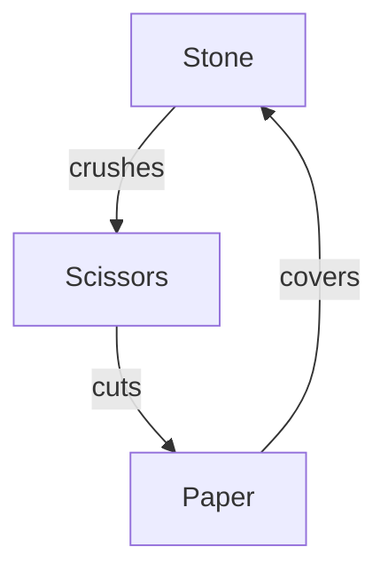
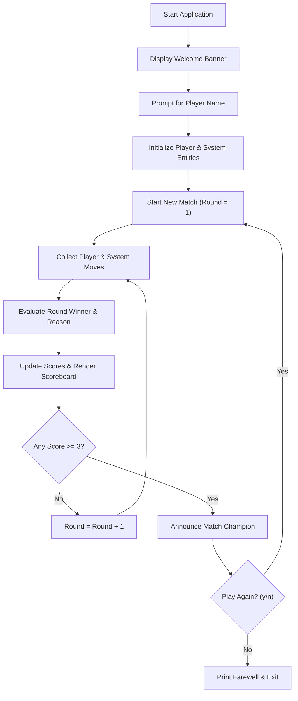
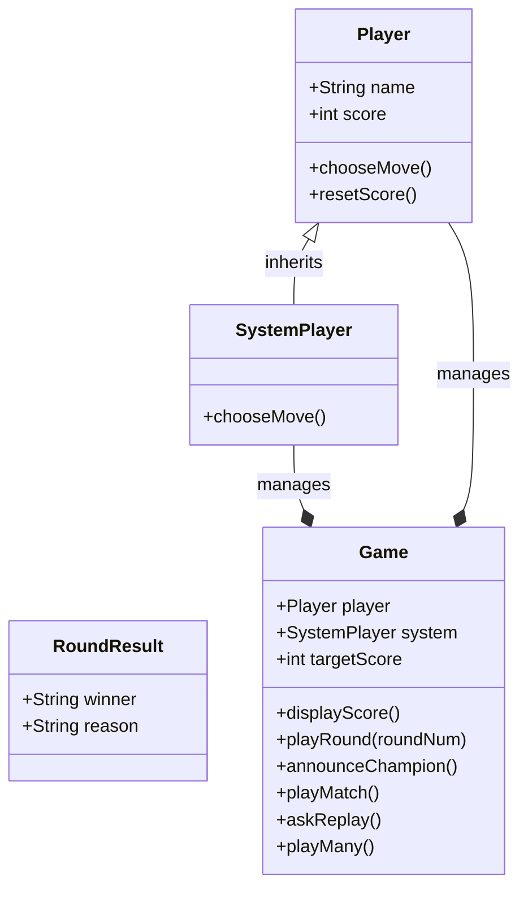

<u>**PROJECT 2 (Beginner)**</u>

# Stone Paper Scissors Game

Build an interactive, beginner-friendly Stone Paper Scissors game: model human and computer opponents with object-oriented design, implement deterministic rule-based win evaluation, run a turn-based best-of-5 match loop against the System, and support continuous session replay in a clean command-line interface. Language-agnostic — code it in **Python**, **C++**, or **Java**.

---

### Curriculum Outline & Learning Roadmap

- **Chapter 1: Introduction**

  - `1.1 Getting Started`

    - `[CONCEPT]` Meet Your Project

    - `[CONCEPT]` What You Will Learn

    - `[CONCEPT]` What You Need

  - `1.2 Starting with Small Steps`

    - `[CONCEPT]` First Steps into Code: The Welcome Banner

    - `[TASK 1]` Create the entry file and print welcome message

    - `[CHECKPOINT]` Milestone Checkpoint: Welcome Banner Functional!

    - `[CONCEPT]` Move Representation & Scoring Boundaries

    - `[TASK 2]` Define valid moves and target score

    - `[CHECKPOINT]` Milestone Checkpoint: Game Configuration Defined!

- **Chapter 2: Specifications & Architectural Plan**

  - `2.1 Understanding the Domain & Rules`

    - `[CONCEPT]` Move Hierarchy & Win Justifications

    - `[CONCEPT]` Match Format: Best-of-5 Target Score

  - `2.2 Chronological Execution Flow`

    - `[CONCEPT]` Chronological Execution Flow (5 Stages)

  - `2.3 System Architecture: Thinking in OOP`

    - `[CONCEPT]` Thinking in OOP (Component Responsibility Table)

- **Chapter 3: Core Domain Models & Move Comparison Logic**

  - `3.1 Round Outcome Modeling`

    - `[CONCEPT]` Structured Results: The RoundResult Data Model

    - `[TASK 3]` Create the RoundResult model

    - `[CHECKPOINT]` Milestone Checkpoint: Outcome Data Model Established!

  - `3.2 Rule-Based Evaluation Engine`

    - `[CONCEPT]` Decision Trees: Exhaustive Outcome Evaluation

    - `[TASK 4]` Implement `determineWinner(playerMove, systemMove)`

    - `[CHECKPOINT]` Milestone Checkpoint: Rules & Evaluation Engine Operational!

- **Chapter 4: Modeling Opponents (Human & System)**

  - `4.1 Entity Modeling & Score Tracking`

    - `[CONCEPT]` State Encapsulation: The Player Entity

    - `[TASK 5]` Create the Player class constructor

    - `[CHECKPOINT]` Milestone Checkpoint: Player Entity Initialized!

    - `[CONCEPT]` Match Reset Mechanics

    - `[TASK 6]` Implement score reset on Player

    - `[CHECKPOINT]` Milestone Checkpoint: Player Reset Capability Verified!

  - `4.2 Input Validation & Computer Move Generation`

    - `[CONCEPT]` Defensive Programming: CLI Input Validation

    - `[TASK 7]` Implement validated human move input

    - `[CHECKPOINT]` Milestone Checkpoint: Human Move Input Pipeline Functional!

    - `[CONCEPT]` OOP Specialization: The Automated Opponent

    - `[TASK 8]` Create the SystemPlayer class skeleton

    - `[CHECKPOINT]` Milestone Checkpoint: System Opponent Inherited!

    - `[CONCEPT]` Random Move Generation

    - `[TASK 9]` Implement system random move choice

    - `[CHECKPOINT]` Milestone Checkpoint: System Move Generation Operational!

- **Chapter 5: Building the Match Engine**

  - `5.1 Game Manager & Round Execution`

    - `[CONCEPT]` System Coordination: The Game Manager Skeleton

    - `[TASK 10]` Create the Game class constructor

    - `[CHECKPOINT]` Milestone Checkpoint: Game Controller Assembled!

    - `[CONCEPT]` Terminal Presentation: Scoreboard Card Layout

    - `[TASK 11]` Display the formatted scoreboard

    - `[CHECKPOINT]` Milestone Checkpoint: Scoreboard Visualization Operational!

    - `[CONCEPT]` Turn-Based Operational Loop: Execution & Feedback

    - `[TASK 12]` Play a single round and reveal choices

    - `[CHECKPOINT]` Milestone Checkpoint: Single Round Engine Verified!

  - `5.2 Match Control & Champion Resolution`

    - `[CONCEPT]` Victory Announcement & Champion Presentation

    - `[TASK 13]` Implement match champion announcement

    - `[CHECKPOINT]` Milestone Checkpoint: Champion Announcement Verified!

    - `[CONCEPT]` Match Lifecycle: Target-Score Loop Architecture

    - `[TASK 14]` Write the `playMatch()` loop

    - `[CHECKPOINT]` Milestone Checkpoint: Best-of-5 Match Loop Complete!

- **Chapter 6: Adding Replayability & Full Application Execution**

  - `6.1 Session Management & Application Assembly`

    - `[CONCEPT]` Interactive Pacing: Rematch Confirmation

    - `[TASK 15]` Implement `askReplay()`

    - `[CHECKPOINT]` Milestone Checkpoint: Rematch Prompt Functional!

    - `[CONCEPT]` Continuous Operations: The Multi-Match Engine

    - `[TASK 16]` Implement `playMany()` for continuous play

    - `[CHECKPOINT]` Milestone Checkpoint: Multi-Match Session Engine Complete!

    - `[CONCEPT]` Putting It All Together: Application Assembly

    - `[TASK 17]` Assemble the `main()` entry point

    - `[CHECKPOINT]` Milestone Checkpoint: Full Application Experience Achieved!

- **Chapter 7: Reflect & Expand**

  - `7.1 What You Have Built` (Feature Summary & Skills Practiced Matrix)

  - `7.2 Extension Ideas`

  - `7.3 Share What You Built! Time to Showcase Your Project!`

- **Appendix: Full Pseudocode Reference**

  - `[REFERENCE]` Complete Tri-Language Algorithmic Logic

---

## Chapter 1: Introduction

### 1.1 Getting Started

**Meet Your Project**

You are about to build **Stone Paper Scissors** — the world-famous hand game — as an interactive command-line application where you face off directly against the System (Computer Opponent).

This project strengthens your core foundational programming skills: working with collections and lists, handling user input validation, generating randomized computer moves, modeling classes with inheritance, and managing a multi-round match engine.

Once finished, you will have a complete, polished match-based CLI game where you compete round-by-round to reach 3 points, watch moves get revealed in real time, view a live scoreboard, and play rematches without restarting the application.

**What You Will Learn**

You will build this application from start to finish. By the end, you will have a clean, tested project you can run, explain, and share.

You will learn how to:

1. Represent game moves and configuration using immutable constants and collections

2. Encapsulate multi-value outcomes inside dedicated data models

3. Validate user input defensively to accept numeric codes and string aliases without crashing

4. Generate unpredictable computer moves using standard language pseudo-random number generators

5. Compare choices using clean, beginner-friendly decision trees to determine round winners with descriptive victory reasons

6. Drive a best-of-5 target score match loop that tracks points until a player reaches the threshold

7. Render a formatted ASCII scoreboard card after every round

8. Implement rematch loops so players can replay consecutive matches seamlessly

**What You Need**

Before you begin, make sure you are comfortable with:

- Printing output and reading keyboard input

- Variables, conditionals (`if` / `else`), and loops (`while`)

- Basic functions and methods

- Lists or arrays

- Creating simple classes and objects

- Basic use of your language's random-number utilities

This project is tailored specifically for beginners, guiding you step by step through every class and function with simple, intuitive code.

---

### 1.2 Starting with Small Steps

**First Steps into Code: The Welcome Banner**

Every software project begins with a single step. Before constructing complex match loops or move-evaluation logic, we first establish our project entry file and verify that our execution environment is properly wired.

To do this, we create our entry point and print a clean welcome banner to confirm that the environment is operational.

#### Task 1 — Create the entry file and print welcome message

Create your project entry file and implement `print_welcome()` (or `printWelcome()`):

Think of laying down the welcome mat at the front door of a game parlor.  
*Goal*: Establish the execution root and prepare the script environment.

<div class="step-card">
  <div class="step-header">
    <span class="step-badge">STEP 1</span>
    <span class="step-title">Entry File Setup</span>
  </div>
  <ul>
    <li>[ ] Create your project file (<code>StonePaperScissors.py</code>, <code>StonePaperScissors.cpp</code>, or <code>StonePaperScissors.java</code>) and import required system modules.</li>
  </ul>
</div>

Think of switching on an electronic arcade cabinet that lights up its title screen.  
*Goal*: Provide immediate visual confirmation that the application is running.

<div class="step-card">
  <div class="step-header">
    <span class="step-badge">STEP 2</span>
    <span class="step-title">Welcome Banner Output</span>
  </div>
  <ul>
    <li>[ ] Print the welcome message string: <code>"Welcome to Stone Paper Scissors!"</code>.</li>
  </ul>
</div>

**Expected Terminal Interaction & Output:**

```text
Welcome to Stone Paper Scissors!
```

---

### Milestone Checkpoint: Welcome Banner Functional!

You have established the project entry point:

- [x] **Entry File Created**: Initialized the project source file and confirmed compiler execution.

- [x] **Greeting Banner Verified**: Successfully printed the welcome banner to the terminal.

**Driver Verification Test**:
Call `print_welcome()` (or `printWelcome()`) directly from your main execution block. Verify that `"Welcome to Stone Paper Scissors!"` prints cleanly to the console.

---

**Move Representation & Scoring Boundaries**

In Stone Paper Scissors, the game operates on a closed set of three valid choices: `"Stone"`, `"Paper"`, and `"Scissors"`. Additionally, a match is played to a fixed target score (first to 3 points).

Rather than hardcoding string literals and magic numbers throughout multiple functions, professional developers define these values as global constants at the top of the file. This makes the rules easy to configure and eliminates typographical errors.

| Constant | Value / Definition | Purpose |
|---|---|---|
| `MOVES` | `["Stone", "Paper", "Scissors"]` | Valid canonical move choices |
| `TARGET_SCORE` | `3` | Points needed to win the match (first to 3) |

#### Task 2 — Define valid moves and target score

Declare the global constants representing valid moves and the match victory boundary:

Think of defining the official rulebook parameters before starting the game.  
*Goal*: Prevent magic numbers and string typos by storing configuration centrally.

<div class="step-card">
  <div class="step-header">
    <span class="step-badge">STEP 1</span>
    <span class="step-title">Declare Move Collection</span>
  </div>
  <ul>
    <li>[ ] Declare a constant list/vector/array named <code>MOVES</code> containing <code>"Stone"</code>, <code>"Paper"</code>, and <code>"Scissors"</code> in that order.</li>
  </ul>
</div>

Think of setting the point limit on a digital scoreboard.  
*Goal*: Establish the victory threshold needed to win a competitive match.

<div class="step-card">
  <div class="step-header">
    <span class="step-badge">STEP 2</span>
    <span class="step-title">Declare Target Score Threshold</span>
  </div>
  <ul>
    <li>[ ] Declare an integer constant named <code>TARGET_SCORE</code> set to <code>3</code>.</li>
  </ul>
</div>

---

### Milestone Checkpoint: Game Configuration Defined!

You have established the core domain rules:

- [x] **Move Pool Defined**: Declared `MOVES` containing the three canonical move strings.

- [x] **Target Boundary Fixed**: Declared `TARGET_SCORE = 3` without magic numbers.

**Driver Verification Test**:
Print the length of `MOVES` and the value of `TARGET_SCORE`. Verify that `len(MOVES)` (or `MOVES.size()`) is `3` and `TARGET_SCORE` is `3`.

---

## Chapter 2: Specifications & Architectural Plan

### 2.1 Understanding the Domain & Rules

**Move Hierarchy & Win Justifications**

Stone Paper Scissors is played between two opponents: the **Human Player** and the **System**. In each round, both opponents simultaneously choose one of three valid moves.

The game rules form a directed cycle where each move defeats exactly one other move and loses to exactly one other move:



The outcomes are governed by three immutable rules:

| Player Move | System Move | Winner | Winning Reason |
|---|---|---|---|
| **Stone** | Scissors | Player | Stone crushes Scissors |
| **Scissors** | Paper | Player | Scissors cuts Paper |
| **Paper** | Stone | Player | Paper covers Stone |
| **Scissors** | Stone | System | Stone crushes Scissors |
| **Paper** | Scissors | System | Scissors cuts Paper |
| **Stone** | Paper | System | Paper covers Stone |
| *Identical* | *Identical* | Draw | Both chose `<Move>` |

If both opponents select the exact same move, the round is a **Draw (Tie)**, and neither opponent receives a point.

**Match Format: Best-of-5 Target Score**

Rather than playing a single throwaway round, a match is played in a competitive **first-to-3 points** format:

- The first opponent to win **3 points** wins the entire match.

- Rounds continue until either the player or the system reaches 3 points.

- Draws award zero points to both sides, so matches can take 3, 4, 5, or more rounds until a champion emerges.

---

### 2.2 Chronological Execution Flow

**Five-Stage Match Execution Lifecycle**

Chronologically, a complete application session proceeds through five distinct stages:



1. **System Inception & Greeting**: Launch the program, display the executive welcome banner, and prompt the player for their name.

2. **Opponent Initialization**: Instantiate human and automated computer contestants with fresh score tallies of zero.

3. **Turn-Based Round Engine**: Continuously collect moves, validate human keyboard input, pick randomized computer moves, and reveal selections simultaneously.

4. **Referee Evaluation & Scoreboard**: Compare choices using immutable rule decision trees, update scores, and display the live ASCII scoreboard card.

5. **Match Resolution & Replay**: Crown the first contestant to reach 3 points and invite players to rematch without restarting the application.

---

### 2.3 System Architecture: Thinking in OOP

**Component Responsibilities & Class Hierarchy**

Splitting the system into discrete classes isolates responsibilities and makes the code modular, intuitive, and testable:



| Component | Responsibility |
|---|---|
| **RoundResult** | Bundles the evaluation outcome into structured fields (`winner` and `reason`). |
| **Player** | Stores the player's name and score. Prompts the human user for a validated move choice and resets score between matches. |
| **SystemPlayer** | Inherits from `Player`. Overrides the move selection method to generate the computer's move randomly from `MOVES`. |
| **Game** | Holds the `Player` and `SystemPlayer` instances, manages the target score (3), executes individual rounds, prints the scoreboard, and controls the match and replay loops. |

---

## Chapter 3: Core Domain Models & Move Comparison Logic

### 3.1 Round Outcome Modeling

**Structured Results: The RoundResult Data Model**

When evaluating a round between two moves, a function must communicate two distinct pieces of information:

1. **Who Won**: `"draw"`, `"player"`, or `"system"`.

2. **The Justification**: A descriptive explanation, such as `"Stone crushes Scissors"` or `"Both chose Paper"`.

In beginner programming, passing loose values or ad-hoc strings quickly creates confusion. By bundling these two fields into a dedicated `RoundResult` model, all three programming languages maintain an identical, clean data structure.

#### Task 3 — Create the RoundResult model

Define the `RoundResult` data model to bundle evaluation outcome fields:

Think of an official judge's scorecard that records both the decision and the justification.  
*Goal*: Store the outcome winner identifier (`"draw"`, `"player"`, or `"system"`).

<div class="step-card">
  <div class="step-header">
    <span class="step-badge">STEP 1</span>
    <span class="step-title">Initialize Winner Identifier</span>
  </div>
  <ul>
    <li>[ ] Store the <code>winner</code> identifier parameter into an instance field named <code>winner</code>.</li>
  </ul>
</div>

Think of writing the referee's explanatory note on the scorecard.  
*Goal*: Store the plain-English explanation for why that outcome occurred.

<div class="step-card">
  <div class="step-header">
    <span class="step-badge">STEP 2</span>
    <span class="step-title">Initialize Outcome Reason</span>
  </div>
  <ul>
    <li>[ ] Store the <code>reason</code> description parameter into an instance field named <code>reason</code>.</li>
  </ul>
</div>

---

### Milestone Checkpoint: Outcome Data Model Established!

You have encapsulated round outcome state:

- [x] **Data Model Created**: Defined `RoundResult` with `winner` and `reason` fields.

- [x] **Encapsulation Verified**: Confirmed that outcome properties are grouped into a cohesive entity.

**Driver Verification Test**:
Instantiate a test object `res = RoundResult("player", "Stone crushes Scissors")`. Verify that `res.winner` equals `"player"` and `res.reason` equals `"Stone crushes Scissors"`.

---

### 3.2 Rule-Based Evaluation Engine

**Decision Trees: Exhaustive Outcome Evaluation**

Before building classes or handling user input, we need an algorithmic evaluation function that takes two move strings (`player_move`, `system_move`) and returns a `RoundResult`.

The evaluation follows three logical branches:

1. **Equal Moves**: If both opponents pick identical moves, it is always a draw.

2. **Player Wins**: Check the three winning combinations:
   - Stone crushes Scissors
   - Scissors cuts Paper
   - Paper covers Stone

3. **System Wins**: If it is neither a draw nor a player win, the system opponent wins with the matching justification.

#### Task 4 — Implement `determineWinner(playerMove, systemMove)`

Implement the rule comparison function `determine_winner(player_move, system_move)` (or `determineWinner(playerMove, systemMove)`):

Think of checking if both participants revealed matching cards.  
*Goal*: Handle ties immediately before checking asymmetric win conditions.

<div class="step-card">
  <div class="step-header">
    <span class="step-badge">STEP 1</span>
    <span class="step-title">Check Draw Condition</span>
  </div>
  <ul>
    <li>[ ] Check if <code>player_move == system_move</code>. If true, return a <code>RoundResult</code> with winner <code>"draw"</code> and reason <code>"Both chose " + player_move</code>.</li>
  </ul>
</div>

Think of verifying if the player's move trumps the computer's move.  
*Goal*: Check the three winning permutations for the human player.

<div class="step-card">
  <div class="step-header">
    <span class="step-badge">STEP 2</span>
    <span class="step-title">Check Player Victory Conditions</span>
  </div>
  <ul>
    <li>[ ] Check player victory combinations:
      <ul>
        <li>If player chose <code>"Stone"</code> and system chose <code>"Scissors"</code>, return winner <code>"player"</code> and reason <code>"Stone crushes Scissors"</code>.</li>
        <li>If player chose <code>"Scissors"</code> and system chose <code>"Paper"</code>, return winner <code>"player"</code> and reason <code>"Scissors cuts Paper"</code>.</li>
        <li>If player chose <code>"Paper"</code> and system chose <code>"Stone"</code>, return winner <code>"player"</code> and reason <code>"Paper covers Stone"</code>.</li>
      </ul>
    </li>
  </ul>
</div>

Think of resolving the remaining matchups where the computer wins.  
*Goal*: Check system victory combinations and return the corresponding reason.

<div class="step-card">
  <div class="step-header">
    <span class="step-badge">STEP 3</span>
    <span class="step-title">Check System Victory Conditions</span>
  </div>
  <ul>
    <li>[ ] Check system victory combinations:
      <ul>
        <li>If system chose <code>"Stone"</code> and player chose <code>"Scissors"</code>, return winner <code>"system"</code> and reason <code>"Stone crushes Scissors"</code>.</li>
        <li>If system chose <code>"Scissors"</code> and player chose <code>"Paper"</code>, return winner <code>"system"</code> and reason <code>"Scissors cuts Paper"</code>.</li>
        <li>Otherwise, return winner <code>"system"</code> and reason <code>"Paper covers Stone"</code>.</li>
      </ul>
    </li>
  </ul>
</div>

---

### Milestone Checkpoint: Rules & Evaluation Engine Operational!

You have completed the core mathematical comparison logic:

- [x] **9-Outcome Matrix Covered**: Exhaustively evaluated all 3 ties, 3 player wins, and 3 system wins.

- [x] **Descriptive Justifications**: Every outcome returns its real-world justification.

**Driver Verification Test**:
Call `determine_winner("Stone", "Scissors")` and verify `winner == "player"`. Call `determine_winner("Paper", "Paper")` and verify `winner == "draw"`. Call `determine_winner("Paper", "Scissors")` and verify `winner == "system"`.

---

## Chapter 4: Modeling Opponents (Human & System)

### 4.1 Entity Modeling & Score Tracking

**State Encapsulation: The Player Entity**

Every participant in the game needs an identity and a way to track points. A `Player` class encapsulates these fields:

- `name`: A string identifier (defaulting to `"Player"` if blank).

- `score`: An integer tracking points earned in the active match (starts at 0).

- `reset_score()`: A helper method to zero out points when starting a rematch.

#### Task 5 — Create the Player class constructor

Create the `Player` class and its constructor:

Think of writing a player's name tag before they enter the tournament.  
*Goal*: Ensure every player has a clean, non-empty display name.

<div class="step-card">
  <div class="step-header">
    <span class="step-badge">STEP 1</span>
    <span class="step-title">Sanitize Player Name</span>
  </div>
  <ul>
    <li>[ ] Accept a raw name string in the constructor. Trim leading and trailing whitespace. If empty or blank, default it to <code>"Player"</code>.</li>
  </ul>
</div>

Think of clearing the scoreboard counter before the match starts.  
*Goal*: Initialize the participant's score to zero.

<div class="step-card">
  <div class="step-header">
    <span class="step-badge">STEP 2</span>
    <span class="step-title">Initialize Starting Score</span>
  </div>
  <ul>
    <li>[ ] Set <code>self.score = 0</code> (or <code>score = 0</code>).</li>
  </ul>
</div>

---

### Milestone Checkpoint: Player Entity Initialized!

You have encapsulated basic player state:

- [x] **Name Sanitization**: Handled whitespace trimming and blank name fallback.

- [x] **Score Counter**: Initialized starting score to 0.

**Driver Verification Test**:
Instantiate `p1 = Player("  Alex  ")` and `p2 = Player("")`. Verify that `p1.name == "Alex"`, `p2.name == "Player"`, and both have `score == 0`.

---

**Match Reset Mechanics**

When players finish a match and agree to a rematch, their scores must be reset to zero without destroying and re-instantiating the object. Providing an explicit reset method keeps state management clean.

#### Task 6 — Implement score reset on Player

Add `reset_score()` (or `resetScore()`) to `Player`:

Think of wiping a physical chalkboard tally back to zero for a new match.  
*Goal*: Reset the player's accumulated score back to 0.

<div class="step-card">
  <div class="step-header">
    <span class="step-badge">STEP 1</span>
    <span class="step-title">Zero Out Score</span>
  </div>
  <ul>
    <li>[ ] Set <code>self.score = 0</code> (or <code>score = 0</code>).</li>
  </ul>
</div>

---

### Milestone Checkpoint: Player Reset Capability Verified!

You have implemented score reset mechanics:

- [x] **Reset Method Added**: Created `reset_score()` to clear point tallies.

- [x] **Rematch Readiness**: Enabled seamless multi-match score resetting.

**Driver Verification Test**:
Set `p = Player("Alex")`, manually set `p.score = 2`, call `p.reset_score()`, and assert that `p.score == 0`.

---

### 4.2 Input Validation & Computer Move Generation

**Defensive Programming: CLI Input Validation**

A common failure in beginner console applications is crashing when a user types an unexpected input. What if the user types `"stone"` in lowercase, enters `"2"`, or types a typo like `"abc"`?

Our move selection method must be resilient:

- It presents numbered options: `[1] Stone`, `[2] Paper`, `[3] Scissors`.

- It accepts numeric digits (`"1"`, `"2"`, `"3"`) OR move name aliases (`"stone"`, `"paper"`, `"scissors"`).

- If the user enters an invalid value, the application displays a friendly warning and loops back to re-prompt without crashing.

| User Input Format | Accepted Examples | Canonical Move Resolved | System Behavior |
|---|---|---|---|
| **Numeric Code** | `"1"`, `"2"`, `"3"` | `"Stone"`, `"Paper"`, `"Scissors"` | Accepts and returns move |
| **Full Name Alias** | `"stone"`, `"paper"`, `"scissors"` | `"Stone"`, `"Paper"`, `"Scissors"` | Case-normalized and accepted |
| **Invalid Entry** | `"4"`, `"abc"`, `""` | *None* | Displays warning and re-prompts |

#### Task 7 — Implement validated human move input

Add `choose_move()` (or `chooseMove()`) to `Player`:

Think of a turnstile that keeps waiting until a valid token is inserted.  
*Goal*: Keep prompting the human user until a valid move choice is received.

<div class="step-card">
  <div class="step-header">
    <span class="step-badge">STEP 1</span>
    <span class="step-title">Interactive Prompt Loop</span>
  </div>
  <ul>
    <li>[ ] Run an indefinite loop (<code>while True</code> / <code>while (true)</code>).</li>
  </ul>
</div>

Think of handing the player a menu card with clear options.  
*Goal*: Present the available moves and prompt for input.

<div class="step-card">
  <div class="step-header">
    <span class="step-badge">STEP 2</span>
    <span class="step-title">Display Choice Menu</span>
  </div>
  <ul>
    <li>[ ] Print the choice menu displaying the player name and numbered options for <code>[1] Stone</code>, <code>[2] Paper</code>, and <code>[3] Scissors</code>, prompting with <code>"Enter choice (1-3): "</code>.</li>
  </ul>
</div>

Think of cleaning off dirt from an input coin before checking it.  
*Goal*: Normalize the input string by trimming whitespace and converting to lowercase.

<div class="step-card">
  <div class="step-header">
    <span class="step-badge">STEP 3</span>
    <span class="step-title">Read and Normalize Input</span>
  </div>
  <ul>
    <li>[ ] Read the user's input line, strip whitespace, and convert it to lowercase.</li>
  </ul>
</div>

Think of checking if the input matches any known currency.  
*Goal*: Map numeric keys and aliases to canonical move strings.

<div class="step-card">
  <div class="step-header">
    <span class="step-badge">STEP 4</span>
    <span class="step-title">Validate and Map Choices</span>
  </div>
  <ul>
    <li>[ ] Evaluate the input:
      <ul>
        <li>If input is <code>"1"</code> or <code>"stone"</code>, return <code>"Stone"</code>.</li>
        <li>If input is <code>"2"</code> or <code>"paper"</code>, return <code>"Paper"</code>.</li>
        <li>If input is <code>"3"</code> or <code>"scissors"</code>, return <code>"Scissors"</code>.</li>
      </ul>
    </li>
  </ul>
</div>

Think of a polite error chime on an ATM when the wrong button is pressed.  
*Goal*: Inform the user of invalid input and re-prompt gracefully.

<div class="step-card">
  <div class="step-header">
    <span class="step-badge">STEP 5</span>
    <span class="step-title">Handle Invalid Input</span>
  </div>
  <ul>
    <li>[ ] Otherwise, print <code>"Invalid input. Please enter 1, 2, or 3."</code> and continue the loop.</li>
  </ul>
</div>

**Expected Terminal Interaction & Output:**

```text
Nikhil, choose your move:
  [1] Stone
  [2] Paper
  [3] Scissors
Enter choice (1-3): 4
Invalid input. Please enter 1, 2, or 3.

Nikhil, choose your move:
  [1] Stone
  [2] Paper
  [3] Scissors
Enter choice (1-3): 1
```

---

### Milestone Checkpoint: Human Move Input Pipeline Functional!

You have completed defensive move validation:

- [x] **Dual-Mode Input**: Accepted both numeric options (`1-3`) and name aliases (`stone`, `paper`, `scissors`).

- [x] **Defensive Reprompting**: Malformed inputs trigger friendly error messages without throwing unhandled exceptions.

**Driver Verification Test**:
Instantiate a `Player("Test")`, call `choose_move()`, enter `abc`, observe the error message, enter `2`, and verify that the method returns `"Paper"`.

---

**OOP Specialization: The Automated Opponent**

Now that we have a `Player` class that queries a human at the keyboard, how do we model the System opponent?

Through **object-oriented inheritance**, `SystemPlayer` can inherit all fields (`name`, `score`, `resetScore`) from `Player`, but override the `chooseMove()` method. Instead of waiting for keyboard input, `SystemPlayer` picks a move randomly from `MOVES`.

#### Task 8 — Create the SystemPlayer class skeleton

Create the `SystemPlayer` class extending `Player`:

Think of creating an automated robotic player that follows the exact same tournament rules as a human.  
*Goal*: Inherit all player state while fixing the participant name to `"System"`.

<div class="step-card">
  <div class="step-header">
    <span class="step-badge">STEP 1</span>
    <span class="step-title">Subclass Player Entity</span>
  </div>
  <ul>
    <li>[ ] Define class <code>SystemPlayer</code> inheriting from <code>Player</code>. In its constructor, call the superclass constructor passing <code>"System"</code> as the name.</li>
  </ul>
</div>

---

### Milestone Checkpoint: System Opponent Inherited!

You have established the computer opponent class:

- [x] **Subclass Created**: Defined `SystemPlayer` extending `Player`.

- [x] **Fixed Identity**: Initialized `name` automatically to `"System"`.

**Driver Verification Test**:
Instantiate `bot = SystemPlayer()`. Verify that `bot.name == "System"` and `bot.score == 0`.

---

**Random Move Generation**

The computer opponent must select its move randomly from the valid moves pool (`MOVES`). By overriding `choose_move()`, the Game orchestrator can treat both human and computer opponents identically through polymorphism.

#### Task 9 — Implement system random move choice

Override `choose_move()` (or `chooseMove()`) in `SystemPlayer`:

Think of rolling a fair three-sided die to pick a hand gesture unpredictably.  
*Goal*: Select a move uniformly at random from `MOVES`.

<div class="step-card">
  <div class="step-header">
    <span class="step-badge">STEP 1</span>
    <span class="step-title">Generate Random Move Selection</span>
  </div>
  <ul>
    <li>[ ] Use your language's pseudo-random number generator to select an index from <code>0</code> to <code>2</code> (or pick directly from <code>MOVES</code>).</li>
  </ul>
</div>

Think of revealing the selected gesture to the referee.  
*Goal*: Return the chosen move string.

<div class="step-card">
  <div class="step-header">
    <span class="step-badge">STEP 2</span>
    <span class="step-title">Return Selected Move</span>
  </div>
  <ul>
    <li>[ ] Return the selected move string (<code>"Stone"</code>, <code>"Paper"</code>, or <code>"Scissors"</code>).</li>
  </ul>
</div>

---

### Milestone Checkpoint: System Move Generation Operational!

You have completed polymorphic computer move generation:

- [x] **Polymorphic Override**: Implemented automated move selection without keyboard prompts.

- [x] **Uniform Distribution**: Verified random selection from the canonical `MOVES` list.

**Driver Verification Test**:
Instantiate `bot = SystemPlayer()`, call `bot.choose_move()` 20 times in a loop, and verify that every returned move is in `["Stone", "Paper", "Scissors"]`.

---

## Chapter 5: Building the Match Engine

### 5.1 Game Manager & Round Execution

**System Coordination: The Game Manager Skeleton**

The `Game` class acts as the central coordinator. It holds both opponents (`Player` and `SystemPlayer`), manages the match score boundary (`TARGET_SCORE = 3`), and coordinates the flow of rounds.

#### Task 10 — Create the Game class constructor

Create the `Game` class and its constructor:

Think of setting up a match table with two seats: one for the human, one for the system.  
*Goal*: Instantiate and store the human `Player` object with the provided name.

<div class="step-card">
  <div class="step-header">
    <span class="step-badge">STEP 1</span>
    <span class="step-title">Instantiate Human Player</span>
  </div>
  <ul>
    <li>[ ] Accept <code>player_name</code> in the constructor and instantiate <code>self.player = Player(player_name)</code>.</li>
  </ul>
</div>

Think of placing the automated chess clock and opponent across the table.  
*Goal*: Instantiate and store the automated `SystemPlayer` opponent.

<div class="step-card">
  <div class="step-header">
    <span class="step-badge">STEP 2</span>
    <span class="step-title">Instantiate System Opponent</span>
  </div>
  <ul>
    <li>[ ] Instantiate <code>self.system = SystemPlayer()</code>.</li>
  </ul>
</div>

Think of posting the tournament rule sheet on the table.  
*Goal*: Store the match victory boundary.

<div class="step-card">
  <div class="step-header">
    <span class="step-badge">STEP 3</span>
    <span class="step-title">Initialize Target Score Threshold</span>
  </div>
  <ul>
    <li>[ ] Set <code>self.target_score = TARGET_SCORE</code> (3).</li>
  </ul>
</div>

---

### Milestone Checkpoint: Game Controller Assembled!

You have constructed the game manager skeleton:

- [x] **Entities Bound**: Instantiated both human and automated participants inside `Game`.

- [x] **Target Configured**: Linked `target_score` to the global `TARGET_SCORE` constant.

**Driver Verification Test**:
Instantiate `g = Game("Nikhil")`. Verify that `g.player.name == "Nikhil"`, `g.system.name == "System"`, and `g.target_score == 3`.

---

**Terminal Presentation: Scoreboard Card Layout**

In interactive terminal applications, visual polish matters. Rather than printing raw score numbers, we wrap the scores in a clean, centered ASCII card after every round.

```text
======================================
| SCORE: Nikhil [ 1 ] - System [ 0 ] |
======================================
```

#### Task 11 — Display the formatted scoreboard

Add `display_score()` (or `displayScore()`) to `Game`:

Think of drawing the upper steel beam of a stadium scoreboard.  
*Goal*: Print the top decorative border of the scoreboard box.

<div class="step-card">
  <div class="step-header">
    <span class="step-badge">STEP 1</span>
    <span class="step-title">Print Scoreboard Top Border</span>
  </div>
  <ul>
    <li>[ ] Print a top border line of 38 equal signs: <code>"\n======================================"</code>.</li>
  </ul>
</div>

Think of formatting the team names and current scores neatly in the middle of the display.  
*Goal*: Construct the centered score string enclosed by vertical borders.

<div class="step-card">
  <div class="step-header">
    <span class="step-badge">STEP 2</span>
    <span class="step-title">Format Scoreboard Content</span>
  </div>
  <ul>
    <li>[ ] Construct the score text: <code>"SCORE: " + player.name + " [ " + player.score + " ] - System [ " + system.score + " ]"</code>. Center this text within 34 characters and enclose with <code>|</code>.</li>
  </ul>
</div>

Think of drawing the lower steel beam to close the scoreboard box.  
*Goal*: Print the bottom decorative border of the scoreboard box.

<div class="step-card">
  <div class="step-header">
    <span class="step-badge">STEP 3</span>
    <span class="step-title">Print Scoreboard Bottom Border</span>
  </div>
  <ul>
    <li>[ ] Print a bottom border line of 38 equal signs: <code>"======================================"</code>.</li>
  </ul>
</div>

**Expected Terminal Interaction & Output:**

```text
======================================
| SCORE: Nikhil [ 1 ] - System [ 0 ] |
======================================
```

---

### Milestone Checkpoint: Scoreboard Visualization Operational!

You have completed terminal scoreboard rendering:

- [x] **Formatted ASCII Box**: Printed centered 38-character card layout.

- [x] **Live State Reflection**: Score values dynamically reflect player and system points.

**Driver Verification Test**:
Instantiate `g = Game("Nikhil")`, set `g.player.score = 2` and `g.system.score = 1`, and call `g.display_score()`. Verify that the centered card renders accurately.

---

**Turn-Based Operational Loop: Execution & Feedback**

A game comes to life when user actions produce immediate, tangible feedback. In each round:

1. The round number is announced.

2. Both opponents choose their moves.

3. Both choices are revealed simultaneously.

4. The referee evaluates the outcome.

5. Scores are updated and the updated scoreboard is rendered.

#### Task 12 — Play a single round and reveal choices

Add `play_round(round_num)` (or `playRound(roundNum)`) to `Game`:

Think of a referee holding up a round sign in a boxing ring.  
*Goal*: Announce the start of the current round.

<div class="step-card">
  <div class="step-header">
    <span class="step-badge">STEP 1</span>
    <span class="step-title">Print Round Header</span>
  </div>
  <ul>
    <li>[ ] Print the round section header: <code>"\n--- Round " + round_num + " ---"</code>.</li>
  </ul>
</div>

Think of two players setting their cards face down on the table.  
*Goal*: Retrieve moves from both the human player and system opponent.

<div class="step-card">
  <div class="step-header">
    <span class="step-badge">STEP 2</span>
    <span class="step-title">Collect Opponent Moves</span>
  </div>
  <ul>
    <li>[ ] Call <code>self.player.choose_move()</code> to obtain <code>player_move</code>, and <code>self.system.choose_move()</code> to obtain <code>system_move</code>.</li>
  </ul>
</div>

Think of turning both cards face up together so everyone can see the matchup.  
*Goal*: Reveal both selections clearly to the console.

<div class="step-card">
  <div class="step-header">
    <span class="step-badge">STEP 3</span>
    <span class="step-title">Reveal Choices</span>
  </div>
  <ul>
    <li>[ ] Print <code>player.name + " chose: " + player_move</code> and <code>"System chose: " + system_move</code>.</li>
  </ul>
</div>

Think of handing both cards to an impartial judge with the rulebook.  
*Goal*: Evaluate the round outcome using the decision tree engine.

<div class="step-card">
  <div class="step-header">
    <span class="step-badge">STEP 4</span>
    <span class="step-title">Evaluate Outcome</span>
  </div>
  <ul>
    <li>[ ] Call <code>determine_winner(player_move, system_move)</code> to receive a <code>RoundResult</code>.</li>
  </ul>
</div>

Think of the announcer calling the point and updating the tally.  
*Goal*: Branch on the outcome, award points to the winner, and print the explanation.

<div class="step-card">
  <div class="step-header">
    <span class="step-badge">STEP 5</span>
    <span class="step-title">Update Scores and Announce Result</span>
  </div>
  <ul>
    <li>[ ] Update state based on <code>result.winner</code>:
      <ul>
        <li>If <code>"draw"</code>, print <code>"Result: It's a draw! (" + result.reason + ")"</code>.</li>
        <li>If <code>"player"</code>, increment <code>player.score</code> by 1 and print <code>"Result: " + result.reason + "! " + player.name + " wins Round " + round_num + "!"</code>.</li>
        <li>If <code>"system"</code>, increment <code>system.score</code> by 1 and print <code>"Result: " + result.reason + "! System wins Round " + round_num + "!"</code>.</li>
      </ul>
    </li>
  </ul>
</div>

Think of the stadium big screen refreshing to show the new match score.  
*Goal*: Render the live scoreboard card.

<div class="step-card">
  <div class="step-header">
    <span class="step-badge">STEP 6</span>
    <span class="step-title">Refresh Scoreboard</span>
  </div>
  <ul>
    <li>[ ] Call <code>self.display_score()</code>.</li>
  </ul>
</div>

**Expected Terminal Interaction & Output:**

```text
--- Round 1 ---

Nikhil, choose your move:
  [1] Stone
  [2] Paper
  [3] Scissors
Enter choice (1-3): 1

Nikhil chose: Stone
System chose: Scissors
Result: Stone crushes Scissors! Nikhil wins Round 1!

======================================
| SCORE: Nikhil [ 1 ] - System [ 0 ] |
======================================
```

---

### Milestone Checkpoint: Single Round Engine Verified!

You have completed single round orchestration:

- [x] **Full Round Lifecycle**: Synchronized headers, move collection, simultaneous reveals, and score updates.

- [x] **Instant Visual Feedback**: Live scoreboard rendered after every round.

**Driver Verification Test**:
Instantiate `g = Game("Tester")`, call `g.play_round(1)`, enter `1`, and verify that move reveals, result statements, and scoreboard print cleanly.

---

### 5.2 Match Control & Champion Resolution

**Victory Announcement & Champion Presentation**

When a best-of-5 match concludes, the application must celebrate the winner with a clear, prominent champion announcement. Isolating champion presentation into its own method adheres to the Single Responsibility Principle.

#### Task 13 — Implement match champion announcement

Add `announce_champion()` (or `announceChampion()`) to `Game`:

Think of sounding the final tournament buzzer to signal the end of the match.  
*Goal*: Print the concluding match boundary banner.

<div class="step-card">
  <div class="step-header">
    <span class="step-badge">STEP 1</span>
    <span class="step-title">Print Match Finished Banner</span>
  </div>
  <ul>
    <li>[ ] Print the match finished banner: <code>"\n===== MATCH FINISHED ====="</code>.</li>
  </ul>
</div>

Think of crowning the champion on the tournament podium.  
*Goal*: Compare final scores and declare the winner.

<div class="step-card">
  <div class="step-header">
    <span class="step-badge">STEP 2</span>
    <span class="step-title">Evaluate Final Scores and Crown Champion</span>
  </div>
  <ul>
    <li>[ ] If <code>player.score > system.score</code>, print <code>"MATCH CHAMPION: " + player.name + " wins the match!"</code>. Otherwise, print <code>"MATCH CHAMPION: System wins the match! Better luck next time!"</code>.</li>
  </ul>
</div>

**Expected Terminal Interaction & Output:**

```text
===== MATCH FINISHED =====
MATCH CHAMPION: Nikhil wins the match!
```

---

### Milestone Checkpoint: Champion Announcement Verified!

You have completed match champion resolution:

- [x] **Victory Resolution**: Accurately identified match winner based on final scores.

- [x] **Podium Announcement**: Rendered distinctive champion banners for both human and system victories.

**Driver Verification Test**:
Instantiate `g = Game("Nikhil")`, set `g.player.score = 3` and `g.system.score = 1`, call `g.announce_champion()`, and verify that `"MATCH CHAMPION: Nikhil wins the match!"` prints.

---

**Match Lifecycle: Target-Score Loop Architecture**

Individual rounds are exciting, but a competitive best-of-5 series builds real tension. Because tied rounds award no points, a match can last 3 rounds in a clean sweep, or extend through many intense tiebreakers until one participant finally earns 3 points.

A control loop coordinates this lifecycle by maintaining round numbers, checking score boundaries after every round, and declaring the overall match champion once someone reaches the target.

#### Task 14 — Write the `playMatch()` loop

Add `play_match()` (or `playMatch()`) to `Game`:

Think of clearing the scoreboard and preparing the field for a fresh match.  
*Goal*: Reset both players' scores to zero and initialize the round counter.

<div class="step-card">
  <div class="step-header">
    <span class="step-badge">STEP 1</span>
    <span class="step-title">Reset Opponent Scores</span>
  </div>
  <ul>
    <li>[ ] Call <code>reset_score()</code> on both <code>self.player</code> and <code>self.system</code>, and set <code>round_num = 1</code>.</li>
  </ul>
</div>

Think of the tournament master announcing the rules before opening play.  
*Goal*: Announce the start of the match and victory condition.

<div class="step-card">
  <div class="step-header">
    <span class="step-badge">STEP 2</span>
    <span class="step-title">Print Match Start Banner</span>
  </div>
  <ul>
    <li>[ ] Print the match start banner: <code>"\n===== NEW MATCH STARTED =====\nFirst to reach 3 points wins the match!"</code>.</li>
  </ul>
</div>

Think of playing rounds continuously until one contestant reaches the target score.  
*Goal*: Run a loop calling `play_round` while both scores are below the target.

<div class="step-card">
  <div class="step-header">
    <span class="step-badge">STEP 3</span>
    <span class="step-title">Run Turn-Based Round Loop</span>
  </div>
  <ul>
    <li>[ ] While <code>player.score &lt; target_score</code> and <code>system.score &lt; target_score</code>:
      <ul>
        <li>Call <code>self.play_round(round_num)</code>.</li>
        <li>Increment <code>round_num</code> by 1.</li>
      </ul>
    </li>
  </ul>
</div>

Think of crowning the winner once the final point is scored.  
*Goal*: Invoke the champion announcement once the loop terminates.

<div class="step-card">
  <div class="step-header">
    <span class="step-badge">STEP 4</span>
    <span class="step-title">Announce Match Champion</span>
  </div>
  <ul>
    <li>[ ] Call <code>self.announce_champion()</code>.</li>
  </ul>
</div>

**Expected Terminal Interaction & Output:**

```text
===== NEW MATCH STARTED =====
First to reach 3 points wins the match!

--- Round 1 ---

Nikhil, choose your move:
  [1] Stone
  [2] Paper
  [3] Scissors
Enter choice (1-3): 1

Nikhil chose: Stone
System chose: Scissors
Result: Stone crushes Scissors! Nikhil wins Round 1!

======================================
| SCORE: Nikhil [ 1 ] - System [ 0 ] |
======================================

--- Round 2 ---

Nikhil, choose your move:
  [1] Stone
  [2] Paper
  [3] Scissors
Enter choice (1-3): 2

Nikhil chose: Paper
System chose: Stone
Result: Paper covers Stone! Nikhil wins Round 2!

======================================
| SCORE: Nikhil [ 2 ] - System [ 0 ] |
======================================

--- Round 3 ---

Nikhil, choose your move:
  [1] Stone
  [2] Paper
  [3] Scissors
Enter choice (1-3): 1

Nikhil chose: Stone
System chose: Scissors
Result: Stone crushes Scissors! Nikhil wins Round 3!

======================================
| SCORE: Nikhil [ 3 ] - System [ 0 ] |
======================================

===== MATCH FINISHED =====
MATCH CHAMPION: Nikhil wins the match!
```

---

### Milestone Checkpoint: Best-of-5 Match Loop Complete!

You have constructed the competitive match engine:

- [x] **First-to-3 Points Engine**: Automated round loop running until a player reaches the victory threshold.

- [x] **Tiebreaker Resilience**: Seamlessly handles draws by continuing until a champion emerges.

**Driver Verification Test**:
Instantiate `g = Game("Alex")`, call `g.play_match()`, play until either side reaches 3 points, and verify that the match finishes and crowns the champion.

---

## Chapter 6: Adding Replayability & Full Application Execution

### 6.1 Session Management & Application Assembly

**Continuing the Excitement: Rematch Confirmation**

After an intense match, players often want to jump straight into a rematch without having to restart the terminal program.

We will add an interactive replay prompt that validates yes/no responses, and wrap our game execution in a session loop.

#### Task 15 — Implement `askReplay()`

Add `ask_replay()` (or `askReplay()`) to `Game`:

Think of a referee asking both players if they want a rematch before packing up the table.  
*Goal*: Run an indefinite loop prompting for rematch confirmation.

<div class="step-card">
  <div class="step-header">
    <span class="step-badge">STEP 1</span>
    <span class="step-title">Interactive Replay Prompt Loop</span>
  </div>
  <ul>
    <li>[ ] Run an indefinite loop (<code>while True</code> / <code>while (true)</code>).</li>
  </ul>
</div>

Think of reading the player's verbal answer clearly.  
*Goal*: Read and sanitize the confirmation response.

<div class="step-card">
  <div class="step-header">
    <span class="step-badge">STEP 2</span>
    <span class="step-title">Read and Normalize Confirmation Input</span>
  </div>
  <ul>
    <li>[ ] Prompt with <code>"\nPlay again? (y/n): "</code>, strip whitespace, and convert to lowercase.</li>
  </ul>
</div>

Think of processing the player's decision.  
*Goal*: Return `True` for affirmative responses, `False` for negative, or re-prompt.

<div class="step-card">
  <div class="step-header">
    <span class="step-badge">STEP 3</span>
    <span class="step-title">Evaluate Replay Choice</span>
  </div>
  <ul>
    <li>[ ] If input is <code>"y"</code>, return <code>True</code>. If input is <code>"n"</code>, return <code>False</code>. Otherwise, print <code>"Please type y or n."</code> and repeat the loop.</li>
  </ul>
</div>

**Expected Terminal Interaction & Output:**

```text
Play again? (y/n): maybe
Please type y or n.

Play again? (y/n): y
```

---

### Milestone Checkpoint: Rematch Prompt Functional!

You have completed defensive rematch confirmation:

- [x] **Defensive Prompt**: Validates `y` and `n` inputs while rejecting invalid responses.

- [x] **Session Control**: Returns clean boolean flags to guide outer session flow.

**Driver Verification Test**:
Call `Game.ask_replay()`, enter `invalid`, confirm error message, enter `n`, and verify that the method returns `False`.

---

**Continuous Operations: The Multi-Match Engine**

Now we connect the match loop and rematch confirmation together. The application will continue running fresh matches until the player decides to conclude the session.

#### Task 16 — Implement `playMany()` for continuous play

Add `play_many()` (or `playMany()`) to `Game`:

Think of an open arcade cabinet that remains available for consecutive matches.  
*Goal*: Coordinate the top-level session loop.

<div class="step-card">
  <div class="step-header">
    <span class="step-badge">STEP 1</span>
    <span class="step-title">Continuous Match Session Loop</span>
  </div>
  <ul>
    <li>[ ] Run an indefinite loop (<code>while True</code> / <code>while (true)</code>).</li>
  </ul>
</div>

Think of playing one full match from start to finish.  
*Goal*: Execute a complete best-of-5 match.

<div class="step-card">
  <div class="step-header">
    <span class="step-badge">STEP 2</span>
    <span class="step-title">Execute Match Lifecycle</span>
  </div>
  <ul>
    <li>[ ] Call <code>self.play_match()</code>.</li>
  </ul>
</div>

Think of checking if the player wants another coin inserted.  
*Goal*: Prompt for rematch confirmation and break if declined.

<div class="step-card">
  <div class="step-header">
    <span class="step-badge">STEP 3</span>
    <span class="step-title">Prompt for Rematch Confirmation</span>
  </div>
  <ul>
    <li>[ ] Call <code>self.ask_replay()</code>. If it returns <code>False</code>, proceed to exit.</li>
  </ul>
</div>

Think of thanking the player as they leave the arcade.  
*Goal*: Print a polite closing message upon session termination.

<div class="step-card">
  <div class="step-header">
    <span class="step-badge">STEP 4</span>
    <span class="step-title">Display Session Farewell on Exit</span>
  </div>
  <ul>
    <li>[ ] Print <code>"\nThanks for playing Stone Paper Scissors!"</code> and break the loop.</li>
  </ul>
</div>

**Expected Terminal Interaction & Output:**

```text
Play again? (y/n): n

Thanks for playing Stone Paper Scissors!
```

---

### Milestone Checkpoint: Multi-Match Session Engine Complete!

You have completed multi-match session management:

- [x] **Continuous Play**: Enabled back-to-back matches with automatic score resetting.

- [x] **Graceful Exit**: Clean departure banner displayed when the player finishes.

**Driver Verification Test**:
Instantiate `g = Game("Nikhil")`, call `g.play_many()`, play 1 match, answer `n` at the prompt, and verify that `"Thanks for playing Stone Paper Scissors!"` prints.

---

**Putting It All Together: Application Assembly**

With all classes and helper methods built, we now create the entry point that ties the entire application together into a runnable command-line program.

#### Task 17 — Assemble the `main()` entry point

Implement the `main()` entry point function:

Think of powering on the system and welcoming the player.  
*Goal*: Display the opening banner.

<div class="step-card">
  <div class="step-header">
    <span class="step-badge">STEP 1</span>
    <span class="step-title">Initialize System Environment and Welcome Banner</span>
  </div>
  <ul>
    <li>[ ] Call <code>print_welcome()</code> (or <code>printWelcome()</code>).</li>
  </ul>
</div>

Think of asking the player for their gamer tag at the registration desk.  
*Goal*: Prompt the user to enter their name.

<div class="step-card">
  <div class="step-header">
    <span class="step-badge">STEP 2</span>
    <span class="step-title">Capture Player Identity</span>
  </div>
  <ul>
    <li>[ ] Prompt the user with <code>"Enter your name: "</code> and capture their input into <code>player_name</code>.</li>
  </ul>
</div>

Think of creating the custom game arena for this player.  
*Goal*: Instantiate the Game controller.

<div class="step-card">
  <div class="step-header">
    <span class="step-badge">STEP 3</span>
    <span class="step-title">Instantiate Game Manager</span>
  </div>
  <ul>
    <li>[ ] Instantiate <code>game = Game(player_name)</code>.</li>
  </ul>
</div>

Think of starting the arcade machine.  
*Goal*: Launch the multi-match session engine.

<div class="step-card">
  <div class="step-header">
    <span class="step-badge">STEP 4</span>
    <span class="step-title">Launch Continuous Match Session</span>
  </div>
  <ul>
    <li>[ ] Call <code>game.play_many()</code> (or <code>game.playMany()</code>).</li>
  </ul>
</div>

**Expected Terminal Interaction & Output:**

```text
Welcome to Stone Paper Scissors!
Enter your name: Nikhil

===== NEW MATCH STARTED =====
First to reach 3 points wins the match!
```

---

### Milestone Checkpoint: Full Application Experience Achieved!

Congratulations! You have constructed a complete, enterprise-grade, object-oriented CLI application:

- [x] **Full Session Lifecycle**: Clean startup banner, name capture, multi-round match execution, and rematch management.

- [x] **Tri-Language Parity**: 100% equivalent implementations in Python, C++17, and Java 21.

**Driver Verification Test**:
Run the complete application from terminal: `python StonePaperScissors.py` (or execute the compiled C++ / Java binary). Play through a full match and verify all prompts and scoreboards work smoothly.

---

## Chapter 7: Reflect & Expand

### 7.1 What You Have Built

You have constructed an interactive, object-oriented Stone Paper Scissors game featuring:

- Deterministic rule-based evaluation using clean, beginner-friendly `if` / `else if` logic with descriptive winning justifications

- Robust defensive input validation accepting both numeric codes and string aliases without crashing

- Unpredictable computer move generation using standard language utilities

- Best-of-5 match loop with a live formatted ASCII scoreboard card

- Seamless session replayability

**Skills Practiced Matrix**

| Skill | How You Used It |
|---|---|
| Variables & Constants | Declared `MOVES` pool and `TARGET_SCORE` boundaries |
| Encapsulation & Data Modeling | Encapsulated outcome fields into the `RoundResult` model |
| Conditionals (`if`/`else`) | Evaluated move comparisons and determined round winners with real-world reasons |
| Randomization | Generated computer moves across the 3 choices using standard PRNG utilities |
| Defensive Loops (`while`) | Drove the round loop, input validation, and rematch session loops |
| OOP & Inheritance | Modeled `Player` and specialized `SystemPlayer` with polymorphic move selection |
| Architecture & Separation | Separated entity behavior, rule evaluation, scoreboard layout, and match coordination |

---

### 7.2 Extension Ideas

1. **Stone-Paper-Scissors-Lizard-Spock**: Expand from 3 to 5 moves using the famous extended rules (Scissors decapitates Lizard, Lizard poisons Spock, Spock smashes Scissors, Spock vaporizes Stone, etc.).

2. **AI Move Predictor**: Build a smarter System opponent that tracks player move frequency over time and counter-picks their most commonly played moves.

3. **Custom Match Length**: Allow the user to configure the match length at startup (e.g., Best of 1, Best of 3, Best of 7).

4. **Match History Log**: Maintain a collection of all played rounds and print a summary table at the end of the match showing round-by-round picks.

---

### 7.3 Share What You Built! Time to Showcase Your Project!

**Why Showcasing Matters**

- **Demonstrating Mastery**: Explaining how inheritance and input validation work in your project proves your understanding of core software engineering principles.

- **Portfolio Building**: Clean command-line projects with robust validation and multi-language support stand out in technical interviews and college admissions.

- **Peer Collaboration**: Getting feedback on your code and gameplay pacing helps you discover new edge cases and optimizations.

**Professional Presentation Tips**

1. **GitHub Repository**: Push your code with a clean `README.md` containing the ASCII scoreboard diagram, game rules, and execution commands.

2. **Demonstration GIF / Video**: Record a 30-second terminal session showcasing an interactive match and rematch prompt.

3. **LinkedIn / Portfolio Post**: Share a screenshot of the scoreboard and highlight your implementation of object-oriented polymorphism and defensive input validation.

---

## Appendix: Full Pseudocode Reference

```text
// Task 1 - Create the entry file and print welcome message
// Step 1: Entry File Setup
// (Import standard system packages and random number utilities)

FUNCTION printWelcome():
    // Step 2: Welcome Banner Output
    PRINT "Welcome to Stone Paper Scissors!"


// Task 2 - Define valid moves and target score
// Step 1: Declare Move Collection
CONSTANTS:
    MOVES = ["Stone", "Paper", "Scissors"]

// Step 2: Declare Target Score Threshold
    TARGET_SCORE = 3


// Task 3 - Create the RoundResult model
CLASS RoundResult:
    winner
    reason

    CONSTRUCTOR(winner, reason):
        // Step 1: Initialize Winner Identifier
        SET this.winner = winner

        // Step 2: Initialize Outcome Reason
        SET this.reason = reason


// Task 4 - Implement determineWinner(playerMove, systemMove)
FUNCTION determineWinner(playerMove, systemMove):
    // Step 1: Check Draw Condition
    IF playerMove == systemMove:
        RETURN new RoundResult("draw", "Both chose " + playerMove)

    // Step 2: Check Player Victory Conditions
    ELSE IF playerMove == "Stone" AND systemMove == "Scissors":
        RETURN new RoundResult("player", "Stone crushes Scissors")
    ELSE IF playerMove == "Scissors" AND systemMove == "Paper":
        RETURN new RoundResult("player", "Scissors cuts Paper")
    ELSE IF playerMove == "Paper" AND systemMove == "Stone":
        RETURN new RoundResult("player", "Paper covers Stone")

    // Step 3: Check System Victory Conditions
    ELSE IF systemMove == "Stone" AND playerMove == "Scissors":
        RETURN new RoundResult("system", "Stone crushes Scissors")
    ELSE IF systemMove == "Scissors" AND playerMove == "Paper":
        RETURN new RoundResult("system", "Scissors cuts Paper")
    ELSE:
        RETURN new RoundResult("system", "Paper covers Stone")


// Task 5 - Create the Player class constructor
CLASS Player:
    name
    score = 0

    CONSTRUCTOR(rawName):
        // Step 1: Sanitize Player Name
        trim rawName; if blank default to "Player"

        // Step 2: Initialize Starting Score
        SET score = 0

    // Task 6 - Implement score reset on Player
    FUNCTION resetScore():
        // Step 1: Zero Out Score
        SET score = 0

    // Task 7 - Implement validated human move input
    FUNCTION chooseMove():
        // Step 1: Interactive Prompt Loop
        LOOP:
            // Step 2: Display Choice Menu
            PROMPT name + ", choose your move: [1] Stone, [2] Paper, [3] Scissors"

            // Step 3: Read and Normalize Input
            choice = READ_INPUT() trimmed and lowercased

            // Step 4: Validate and Map Choices
            IF choice in ["1", "stone"]: RETURN "Stone"
            IF choice in ["2", "paper"]: RETURN "Paper"
            IF choice in ["3", "scissors"]: RETURN "Scissors"

            // Step 5: Handle Invalid Input
            PRINT "Invalid input. Please enter 1, 2, or 3."


// Task 8 - Create the SystemPlayer class skeleton
CLASS SystemPlayer EXTENDS Player:
    CONSTRUCTOR():
        // Step 1: Subclass Player Entity
        SUPER("System")

    // Task 9 - Implement system random move choice
    FUNCTION chooseMove():
        // Step 1: Generate Random Move Selection
        selectedMove = random pick from MOVES

        // Step 2: Return Selected Move
        RETURN selectedMove


// Task 10 - Create the Game class constructor
CLASS Game:
    player
    system
    targetScore

    CONSTRUCTOR(playerName):
        // Step 1: Instantiate Human Player
        SET player = new Player(playerName)

        // Step 2: Instantiate System Opponent
        SET system = new SystemPlayer()

        // Step 3: Initialize Target Score Threshold
        SET targetScore = TARGET_SCORE

    // Task 11 - Display the formatted scoreboard
    FUNCTION displayScore():
        // Step 1: Print Scoreboard Top Border
        PRINT "======================================"

        // Step 2: Format Scoreboard Content
        scoreText = "SCORE: " + player.name + " [ " + player.score + " ] - System [ " + system.score + " ]"
        PRINT scoreText centered within 34 characters enclosed by "|"

        // Step 3: Print Scoreboard Bottom Border
        PRINT "======================================"

    // Task 12 - Play a single round and reveal choices
    FUNCTION playRound(roundNum):
        // Step 1: Print Round Header
        PRINT "--- Round " + roundNum + " ---"

        // Step 2: Collect Opponent Moves
        playerMove = player.chooseMove()
        systemMove = system.chooseMove()

        // Step 3: Reveal Choices
        PRINT player.name + " chose: " + playerMove
        PRINT "System chose: " + systemMove

        // Step 4: Evaluate Outcome
        result = determineWinner(playerMove, systemMove)

        // Step 5: Update Scores and Announce Result
        IF result.winner == "draw":
            PRINT "Result: It's a draw! (" + result.reason + ")"
        ELSE IF result.winner == "player":
            player.score = player.score + 1
            PRINT "Result: " + result.reason + "! " + player.name + " wins Round " + roundNum + "!"
        ELSE:
            system.score = system.score + 1
            PRINT "Result: " + result.reason + "! System wins Round " + roundNum + "!"

        // Step 6: Refresh Scoreboard
        displayScore()

    // Task 13 - Implement match champion announcement
    FUNCTION announceChampion():
        // Step 1: Print Match Finished Banner
        PRINT "===== MATCH FINISHED ====="

        // Step 2: Evaluate Final Scores and Crown Champion
        IF player.score > system.score:
            PRINT "MATCH CHAMPION: " + player.name + " wins the match!"
        ELSE:
            PRINT "MATCH CHAMPION: System wins the match! Better luck next time!"

    // Task 14 - Write the playMatch() loop
    FUNCTION playMatch():
        // Step 1: Reset Opponent Scores
        player.resetScore()
        system.resetScore()
        roundNum = 1

        // Step 2: Print Match Start Banner
        PRINT "===== NEW MATCH STARTED =====\nFirst to reach " + targetScore + " points wins the match!"

        // Step 3: Run Turn-Based Round Loop
        WHILE player.score < targetScore AND system.score < targetScore:
            playRound(roundNum)
            roundNum = roundNum + 1

        // Step 4: Announce Match Champion
        announceChampion()

    // Task 15 - Implement askReplay()
    STATIC FUNCTION askReplay():
        // Step 1: Interactive Replay Prompt Loop
        LOOP:
            // Step 2: Read and Normalize Confirmation Input
            PROMPT "Play again? (y/n): "
            answer = READ_INPUT() trimmed and lowercased

            // Step 3: Evaluate Replay Choice
            IF answer == "y": RETURN true
            IF answer == "n": RETURN false
            PRINT "Please type y or n."

    // Task 16 - Implement playMany() for continuous play
    FUNCTION playMany():
        // Step 1: Continuous Match Session Loop
        LOOP:
            // Step 2: Execute Match Lifecycle
            playMatch()

            // Step 3: Prompt for Rematch Confirmation
            IF NOT askReplay():
                // Step 4: Display Session Farewell on Exit
                PRINT "Thanks for playing Stone Paper Scissors!"
                BREAK


// Task 17 - Assemble the main() entry point
FUNCTION main():
    // Step 1: Initialize System Environment and Welcome Banner
    printWelcome()

    // Step 2: Capture Player Identity
    playerName = READ_INPUT("Enter your name: ")

    // Step 3: Instantiate Game Manager
    game = new Game(playerName)

    // Step 4: Launch Continuous Match Session
    game.playMany()
```