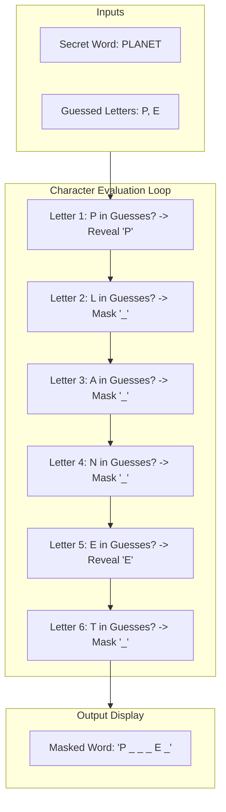
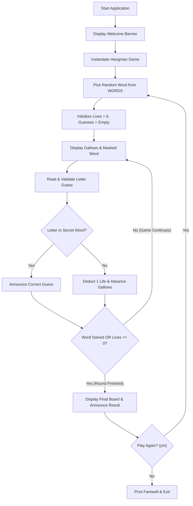
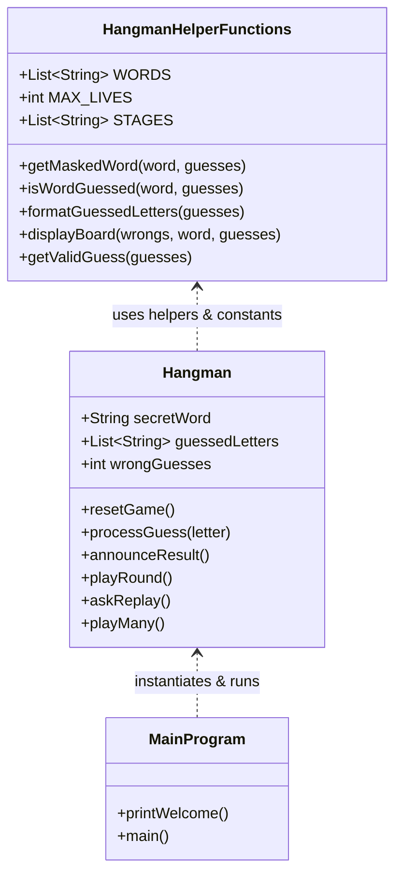

<u>**PROJECT 3 (Beginner)**</u>

# Hangman Word Guessing Game

Build an interactive, beginner-friendly Hangman word guessing game: model game state with object-oriented design, implement string masking and character verification logic, render progressive multi-stage ASCII gallows visual art, manage lives deduction and win/loss resolution, and support continuous session replay in a clean command-line interface. Language-agnostic — code it in **Python**, **C++**, or **Java**.

---

### Curriculum Outline & Learning Roadmap

- **Chapter 1: Introduction**

  - `1.1 Getting Started`

    - `[CONCEPT]` Meet Your Project

    - `[CONCEPT]` What You Will Learn

    - `[CONCEPT]` What You Need

  - `1.2 Starting with Small Steps`

    - `[CONCEPT]` First Steps into Code: The Welcome Banner

    - `[TASK 1]` Create the entry file and print welcome message

    - `[CHECKPOINT]` Milestone Checkpoint: Welcome Banner Functional!

    - `[CONCEPT]` Secret Word Pool & Lives Boundary

    - `[TASK 2]` Define word pool, maximum lives, and gallows stages

    - `[CHECKPOINT]` Milestone Checkpoint: Game Configuration Defined!

- **Chapter 2: Specifications & Architectural Plan**

  - `2.1 Understanding the Domain & Rules`

    - `[CONCEPT]` Core Rules & Multi-Stage Gallows Mechanics

    - `[CONCEPT]` Character Masking & Reveal Pipeline

  - `2.2 Chronological Execution Flow`

    - `[CONCEPT]` Chronological Execution Flow (5 Stages)

  - `2.3 System Architecture: Thinking in OOP`

    - `[CONCEPT]` Thinking in OOP (Component Responsibility Table)

- **Chapter 3: Core Word Masking Logic**

  - `3.1 Word Masking Pipeline`

    - `[CONCEPT]` Masked String Generation

    - `[TASK 3]` Build the masked word string

    - `[CHECKPOINT]` Milestone Checkpoint: Masked Word Generator Operational!

  - `3.2 Win Condition Evaluation`

    - `[CONCEPT]` Word Completion Scan

    - `[TASK 4]` Check word completion status

    - `[CHECKPOINT]` Milestone Checkpoint: Win Condition Logic Verified!

- **Chapter 4: Visual Board & Defensive Input Pipeline**

  - `4.1 Formatted Board Rendering`

    - `[CONCEPT]` Alphabetical Guessed Letters

    - `[TASK 5]` Format guessed letters display

    - `[CHECKPOINT]` Milestone Checkpoint: Guessed Letters Formatter Functional!

    - `[CONCEPT]` ASCII Gallows Visualization

    - `[TASK 6]` Render gallows and full game board

    - `[CHECKPOINT]` Milestone Checkpoint: Visual Board Display Operational!

  - `4.2 Defensive Input Validation Engine`

    - `[CONCEPT]` Raw Input Capture & Normalization

    - `[TASK 7]` Read and normalize letter input

    - `[CHECKPOINT]` Milestone Checkpoint: Raw Input Capture Operational!

    - `[CONCEPT]` Character Format Validation

    - `[TASK 8]` Validate character format

    - `[CHECKPOINT]` Milestone Checkpoint: Character Format Validation Functional!

    - `[CONCEPT]` Duplicate Prevention & Re-prompt Loop

    - `[TASK 9]` Check duplicates and finalize guess input

    - `[CHECKPOINT]` Milestone Checkpoint: Defensive Guess Pipeline Complete!

- **Chapter 5: Building the Game Engine (Thinking in OOP)**

  - `5.1 Game State & Reset Mechanics`

    - `[CONCEPT]` State Encapsulation in Hangman Class

    - `[TASK 10]` Create the Hangman class constructor

    - `[CHECKPOINT]` Milestone Checkpoint: Hangman State Initialized!

    - `[CONCEPT]` Secret Word Selection & Fresh State Initialization

    - `[TASK 11]` Implement word selection and game reset

    - `[CHECKPOINT]` Milestone Checkpoint: Game Reset & Word Selection Operational!

  - `5.2 Guess Processing & Outcome Resolution`

    - `[CONCEPT]` Registering Letters & Decrementing Lives

    - `[TASK 12]` Implement single guess processing

    - `[CHECKPOINT]` Milestone Checkpoint: Guess Processing & Lives Deduction Verified!

    - `[CONCEPT]` Result Announcement & Secret Reveal

    - `[TASK 13]` Announce outcome and reveal secret word

    - `[CHECKPOINT]` Milestone Checkpoint: Game Outcome Presentation Operational!

  - `5.3 Single-Game Turn Loop`

    - `[CONCEPT]` Turn-Based Lifecycle Architecture

    - `[TASK 14]` Construct single-game turn loop

    - `[CHECKPOINT]` Milestone Checkpoint: Single-Game Turn Loop Complete!

- **Chapter 6: Adding Replayability & Full Application Execution**

  - `6.1 Session Management`

    - `[CONCEPT]` Interactive Rematch Confirmation

    - `[TASK 15]` Implement rematch prompt

    - `[CHECKPOINT]` Milestone Checkpoint: Rematch Prompt Functional!

    - `[CONCEPT]` Multi-Game Continuous Session Engine

    - `[TASK 16]` Construct multi-game session loop

    - `[CHECKPOINT]` Milestone Checkpoint: Multi-Game Session Engine Complete!

  - `6.2 Application Assembly`

    - `[CONCEPT]` Program Inception & Launch Pipeline

    - `[TASK 17]` Assemble the main() entry point

    - `[CHECKPOINT]` Milestone Checkpoint: Full Application Experience Achieved!

- **Chapter 7: Reflect & Expand**

  - `7.1 What You Have Built` (Feature Summary & Skills Practiced Matrix)

  - `7.2 Extension Ideas`

  - `7.3 Share What You Built! Time to Showcase Your Project!`

- **Appendix: Full Pseudocode Reference**

  - `[REFERENCE]` Complete Tri-Language Algorithmic Logic

---

## Chapter 1: Introduction

### 1.1 Getting Started

**Meet Your Project**

You are about to build **Hangman** — the classic word-guessing puzzle — as a fully functional, interactive terminal game. In this project, a secret word is selected at random from an approved vocabulary bank, and the player attempts to decipher it one letter at a time before running out of attempts.

This project reinforces essential software development patterns: string manipulation, character iteration, state tracking, defensive CLI input parsing, procedural-to-object-oriented architecture transitions, and terminal visualization with ASCII art.

By completing this workbook, you will gain hands-on mastery over stateful game loops, collection filtering, input sanitation, and class construction in **Python**, **C++**, or **Java**.

**What You Will Learn**

Throughout this guided curriculum, you will build this application step by step. By the end, you will have a complete, production-grade project you can execute, explain, and expand.

You will learn how to:

1. Maintain immutable word collections and configuration constants without magic numbers
2. Dynamically mask and unmask secret strings based on player guess histories
3. Validate user inputs defensively against invalid character counts, non-alphabetic inputs, and duplicate guesses
4. Render multi-stage ASCII gallows visual art corresponding precisely to the remaining lives count
5. Encapsulate mutable round data inside an object-oriented `Hangman` class
6. Drive a turn-based execution loop that alternates between state updates and screen presentations
7. Handle end-of-game victory and defeat conditions gracefully with informative feedback
8. Implement an interactive rematch confirmation cycle that allows players to enjoy continuous gaming sessions

**What You Need**

Before you begin, ensure you have basic familiarity with:

- Terminal input and output (`input()` / `print()` in Python, `cin` / `cout` in C++, `Scanner` / `System.out.println()` in Java)
- Primitive data types, strings, lists/vectors, and arrays
- Conditional decision making (`if` / `else`) and loops (`while`, `for`)
- Basic class declarations and instance methods

---

### 1.2 Starting with Small Steps

**First Steps into Code: The Welcome Banner**

Every well-engineered application starts with a clean greeting that informs the player what software has launched. We begin by creating our project entry file and defining our banner printer.

#### Task 1 — Create the entry file and print welcome message

Establish the application entry file and output the initial greeting banner:

Think of laying the foundation stones and unlocking your workbench before assembling a project.  
*Goal*: Create your project source file and import foundational standard modules.

<div class="step-card">
  <div class="step-header">
    <span class="step-badge">STEP 1</span>
    <span class="step-title">Entry File Setup</span>
  </div>
  <ul>
    <li>[ ] Create your project source file (<code>Hangman.py</code>, <code>Hangman.cpp</code>, or <code>Hangman.java</code>).</li>
    <li>[ ] Include required foundational standard libraries and establish the primary module namespace.</li>
  </ul>
</div>

Think of illuminated neon signage outside an arcade signaling that the game is open and running.  
*Goal*: Print the official game title to the terminal standard output.

<div class="step-card">
  <div class="step-header">
    <span class="step-badge">STEP 2</span>
    <span class="step-title">Welcome Banner Output</span>
  </div>
  <ul>
    <li>[ ] Define a function or method named <code>print_welcome()</code> (or <code>printWelcome()</code>).</li>
    <li>[ ] Print the text <code>"Welcome to Hangman!"</code> followed by a newline.</li>
  </ul>
</div>

**Expected Terminal Interaction & Output:**

```text
Welcome to Hangman!
```

### Milestone Checkpoint: Welcome Banner Functional!

You have established the entry point of your application:

- [x] **Source File Established**: Created clean project file with required system imports.
- [x] **Banner Output Operational**: Greeting function cleanly outputs the game title.

**Driver Verification Test**:  
Execute `print_welcome()` (or `printWelcome()`). Verify that `Welcome to Hangman!` prints cleanly to the console.

---

**Secret Word Pool & Lives Boundary**

Hangman requires an approved vocabulary list from which mystery words are picked, an integer defining how many incorrect guesses are allowed before defeat, and graphical representations for each mistake stage.

#### Task 2 — Define word pool, maximum lives, and gallows stages

Define the immutable word list, lives limit, and ASCII gallows illustrations:

Think of loading a card deck with approved mystery vocabulary words.  
*Goal*: Declare the constant list/array of uppercase mystery puzzle words.

<div class="step-card">
  <div class="step-header">
    <span class="step-badge">STEP 1</span>
    <span class="step-title">Declare Secret Word Pool</span>
  </div>
  <ul>
    <li>[ ] Declare a constant list or array named <code>WORDS</code> populated with uppercase words: <code>"PYTHON"</code>, <code>"PLANET"</code>, <code>"ROBOT"</code>, <code>"GUITAR"</code>, <code>"SILVER"</code>, <code>"ROCKET"</code>, <code>"CODING"</code>.</li>
  </ul>
</div>

Think of painting 6 full hearts on a classic video game life bar.  
*Goal*: Establish the maximum allowable mistake threshold as an immutable constant.

<div class="step-card">
  <div class="step-header">
    <span class="step-badge">STEP 2</span>
    <span class="step-title">Declare Maximum Lives Threshold</span>
  </div>
  <ul>
    <li>[ ] Declare an integer constant named <code>MAX_LIVES</code> set to <code>6</code>.</li>
  </ul>
</div>

Think of sketching out an artist's flipbook where each page adds one line to the drawing.  
*Goal*: Store the 7 progressive multiline ASCII gallows strings in an indexed collection.

<div class="step-card">
  <div class="step-header">
    <span class="step-badge">STEP 3</span>
    <span class="step-title">Declare Gallows ASCII Art Stages</span>
  </div>
  <ul>
    <li>[ ] Declare a list or array named <code>STAGES</code> containing 7 multiline ASCII strings representing mistake counts from 0 (empty gallows) up to 6 (full figure / Game Over).</li>
  </ul>
</div>

### Milestone Checkpoint: Game Configuration Defined!

You have established the core parameters of the game:

- [x] **Word Pool Established**: 7 distinct uppercase words configured.
- [x] **Lives Limit Fixed**: `MAX_LIVES = 6` without magic numbers.
- [x] **Gallows Art Configured**: 7 progressive visual stages indexed by mistake count.

**Driver Verification Test**:  
Print `len(WORDS)` (or `WORDS.size()` / `WORDS.length`) and verify it equals `7`. Print `len(STAGES)` and verify it equals `7`. Print `MAX_LIVES` and verify it equals `6`.

---

## Chapter 2: Specifications & Architectural Plan

### 2.1 Understanding the Domain & Rules

**Core Rules & Multi-Stage Gallows Mechanics**

Hangman is played between a single player and the computer. In each round, the computer chooses a secret word from `WORDS`, and the player attempts to uncover all letters of the secret word before making 6 incorrect guesses.

The rules and visual states are governed by mistake counts:

| Mistakes | Lives Remaining | Visual Figure Description | Game State |
|---|---|---|---|
| **0** | 6 | Empty gallows beam and rope | Active Play (Fresh Round) |
| **1** | 5 | Head (`O`) attached to rope | Active Play |
| **2** | 4 | Torso (`|`) drawn | Active Play |
| **3** | 3 | Left arm (`/`) drawn | Active Play |
| **4** | 2 | Right arm (`\`) drawn | Active Play |
| **5** | 1 | Left leg (`/`) drawn | Danger: Final Life! |
| **6** | 0 | Right leg (`\`) drawn | Defeat (Game Over) |

**Character Masking & Reveal Pipeline**

At any point in the game, the word is displayed with known letters revealed and unsolved letters hidden as underscores (`_`). Each character is separated by a single space for clear readability:



1. For each character in the secret word, check if it exists in the player's guessed letters list.
2. If the character has been guessed, keep the letter visible.
3. If the character has not been guessed yet, replace it with an underscore (`_`).
4. Join the resulting characters with single space delimiters (e.g., `"P _ _ _ E _"` for `"PLANET"` with guesses `['P', 'E']`).

---

### 2.2 Chronological Execution Flow

**Five-Stage Match Execution Lifecycle**

A complete application session proceeds through five distinct stages:



1. **System Inception & Greeting**: Launch the program, display the executive welcome banner, and establish game constants.
2. **Game State Initialization**: Pick a random secret word, initialize the guessed letters collection to empty, and set wrong guesses to 0.
3. **Turn-Based Board & Input Loop**: Render the current gallows ASCII art, display the masked word, show previous guesses and lives remaining, prompt for a single letter, validate input, and record the guess.
4. **Outcome Evaluation**: Verify if all letters in the secret word have been solved (Victory) or if the player has accumulated 6 mistakes (Defeat).
5. **Outcome Announcement & Replay**: Announce congratulations or reveal the secret word, prompt for rematch confirmation, and restart or exit cleanly.

---

### 2.3 System Architecture: Thinking in OOP

**Component Responsibilities & Class Hierarchy**

Separating the game into helper functions and a stateful `Hangman` class isolates data, simplifies debugging, and enables multi-game sessions:



| Component | Responsibility |
|---|---|
| **HangmanHelperFunctions** | Houses pure static utilities and constants: `WORDS`, `MAX_LIVES`, `STAGES`, `getMaskedWord()`, `isWordGuessed()`, `formatGuessedLetters()`, `displayBoard()`, and `getValidGuess()`. |
| **Hangman** | Holds mutable round state (`secretWord`, `guessedLetters`, `wrongGuesses`). Manages word randomization, single-guess processing, outcome evaluation, turn loops, and replay flow. |
| **MainProgram** | Serves as the program entry point: displays the welcome banner, instantiates the `Hangman` engine, and starts the session loop. |

---

## Chapter 3: Core Word Masking Logic

### 3.1 Word Masking Pipeline

**Masked String Generation**

In Hangman, the player must never see the full secret word until they have correctly guessed its letters. We need a function that takes the `secret_word` and the collection of `guessed_letters`, and outputs a spaced masked string.

#### Task 3 — Build the masked word string

Construct the formatted string displaying guessed letters and underscores:

Think of laying out an empty tray of tile holders matching the length of the secret word.  
*Goal*: Prepare an empty collection container to hold the display characters.

<div class="step-card">
  <div class="step-header">
    <span class="step-badge">STEP 1</span>
    <span class="step-title">Initialize Masked Character Collection</span>
  </div>
  <ul>
    <li>[ ] Initialize an empty collection or accumulator named <code>display_chars</code> (or <code>masked</code>).</li>
  </ul>
</div>

Think of flipping over only those tiles on the puzzle board whose letters have been called.  
*Goal*: Iterate through the secret word, adding the revealed letter if guessed or an underscore if unsolved.

<div class="step-card">
  <div class="step-header">
    <span class="step-badge">STEP 2</span>
    <span class="step-title">Iterate Letters and Reveal Guessed Characters</span>
  </div>
  <ul>
    <li>[ ] Iterate through every character in <code>secret_word</code>.</li>
    <li>[ ] If the character exists in <code>guessed_letters</code>, append the character; otherwise, append an underscore (<code>"_"</code>).</li>
  </ul>
</div>

Think of spacing tiles neatly across the game table with a single gap between each space.  
*Goal*: Join all display characters with single space delimiters and return the resulting masked string.

<div class="step-card">
  <div class="step-header">
    <span class="step-badge">STEP 3</span>
    <span class="step-title">Join and Return Formatted Masked String</span>
  </div>
  <ul>
    <li>[ ] Combine characters with space delimiters and return the final string.</li>
  </ul>
</div>

### Milestone Checkpoint: Masked Word Generator Operational!

You have implemented dynamic word masking:

- [x] **Character Inspection**: Accurately matches guessed characters against target secret letters.
- [x] **Visual Masking**: Replaces unrevealed letters with underscores separated by spaces.

**Driver Verification Test**:  
Execute `get_masked_word("PLANET", ['P', 'E'])`. Verify that the return value is `"P _ _ _ E _"`.

---

### 3.2 Win Condition Evaluation

**Word Completion Scan**

To determine if the player has won the game, we must verify whether every character in the secret word has been guessed. If even a single letter remains unsolved, the game has not been won.

#### Task 4 — Check word completion status

Verify if all letters of the secret word are present in the guessed letters set:

Think of a puzzle inspector checking the board for any remaining blank spaces.  
*Goal*: Iterate through the secret word to verify whether any character has not yet been guessed.

<div class="step-card">
  <div class="step-header">
    <span class="step-badge">STEP 1</span>
    <span class="step-title">Scan Secret Word for Unsolved Letters</span>
  </div>
  <ul>
    <li>[ ] Iterate through each character in <code>secret_word</code>.</li>
    <li>[ ] If any character is not found in <code>guessed_letters</code>, immediately return <code>False</code>.</li>
  </ul>
</div>

Think of sounding the victory buzzer the moment every single tile is uncovered.  
*Goal*: Return `False` if any unsolved letter is found, or `True` once all letters are solved.

<div class="step-card">
  <div class="step-header">
    <span class="step-badge">STEP 2</span>
    <span class="step-title">Return Boolean Guess Status</span>
  </div>
  <ul>
    <li>[ ] If the loop completes without finding any missing letters, return <code>True</code>.</li>
  </ul>
</div>

### Milestone Checkpoint: Win Condition Logic Verified!

You have implemented the game completion check:

- [x] **Exhaustive Scanning**: Scans every character in the target secret word.
- [x] **Early Exit**: Immediately detects incomplete words and returns boolean status accurately.

**Driver Verification Test**:  
Execute `is_word_guessed("ROBOT", ['R', 'O', 'B', 'T'])` -> verify `True`.  
Execute `is_word_guessed("ROBOT", ['R', 'O', 'B'])` -> verify `False`.

---

## Chapter 4: Visual Board & Defensive Input Pipeline

### 4.1 Formatted Board Rendering

**Alphabetical Guessed Letters & Visual Board**

Presenting information clearly is vital in CLI games. The player needs to see an organized list of previously guessed letters, their remaining lives, the current gallows illustration, and the masked word.

#### Task 5 — Format guessed letters display

Format previous guesses into an alphabetically sorted, comma-separated string:

Think of filing index cards in alphabetical order from A to Z so they are effortless to scan.  
*Goal*: Sort the accumulated guessed letters collection into alphabetical order.

<div class="step-card">
  <div class="step-header">
    <span class="step-badge">STEP 1</span>
    <span class="step-title">Sort Guessed Letters Alphabetically</span>
  </div>
  <ul>
    <li>[ ] Check if <code>guessed_letters</code> is empty; if empty, return <code>"None"</code>.</li>
    <li>[ ] Sort a copy of the guessed letters collection in ascending alphabetical order.</li>
  </ul>
</div>

Think of printing a neat roster list on a scoreboard banner.  
*Goal*: Return `"None"` if no letters have been guessed, or join the sorted letters with `", "` separators.

<div class="step-card">
  <div class="step-header">
    <span class="step-badge">STEP 2</span>
    <span class="step-title">Construct Comma-Separated Guessed Letters String</span>
  </div>
  <ul>
    <li>[ ] Join the sorted letters with comma-space delimiters (<code>", "</code>) and return the resulting string.</li>
  </ul>
</div>

### Milestone Checkpoint: Guessed Letters Formatter Functional!

You have created a clean presentation helper for used letters:

- [x] **Empty Handling**: Displays `"None"` when no guesses have been registered.
- [x] **Alphabetical Ordering**: Always sorts letters predictably for rapid visual scanning.

**Driver Verification Test**:  
Execute `format_guessed_letters([])` -> verify `"None"`.  
Execute `format_guessed_letters(['Z', 'A', 'M'])` -> verify `"A, M, Z"`.

---

#### Task 6 — Render gallows and full game board

Display the complete visual state of the game board in the console:

Think of flipping to the exact page of the flipbook matching the player's current mistake count.  
*Goal*: Retrieve and print `STAGES[wrong_guesses]` from the gallows art collection.

<div class="step-card">
  <div class="step-header">
    <span class="step-badge">STEP 1</span>
    <span class="step-title">Print Gallows ASCII Stage for Current Mistake Count</span>
  </div>
  <ul>
    <li>[ ] Access <code>STAGES[wrong_guesses]</code> and print the corresponding ASCII illustration.</li>
  </ul>
</div>

Think of illuminating the mystery puzzle board so the player sees their current progress.  
*Goal*: Call `get_masked_word()` and print the spaced secret word representation.

<div class="step-card">
  <div class="step-header">
    <span class="step-badge">STEP 2</span>
    <span class="step-title">Print Masked Word Display</span>
  </div>
  <ul>
    <li>[ ] Call <code>get_masked_word(secret_word, guessed_letters)</code> and print the formatted word line.</li>
  </ul>
</div>

Think of displaying a side panel showing all previously called letters.  
*Goal*: Call `format_guessed_letters()` and print the used letter roster.

<div class="step-card">
  <div class="step-header">
    <span class="step-badge">STEP 3</span>
    <span class="step-title">Print Formatted Guessed Letters</span>
  </div>
  <ul>
    <li>[ ] Call <code>format_guessed_letters(guessed_letters)</code> and print the guessed letters line.</li>
  </ul>
</div>

Think of a digital health gauge displaying remaining hit points out of maximum capacity.  
*Goal*: Calculate remaining lives and print the formatted tally (`lives_left / MAX_LIVES`).

<div class="step-card">
  <div class="step-header">
    <span class="step-badge">STEP 4</span>
    <span class="step-title">Print Remaining Lives Tally</span>
  </div>
  <ul>
    <li>[ ] Calculate <code>lives_left = MAX_LIVES - wrong_guesses</code> and print <code>Lives remaining: {lives_left} / {MAX_LIVES}</code>.</li>
  </ul>
</div>

**Expected Terminal Interaction & Output:**

```text
  +---+
  |   |
      |
      |
      |
      |
=========
Word: P _ _ _ E _
Guessed letters: E, P
Lives remaining: 6 / 6
```

### Milestone Checkpoint: Visual Board Display Operational!

You have assembled the complete game state visualizer:

- [x] **Visual State Integration**: Combines gallows art, masked word, used letters, and lives.
- [x] **Mistake Indexing**: Dynamically maps mistakes directly to ASCII gallows stages.

**Driver Verification Test**:  
Execute `display_board(2, "PYTHON", ['P', 'O'])`. Verify that stage 2 (head + torso) is printed with `"Word: P _ _ _ O _"`, `"Guessed letters: O, P"`, and `"Lives remaining: 4 / 6"`.

---

### 4.2 Defensive Input Validation Engine

**Defensive Programming: CLI Input Validation**

Players can type anything into a terminal: lowercase letters, multiple letters, symbols, numbers, or empty strings. A robust application must never crash when unexpected input is received. We build a modular 3-stage validation pipeline:

1. Read raw text and normalize to uppercase.
2. Validate that input is exactly 1 alphabetic character.
3. Check against already guessed letters and prompt until valid.

#### Task 7 — Read and normalize letter input

Prompt the player and convert raw text into an uppercase character string:

Think of the game host stepping forward and asking the player for their letter choice.  
*Goal*: Display an interactive terminal prompt asking for a single letter.

<div class="step-card">
  <div class="step-header">
    <span class="step-badge">STEP 1</span>
    <span class="step-title">Prompt Player for Guess Input</span>
  </div>
  <ul>
    <li>[ ] Display the input prompt <code>"\nEnter your guess (a single letter): "</code> without a trailing newline.</li>
  </ul>
</div>

Think of cleaning off excess ink and stamping a neat uppercase letter on an official ballot.  
*Goal*: Strip leading/trailing whitespace and convert the input string to uppercase.

<div class="step-card">
  <div class="step-header">
    <span class="step-badge">STEP 2</span>
    <span class="step-title">Trim Whitespace and Convert to Uppercase</span>
  </div>
  <ul>
    <li>[ ] Read user input, trim leading/trailing whitespace, and convert characters to uppercase.</li>
  </ul>
</div>

**Expected Terminal Interaction & Output:**

```text
Enter your guess (a single letter): e
```

### Milestone Checkpoint: Raw Input Capture Operational!

You have built the input reader and normalizer:

- [x] **Prompt Presentation**: Clearly prompts player for a single letter.
- [x] **Case & Whitespace Normalization**: Automatically trims spaces and converts to uppercase.

---

#### Task 8 — Validate character format

Verify that the input consists of exactly one alphabetic character (A-Z):

Think of a coin slot with an exact aperture that rejects anything that is not a single token.  
*Goal*: Confirm that the trimmed input string has a length of exactly 1 character.

<div class="step-card">
  <div class="step-header">
    <span class="step-badge">STEP 1</span>
    <span class="step-title">Verify Exactly One Character Length</span>
  </div>
  <ul>
    <li>[ ] Check if the string length equals <code>1</code>.</li>
  </ul>
</div>

Think of an automated filter that discards numbers, symbols, and punctuation marks.  
*Goal*: Verify that the single character belongs strictly to the alphabet (`A-Z`).

<div class="step-card">
  <div class="step-header">
    <span class="step-badge">STEP 2</span>
    <span class="step-title">Verify Character is Alphabetic</span>
  </div>
  <ul>
    <li>[ ] Check if the single character is an alphabetic letter (A through Z).</li>
  </ul>
</div>

### Milestone Checkpoint: Character Format Validation Functional!

You have built the single-character validator:

- [x] **Length Guard**: Rejects empty strings, multiple letters, and whole words.
- [x] **Alpha Guard**: Rejects numbers, punctuation, and special characters.

**Driver Verification Test**:  
Verify `is_valid_format("A")` is `True`. Verify `is_valid_format("AB")`, `is_valid_format("1")`, and `is_valid_format("")` are `False`.

---

#### Task 9 — Check duplicates and finalize guess input

Combine format validation with duplicate checking in an interactive retry loop:

Think of checking the player's discard pile to confirm this letter has not already been played.  
*Goal*: Check whether the valid uppercase character already exists in the `guessed_letters` collection.

<div class="step-card">
  <div class="step-header">
    <span class="step-badge">STEP 1</span>
    <span class="step-title">Verify Letter Has Not Been Guessed Yet</span>
  </div>
  <ul>
    <li>[ ] Check if the sanitized candidate letter already exists in <code>guessed_letters</code>.</li>
  </ul>
</div>

Think of a referee politely reminding the player that a move has already been used.  
*Goal*: Print an informative message letting the player know they already guessed that letter.

<div class="step-card">
  <div class="step-header">
    <span class="step-badge">STEP 2</span>
    <span class="step-title">Output Friendly Duplicate Notification</span>
  </div>
  <ul>
    <li>[ ] If duplicate, print <code>"You already guessed '{letter}'. Try a different letter."</code>.</li>
    <li>[ ] If invalid format, print <code>"Invalid input. Please enter exactly one alphabetic letter (A-Z)."</code>.</li>
  </ul>
</div>

Think of a turnstile that remains locked until a valid, fresh token is provided.  
*Goal*: Wrap validation inside an indefinite loop, returning only when a clean, unique letter is received.

<div class="step-card">
  <div class="step-header">
    <span class="step-badge">STEP 3</span>
    <span class="step-title">Loop Until Valid Unique Letter Received</span>
  </div>
  <ul>
    <li>[ ] Wrap in a <code>while True</code> loop and return the valid letter as soon as all conditions pass.</li>
  </ul>
</div>

### Milestone Checkpoint: Defensive Guess Pipeline Complete!

You have completed the bulletproof CLI input subsystem:

- [x] **Input Sanitation**: Trims whitespace and enforces single alphabetic character rules.
- [x] **Duplicate Defense**: Prohibits wasting turns on repeated guesses.
- [x] **Continuous Retry**: Re-prompts smoothly without crashes.

---

## Chapter 5: Building the Game Engine (Thinking in OOP)

### 5.1 Game State & Reset Mechanics

**State Encapsulation in Hangman Class**

Now that all standalone utilities are operational, we encapsulate the dynamic round data inside a dedicated `Hangman` class. This class maintains the active mystery word, guessed letters, and wrong guesses counter.

#### Task 10 — Create the Hangman class constructor

Initialize the `Hangman` class attributes and state variables:

Think of reserving a blank slate inside an envelope before the mystery word is chosen.  
*Goal*: Initialize the `secret_word` instance variable to an empty string.

<div class="step-card">
  <div class="step-header">
    <span class="step-badge">STEP 1</span>
    <span class="step-title">Initialize Secret Word Attribute</span>
  </div>
  <ul>
    <li>[ ] Initialize instance attribute <code>self.secret_word = ""</code> (or <code>secretWord = ""</code>).</li>
  </ul>
</div>

Think of placing an empty notebook on the desk to track incoming guesses.  
*Goal*: Initialize `guessed_letters` to an empty list or collection.

<div class="step-card">
  <div class="step-header">
    <span class="step-badge">STEP 2</span>
    <span class="step-title">Initialize Guessed Letters Collection Attribute</span>
  </div>
  <ul>
    <li>[ ] Initialize instance attribute <code>self.guessed_letters = []</code> (or empty collection).</li>
  </ul>
</div>

Think of setting the scoreboard mistake counter to zero before opening kickoff.  
*Goal*: Initialize the `wrong_guesses` integer counter to 0.

<div class="step-card">
  <div class="step-header">
    <span class="step-badge">STEP 3</span>
    <span class="step-title">Initialize Wrong Guesses Counter Attribute</span>
  </div>
  <ul>
    <li>[ ] Initialize instance attribute <code>self.wrong_guesses = 0</code> (or <code>wrongGuesses = 0</code>).</li>
  </ul>
</div>

### Milestone Checkpoint: Hangman State Initialized!

You have created the object-oriented state holder:

- [x] **State Encapsulation**: Cleanly bundles secret word, guessed letters, and wrong guesses count.
- [x] **Safe Initialization**: Initializes empty containers and zeroed counters.

---

#### Task 11 — Implement word selection and game reset

Select a new random secret word and clear round variables for a fresh match:

Think of reaching into a bingo hopper and drawing one secret word at random.  
*Goal*: Select a random word from `WORDS` and assign it to `self.secret_word`.

<div class="step-card">
  <div class="step-header">
    <span class="step-badge">STEP 1</span>
    <span class="step-title">Pick Random Word from Word Pool</span>
  </div>
  <ul>
    <li>[ ] Use the language random generator to choose a random word from <code>WORDS</code> and assign it to <code>secret_word</code>.</li>
  </ul>
</div>

Think of wiping the whiteboard completely clean between matches.  
*Goal*: Clear all entries from the `guessed_letters` collection.

<div class="step-card">
  <div class="step-header">
    <span class="step-badge">STEP 2</span>
    <span class="step-title">Reset Guessed Letters Collection</span>
  </div>
  <ul>
    <li>[ ] Clear all elements in <code>guessed_letters</code> so it becomes an empty list.</li>
  </ul>
</div>

Think of resetting the gallows scaffold back to its pristine, empty starting position.  
*Goal*: Set `self.wrong_guesses = 0`.

<div class="step-card">
  <div class="step-header">
    <span class="step-badge">STEP 3</span>
    <span class="step-title">Reset Wrong Guesses Counter to Zero</span>
  </div>
  <ul>
    <li>[ ] Set <code>wrong_guesses = 0</code>.</li>
  </ul>
</div>

### Milestone Checkpoint: Game Reset & Word Selection Operational!

You have implemented dynamic word picking and session reset:

- [x] **Word Randomization**: Picks unpredictable target words from `WORDS`.
- [x] **State Sanitation**: Flushes prior match history cleanly.

**Driver Verification Test**:  
Instantiate `game = Hangman()` and call `reset_game()`. Verify `game.secret_word in WORDS`, `len(game.guessed_letters) == 0`, and `game.wrong_guesses == 0`.

---

### 5.2 Guess Processing & Outcome Resolution

**Registering Letters & Decrementing Lives**

When a player inputs a valid letter, two actions must occur:

1. The letter is added to `guessed_letters`.
2. If the letter is in `secret_word`, praise the player; if not, increment `wrong_guesses` and notify the player.

#### Task 12 — Implement single guess processing

Process an individual letter guess and update game state:

Think of logging a contestant's official answer into the match record.  
*Goal*: Append the validated `letter` into `self.guessed_letters`.

<div class="step-card">
  <div class="step-header">
    <span class="step-badge">STEP 1</span>
    <span class="step-title">Register Letter in Guessed Letters Collection</span>
  </div>
  <ul>
    <li>[ ] Append the validated <code>letter</code> parameter to <code>self.guessed_letters</code>.</li>
  </ul>
</div>

Think of celebratory bells ringing when a contestant hits a bullseye.  
*Goal*: If `letter` is in `self.secret_word`, print a positive confirmation message.

<div class="step-card">
  <div class="step-header">
    <span class="step-badge">STEP 2</span>
    <span class="step-title">Branch on Match: Announce Correct Guess</span>
  </div>
  <ul>
    <li>[ ] If <code>letter in self.secret_word</code>, print <code>"\nGood guess! '{letter}' is in the word!"</code>.</li>
  </ul>
</div>

Think of a warning buzzer sounding while an extra life token is removed.  
*Goal*: If `letter` is not in `self.secret_word`, increment `self.wrong_guesses` by 1 and print an informative miss notice.

<div class="step-card">
  <div class="step-header">
    <span class="step-badge">STEP 3</span>
    <span class="step-title">Branch on Miss: Increment Wrong Guesses and Announce Miss</span>
  </div>
  <ul>
    <li>[ ] Otherwise, increment <code>self.wrong_guesses += 1</code> and print <code>"\nSorry! '{letter}' is not in the word."</code>.</li>
  </ul>
</div>

**Expected Terminal Interaction & Output:**

```text
Good guess! 'P' is in the word!
```

### Milestone Checkpoint: Guess Processing & Lives Deduction Verified!

You have implemented round state mutations:

- [x] **Guess Registration**: Accurately tracks every player attempt.
- [x] **Lives Deduction**: Increments mistake counter solely when a wrong letter is supplied.
- [x] **Immediate Feedback**: Gives instant verbal feedback on success or miss.

**Driver Verification Test**:  
Set `game.secret_word = "ROBOT"`. Call `game.process_guess("O")` -> verify `game.wrong_guesses == 0`. Call `game.process_guess("Z")` -> verify `game.wrong_guesses == 1`.

---

#### Task 13 — Announce outcome and reveal secret word

Render the final board state and announce whether the player won or ran out of lives:

Think of freezing the game field and displaying the final scoreboard for all to see.  
*Goal*: Call `display_board()` with the final state so the full picture is visible.

<div class="step-card">
  <div class="step-header">
    <span class="step-badge">STEP 1</span>
    <span class="step-title">Render Final Game Board State</span>
  </div>
  <ul>
    <li>[ ] Call <code>display_board(self.wrong_guesses, self.secret_word, self.guessed_letters)</code> to show the final board appearance.</li>
  </ul>
</div>

Think of crowning a triumphant champion under stadium spotlights.  
*Goal*: If `is_word_guessed()` returns `True`, print a celebratory victory proclamation.

<div class="step-card">
  <div class="step-header">
    <span class="step-badge">STEP 2</span>
    <span class="step-title">Evaluate Victory Condition and Congratulate Player</span>
  </div>
  <ul>
    <li>[ ] If <code>is_word_guessed()</code> is <code>True</code>, print <code>"\nCONGRATULATIONS! You solved the secret word: {self.secret_word}!"</code>.</li>
  </ul>
</div>

Think of lifting the mystery curtain after time expires to reveal the hidden answer.  
*Goal*: If lives are exhausted, print a polite game-over message revealing the secret word.

<div class="step-card">
  <div class="step-header">
    <span class="step-badge">STEP 3</span>
    <span class="step-title">Evaluate Defeat Condition and Reveal Secret Word</span>
  </div>
  <ul>
    <li>[ ] Otherwise, print <code>"\nGAME OVER! You ran out of lives. The secret word was: {self.secret_word}."</code>.</li>
  </ul>
</div>

**Expected Terminal Interaction & Output:**

```text
  +---+
  |   |
      |
      |
      |
      |
=========
Word: P L A N E T
Guessed letters: A, E, L, N, P, T
Lives remaining: 6 / 6

CONGRATULATIONS! You solved the secret word: PLANET!
```

### Milestone Checkpoint: Game Outcome Presentation Operational!

You have implemented outcome resolution:

- [x] **Final Board Synchronization**: Guarantees the player sees the full completed or failed board.
- [x] **Closure & Word Reveal**: Always informs the player of the mystery word upon defeat.

---

### 5.3 Single-Game Turn Loop

**Turn-Based Lifecycle Architecture**

A single match orchestrates the full turn lifecycle: resetting state, displaying the match banner, and repeatedly presenting the board, reading guesses, and updating state until either the word is solved or 6 mistakes have accumulated.

#### Task 14 — Construct single-game turn loop

Tie all round mechanisms together into `play_round()`:

Think of preparing the arena for opening round by clearing the board and drawing a new secret word.  
*Goal*: Call `self.reset_game()` to initialize a fresh round.

<div class="step-card">
  <div class="step-header">
    <span class="step-badge">STEP 1</span>
    <span class="step-title">Reset Game State for New Match</span>
  </div>
  <ul>
    <li>[ ] Call <code>self.reset_game()</code> to pick a new secret word and clear counters.</li>
  </ul>
</div>

Think of the master of ceremonies announcing the start of a brand new puzzle game.  
*Goal*: Output the new game header banner and announce the secret word's letter length.

<div class="step-card">
  <div class="step-header">
    <span class="step-badge">STEP 2</span>
    <span class="step-title">Print Match Start Banner</span>
  </div>
  <ul>
    <li>[ ] Print <code>"\n===== NEW HANGMAN GAME ====="</code> and the secret word length indicator.</li>
  </ul>
</div>

Think of rounds ticking by like consecutive innings in a baseball match.  
*Goal*: While `wrong_guesses < MAX_LIVES` and not `is_word_guessed()`, display the board, collect a guess, and process it.

<div class="step-card">
  <div class="step-header">
    <span class="step-badge">STEP 3</span>
    <span class="step-title">Run Turn Loop While Alive and Unsolved</span>
  </div>
  <ul>
    <li>[ ] While <code>self.wrong_guesses < MAX_LIVES</code> and <code>not is_word_guessed(self.secret_word, self.guessed_letters)</code>:</li>
    <li>[ ] Render board via <code>display_board(self.wrong_guesses, self.secret_word, self.guessed_letters)</code>, collect guess via <code>get_valid_guess(self.guessed_letters)</code>, and process guess via <code>self.process_guess(guess)</code>.</li>
  </ul>
</div>

Think of blowing the final whistle and delivering the official match resolution.  
*Goal*: Call `self.announce_result()` once the gameplay loop terminates.

<div class="step-card">
  <div class="step-header">
    <span class="step-badge">STEP 4</span>
    <span class="step-title">Call Outcome Announcer</span>
  </div>
  <ul>
    <li>[ ] After loop exit, call <code>self.announce_result()</code>.</li>
  </ul>
</div>

**Expected Terminal Interaction & Output:**

```text
===== NEW HANGMAN GAME =====
A secret word has been chosen with 6 letters. Good luck!

  +---+
  |   |
      |
      |
      |
      |
=========
Word: _ _ _ _ _ _
Guessed letters: None
Lives remaining: 6 / 6

Enter your guess (a single letter): e
Good guess! 'E' is in the word!
```

### Milestone Checkpoint: Single-Game Turn Loop Complete!

You have built the complete single-game turn coordinator:

- [x] **Loop Boundary Integrity**: Never allows turns past 6 mistakes or after the word is solved.
- [x] **Complete Workflow**: Orchestrates reset, turn presentation, guess processing, and final announcement.

---

## Chapter 6: Adding Replayability & Full Application Execution

### 6.1 Session Management

**Continuous Gaming & Rematch Loops**

For a polished user experience, players should be able to play multiple games in a single session without having to restart the script from the terminal. We build an interactive rematch prompt and a multi-game session loop.

#### Task 15 — Implement rematch prompt

Ask the player if they wish to play again, validating `"y"` or `"n"`:

Think of an arcade cabinet flashing "CONTINUE?" waiting patiently for player input.  
*Goal*: Establish an indefinite loop that persists until valid confirmation is received.

<div class="step-card">
  <div class="step-header">
    <span class="step-badge">STEP 1</span>
    <span class="step-title">Run Interactive Replay Prompt Loop</span>
  </div>
  <ul>
    <li>[ ] Start a <code>while True</code> loop prompting <code>"\nPlay again? (y/n): "</code>.</li>
  </ul>
</div>

Think of reading the player's response and smoothing away accidental spaces or case differences.  
*Goal*: Prompt with `"Play again? (y/n): "`, trim whitespace, and lowercase the input.

<div class="step-card">
  <div class="step-header">
    <span class="step-badge">STEP 2</span>
    <span class="step-title">Read and Normalize Confirmation Input</span>
  </div>
  <ul>
    <li>[ ] Read user response, strip whitespace, and convert to lowercase.</li>
  </ul>
</div>

Think of flipping the power switch to ON or OFF depending on the player's choice.  
*Goal*: Return `True` for `"y"`, `False` for `"n"`, or print `"Please type y or n."` and re-prompt.

<div class="step-card">
  <div class="step-header">
    <span class="step-badge">STEP 3</span>
    <span class="step-title">Return Boolean Replay Decision</span>
  </div>
  <ul>
    <li>[ ] Return <code>True</code> if <code>"y"</code>; return <code>False</code> if <code>"n"</code>; otherwise print <code>"Please type y or n."</code> and re-prompt.</li>
  </ul>
</div>

**Expected Terminal Interaction & Output:**

```text
Play again? (y/n): maybe
Please type y or n.

Play again? (y/n): y
```

### Milestone Checkpoint: Rematch Prompt Functional!

You have implemented the replay inquiry mechanism:

- [x] **Case-Insensitive Normalization**: Accepts upper or lowercase input cleanly.
- [x] **Defensive Guard**: Politely rejects invalid input and re-prompts without exiting.

---

#### Task 16 — Construct multi-game session loop

Wrap `play_round()` in a continuous multi-match session controller:

Think of an arcade cabinet that stays powered on for as many games as the player desires.  
*Goal*: Establish an indefinite outer session loop to orchestrate continuous play.

<div class="step-card">
  <div class="step-header">
    <span class="step-badge">STEP 1</span>
    <span class="step-title">Run Indefinite Session Loop</span>
  </div>
  <ul>
    <li>[ ] Start an indefinite <code>while True</code> loop in method <code>play_many()</code>.</li>
  </ul>
</div>

Think of loading and playing through one complete puzzle round.  
*Goal*: Call `self.play_round()` to run a full single match from start to finish.

<div class="step-card">
  <div class="step-header">
    <span class="step-badge">STEP 2</span>
    <span class="step-title">Execute Game Lifecycle</span>
  </div>
  <ul>
    <li>[ ] Call <code>self.play_round()</code> to run a complete game match.</li>
  </ul>
</div>

Think of consulting the player at the end of each round to see if they wish to continue.  
*Goal*: Call `self.ask_replay()` to evaluate if another game should be launched.

<div class="step-card">
  <div class="step-header">
    <span class="step-badge">STEP 3</span>
    <span class="step-title">Prompt for Rematch Confirmation</span>
  </div>
  <ul>
    <li>[ ] Call <code>not self.ask_replay()</code> to evaluate if the player wishes to stop.</li>
  </ul>
</div>

Think of waving goodbye and thanking guests as they step outside the game center.  
*Goal*: If the player declines replay, print `"Thanks for playing Hangman!"` and break the loop.

<div class="step-card">
  <div class="step-header">
    <span class="step-badge">STEP 4</span>
    <span class="step-title">Print Session Farewell on Exit</span>
  </div>
  <ul>
    <li>[ ] Print <code>"\nThanks for playing Hangman!"</code> and break out of the session loop.</li>
  </ul>
</div>

**Expected Terminal Interaction & Output:**

```text
Play again? (y/n): n
Thanks for playing Hangman!
```

### Milestone Checkpoint: Multi-Game Session Engine Complete!

You have completed the multi-round gameplay coordinator:

- [x] **Continuous Play**: Supports back-to-back puzzle rounds without restarting the program.
- [x] **Clean Termination**: Breaks out cleanly and prints a parting farewell.

---

### 6.2 Application Assembly

**Program Inception & Launch Pipeline**

With all classes, helpers, and state loops complete, the final step is to assemble the `main()` entry function to greet the user, instantiate the game engine, and launch the session.

#### Task 17 — Assemble the main() entry point

Wire the entire application together inside `main()`:

Think of switching on the arena marquee lights to greet visitors.  
*Goal*: Call `print_welcome()` to render the official application title.

<div class="step-card">
  <div class="step-header">
    <span class="step-badge">STEP 1</span>
    <span class="step-title">Call Welcome Banner Function</span>
  </div>
  <ul>
    <li>[ ] Invoke <code>print_welcome()</code> (or <code>printWelcome()</code>).</li>
  </ul>
</div>

Think of deploying the game director to take charge of the tournament.  
*Goal*: Create a new instance of the `Hangman` class.

<div class="step-card">
  <div class="step-header">
    <span class="step-badge">STEP 2</span>
    <span class="step-title">Instantiate Hangman Game Manager</span>
  </div>
  <ul>
    <li>[ ] Create an instance of <code>Hangman</code> named <code>game</code>.</li>
  </ul>
</div>

Think of handing over the microphone and opening play to the contestants.  
*Goal*: Call `game.play_many()` to commence the continuous game session.

<div class="step-card">
  <div class="step-header">
    <span class="step-badge">STEP 3</span>
    <span class="step-title">Launch Multi-Game Session Loop</span>
  </div>
  <ul>
    <li>[ ] Call <code>game.play_many()</code> (or <code>game.playMany()</code>) and add standard script execution guards.</li>
  </ul>
</div>

**Expected Terminal Interaction & Output:**

```text
Welcome to Hangman!

===== NEW HANGMAN GAME =====
A secret word has been chosen with 6 letters. Good luck!
```

### Milestone Checkpoint: Full Application Experience Achieved!

You have completed the entire Hangman architecture:

- [x] **Unified Architecture**: All 17 tasks and 49 steps wired into a cohesive, production-grade CLI game.
- [x] **Tri-Language Parity**: Identical operational logic and structure across Python, C++, and Java.
- [x] **Complete Polish**: Defensive input parsing, ASCII art visualization, and seamless replay loops.

---

## Chapter 7: Reflect & Expand

### 7.1 What You Have Built

You have designed and constructed an interactive, object-oriented Hangman application from scratch. Take a moment to review the software engineering patterns and algorithmic foundations you practiced:

| Feature Dimension | Implementation Technique | Educational Value |
|---|---|---|
| **Constants & Boundaries** | `WORDS`, `MAX_LIVES`, `STAGES` | Eliminates hard-coded magic values; centralizes game difficulty configuration. |
| **String Masking** | Dynamic character-by-character evaluation | Teaches string concatenation, list filtering, and membership checks. |
| **Defensive Input** | 3-stage validation pipeline (`read`, `format`, `duplicates`) | Guards CLI applications against crashes caused by malformed user input. |
| **Terminal Graphics** | Progressive ASCII art stages | Visualizes numeric state changes into intuitive graphical representations. |
| **OOP Encapsulation** | `Hangman` class with instance state | Separates persistent round state from stateless functional utilities. |
| **Interactive Loops** | Multi-game replay coordinator | Demonstrates session management and continuous interactive user loops. |

---

### 7.2 Extension Ideas

Now that you have a functioning game engine, consider challenging yourself with these creative extensions:

1. **Difficulty Settings**: Add easy (8 lives), medium (6 lives), and hard (4 lives) modes with different word lists.
2. **Category Selection**: Allow players to pick word topics (such as Animals, Countries, Programming Languages, or Science).
3. **High Score Tracker**: Save win streaks and best completion times to a local JSON file across sessions.
4. **Hint System**: Allow the player to type `"?"` to reveal a single random unsolved letter at the cost of 2 lives.

---

### 7.3 Share What You Built! Time to Showcase Your Project!

Congratulations on completing Project 3! You now have a complete, polished portfolio project that demonstrates your understanding of object-oriented design and defensive programming.

- Push your repository to GitHub with a clean `README.md` and screenshot recordings.
- Share your code with fellow learners and explain how your 3-stage input pipeline prevents invalid character crashes.
- Explore running your implementation in Python, C++, and Java to appreciate the syntactic strengths of each language.

---

## Appendix: Full Pseudocode Reference

### Complete Tri-Language Algorithmic Logic

```text
PROGRAM HangmanGame:
    CONSTANT WORDS = ["PYTHON", "PLANET", "ROBOT", "GUITAR", "SILVER", "ROCKET", "CODING"]
    CONSTANT MAX_LIVES = 6
    CONSTANT STAGES = [7 ASCII art strings for mistakes 0 through 6]

    FUNCTION print_welcome():
        OUTPUT "Welcome to Hangman!"

    FUNCTION get_masked_word(secret_word, guessed_letters):
        SET display_chars = []
        FOR EACH letter IN secret_word:
            IF letter IN guessed_letters THEN
                APPEND letter TO display_chars
            ELSE
                APPEND "_" TO display_chars
            END IF
        END FOR
        RETURN JOIN display_chars WITH " "

    FUNCTION is_word_guessed(secret_word, guessed_letters):
        FOR EACH letter IN secret_word:
            IF letter NOT IN guessed_letters THEN
                RETURN False
            END IF
        END FOR
        RETURN True

    FUNCTION format_guessed_letters(guessed_letters):
        IF guessed_letters IS EMPTY THEN
            RETURN "None"
        END IF
        SET sorted_letters = SORT(guessed_letters)
        RETURN JOIN sorted_letters WITH ", "

    FUNCTION display_board(wrong_guesses, secret_word, guessed_letters):
        OUTPUT STAGES[wrong_guesses]
        OUTPUT "Word: " + get_masked_word(secret_word, guessed_letters)
        OUTPUT "Guessed letters: " + format_guessed_letters(guessed_letters)
        SET lives_left = MAX_LIVES - wrong_guesses
        OUTPUT "Lives remaining: " + lives_left + " / " + MAX_LIVES

    FUNCTION read_raw_guess():
        PROMPT "\nEnter your guess (a single letter): "
        READ user_input
        RETURN TRIM(UPPERCASE(user_input))

    FUNCTION is_valid_format(guess):
        RETURN LENGTH(guess) == 1 AND IS_ALPHA(guess)

    FUNCTION get_valid_guess(guessed_letters):
        WHILE True:
            SET guess = read_raw_guess()
            IF NOT is_valid_format(guess) THEN
                OUTPUT "Invalid input. Please enter exactly one alphabetic letter (A-Z)."
            ELSE IF guess IN guessed_letters THEN
                OUTPUT "You already guessed '" + guess + "'. Try a different letter."
            ELSE
                RETURN guess
            END IF
        END WHILE

    CLASS Hangman:
        CONSTRUCTOR:
            SET self.secret_word = ""
            SET self.guessed_letters = []
            SET self.wrong_guesses = 0

        METHOD reset_game():
            SET self.secret_word = RANDOM_CHOICE(WORDS)
            SET self.guessed_letters = []
            SET self.wrong_guesses = 0

        METHOD process_guess(letter):
            APPEND letter TO self.guessed_letters
            IF letter IN self.secret_word THEN
                OUTPUT "Good guess! '" + letter + "' is in the word!"
            ELSE
                SET self.wrong_guesses = self.wrong_guesses + 1
                OUTPUT "Sorry! '" + letter + "' is not in the word."
            END IF

        METHOD announce_result():
            CALL display_board(self.wrong_guesses, self.secret_word, self.guessed_letters)
            IF is_word_guessed(self.secret_word, self.guessed_letters) THEN
                OUTPUT "CONGRATULATIONS! You solved the secret word: " + self.secret_word + "!"
            ELSE
                OUTPUT "GAME OVER! You ran out of lives. The secret word was: " + self.secret_word + "."
            END IF

        METHOD play_round():
            CALL self.reset_game()
            OUTPUT "===== NEW HANGMAN GAME ====="
            OUTPUT "A secret word has been chosen with " + LENGTH(self.secret_word) + " letters. Good luck!"
            WHILE self.wrong_guesses < MAX_LIVES AND NOT is_word_guessed(self.secret_word, self.guessed_letters):
                CALL display_board(self.wrong_guesses, self.secret_word, self.guessed_letters)
                SET guess = CALL get_valid_guess(self.guessed_letters)
                CALL self.process_guess(guess)
            END WHILE
            CALL self.announce_result()

        METHOD ask_replay():
            WHILE True:
                PROMPT "Play again? (y/n): "
                READ answer
                SET normalized = TRIM(LOWERCASE(answer))
                IF normalized == "y" THEN
                    RETURN True
                ELSE IF normalized == "n" THEN
                    RETURN False
                ELSE
                    OUTPUT "Please type y or n."
                END IF
            END WHILE

        METHOD play_many():
            WHILE True:
                CALL self.play_round()
                IF NOT self.ask_replay() THEN
                    OUTPUT "Thanks for playing Hangman!"
                    BREAK
                END IF
            END WHILE

    FUNCTION main():
        CALL print_welcome()
        SET game = NEW Hangman()
        CALL game.play_many()

END PROGRAM
```