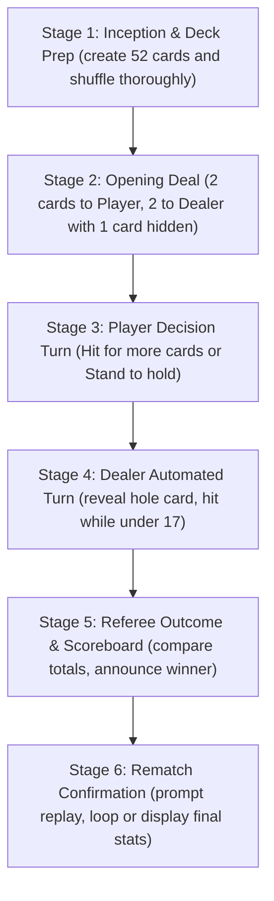

<u>**PROJECT 4 (Beginner)**</u>

# Blackjack Game

Build an interactive, beginner-friendly Blackjack game: model playing cards and 52-card shoe collections, implement dynamic Ace evaluation (11 or 1), manage hidden hole card state, run an interactive turn-based Hit/Stand loop against an automated casino Dealer, track a cumulative multi-round session scoreboard, and manage continuous replay in a clean CLI interface. Language-agnostic — code it in **Python**, **C++**, or **Java**.

---

### Curriculum Outline & Learning Roadmap

- **Chapter 1: Introduction**

  - `1.1 Getting Started`

    - `[CONCEPT]` Meet Your Project

    - `[CONCEPT]` What You Will Learn

    - `[CONCEPT]` What You Need

  - `1.2 Starting with Small Steps`

    - `[CONCEPT]` First Steps into Code: The Welcome Banner

    - `[TASK 1]` Create the entry file and print welcome message

    - `[CHECKPOINT]` Milestone Checkpoint: Environment Operational & Greeting Verified!

    - `[CONCEPT]` Standard Card Anatomy & Deck Boundaries

    - `[TASK 2]` Define standard ranks and suits constants

    - `[CHECKPOINT]` Milestone Checkpoint: Card Configuration Constants Configured!

- **Chapter 2: Rules & Design Plan**

  - `2.1 Understanding the Game`

    - `[CONCEPT]` Blackjack Mechanics & Point Scoring

    - `[CONCEPT]` Card Values & The Dynamic Ace Rule

  - `2.2 Planning the Game`

    - `[CONCEPT]` Chronological Execution Flow (6 Stages)

    - `[CONCEPT]` Thinking in OOP (Component Responsibility Table)

- **Chapter 3: Cards & Deck Architecture**

  - `3.1 Modeling Playing Cards`

    - `[CONCEPT]` State Encapsulation: The Card Model

    - `[TASK 3]` Create the Card class

    - `[CHECKPOINT]` Milestone Checkpoint: Card Entity Model Verified!

  - `3.2 Deck Generation & Manipulation`

    - `[CONCEPT]` Cartesian Product: Populating 52 Unique Cards

    - `[TASK 4]` Create and populate the 52-card deck

    - `[CHECKPOINT]` Milestone Checkpoint: Deck Generation Operational!

    - `[CONCEPT]` Random Permutation: Shuffling the Shoe

    - `[TASK 5]` Shuffle the deck

    - `[CHECKPOINT]` Milestone Checkpoint: Random Deck Shuffler Verified!

    - `[CONCEPT]` The Deal: Drawing from the Top of the Deck

    - `[TASK 6]` Deal a card from the deck

    - `[CHECKPOINT]` Milestone Checkpoint: Card Dealing Mechanic Functional!

- **Chapter 4: Scoring Engine & Hand Visualization**

  - `4.1 Dynamic Score Calculation`

    - `[CONCEPT]` The Dual-Value Ace Dilemma (Dynamic Downgrading)

    - `[TASK 7]` Calculate hand value with automatic Ace adjustment

    - `[CHECKPOINT]` Milestone Checkpoint: Dynamic Ace Scoring Engine Complete!

  - `4.2 Hand Visualization & Information Masking`

    - `[CONCEPT]` Managing Imperfect Information: Revealed vs Hidden Cards

    - `[TASK 8]` Display hands with hidden hole card support

    - `[CHECKPOINT]` Milestone Checkpoint: Hand Visualization Verified!

- **Chapter 5: Turn Controllers & Referee Engine**

  - `5.1 Player Turn Controller`

    - `[CONCEPT]` Defensive Programming: Hit or Stand CLI Prompting

    - `[TASK 9]` Prompt and validate Player choice (Hit or Stand)

    - `[CHECKPOINT]` Milestone Checkpoint: Defensive Player Input Operational!

  - `5.2 Automated Dealer House AI`

    - `[CONCEPT]` Automating the Casino Dealer: The 17+ Fixed Rule

    - `[TASK 10]` Execute Dealer's automated turn

    - `[CHECKPOINT]` Milestone Checkpoint: Dealer Automated AI Operational!

  - `5.3 Outcome Determination`

    - `[CONCEPT]` The Referee Engine: Decision Hierarchy & Tie Resolution

    - `[TASK 11]` Determine and announce round outcome

    - `[CHECKPOINT]` Milestone Checkpoint: Outcome Determination Engine Verified!

- **Chapter 6: Session Management & Application Assembly**

  - `6.1 Session Scoreboard`

    - `[CONCEPT]` Cumulative Session Tracking: Wins, Losses, and Ties

    - `[TASK 12]` Manage and display session scoreboard

    - `[CHECKPOINT]` Milestone Checkpoint: Session Scoreboard Operational!

  - `6.2 Round Orchestration`

    - `[CONCEPT]` System Coordination: The BlackjackGame Controller Skeleton

    - `[TASK 13]` Create BlackjackGame class and implement playRound()

    - `[CHECKPOINT]` Milestone Checkpoint: Full Round Lifecycle Coordinated!

  - `6.3 Rematch & Multi-Round Loop`

    - `[CONCEPT]` Interactive Pacing: Rematch Confirmation

    - `[TASK 14]` Implement askReplay()

    - `[CHECKPOINT]` Milestone Checkpoint: Rematch Prompt Functional!

    - `[CONCEPT]` Continuous Session Operations: The Multi-Round Loop

    - `[TASK 15]` Implement playMany() for continuous play

    - `[CHECKPOINT]` Milestone Checkpoint: Continuous Session Play Operational!

    - `[CONCEPT]` Putting It All Together: Application Assembly

    - `[TASK 16]` Assemble the main() entry point

    - `[CHECKPOINT]` Milestone Checkpoint: Full Application Experience Complete!

- **Chapter 7: Reflect & Expand**

  - `7.1 What You Have Built` (Feature Summary & Skills Practiced Matrix)

  - `7.2 Extension Ideas`

  - `7.3 Share What You Built! Time to Showcase Your Project!`

- **Appendix: Full Pseudocode Reference**

  - `[REFERENCE]` Complete Tri-Language Algorithmic Logic

---

## Chapter 1: Introduction

### 1.1 Getting Started

**Meet Your Project**

You are about to build **Blackjack** — the world's most famous casino card game — as an interactive, turn-based command-line application where you face off against the Dealer (the automated casino opponent) to see who can get closest to 21 without going over.

This project reinforces essential core programming concepts: defining custom domain structures, populating and shuffling collections, implementing dynamic score calculation with dual-value cards (Aces), managing hidden versus revealed state, driving turn-based interactive loops, tracking cumulative session statistics, and structuring code cleanly into modular classes.

Once completed, you will have a fully playable, polished card game that accurately handles standard card values, automatically adjusts Aces when hands exceed 21, enforces authentic dealer drawing rules, records your wins, losses, and pushes across rounds, and invites players to play again.

**What You Will Learn**

You will construct this application from start to finish. By the end, you will have a robust, tested project you can run, explain, and expand.

You will learn how to:

- Represent individual playing cards using custom classes and structures with ranks and suits

- Generate and shuffle a standard 52-card deck using built-in language randomization tools

- Implement the classic dual-value Ace rule (counting as 11, or automatically dropping to 1 to avoid busting)

- Deal cards from the deck and manage partially hidden state (the Dealer's hole card)

- Read and validate player choices (Hit versus Stand) with defensive error handling

- Automate the Dealer's turn using casino standard rules (hit until reaching 17 or higher)

- Determine round outcomes (Player Win, Dealer Win, Busts, and Ties/Pushes)

- Maintain a persistent session scoreboard tracking Wins, Losses, and Ties across multiple rounds

- Encapsulate game state and lifecycle logic into a clean, modular class

**What You Need**

Before you begin, make sure you are comfortable with:

- Printing formatted output and reading keyboard input

- Variables, conditionals (`if` / `else`), and loops (`while`, `for`)

- Working with arrays, lists, or vectors

- Custom classes, structs, or objects

- Basic functions and methods

- Standard random-number utilities

This project is tailored specifically for beginners, guiding you step by step through every function and concept with clean, readable code.

---

### 1.2 Starting with Small Steps

**First Steps into Code: The Welcome Banner**

Every software project begins with a single step. Before constructing complex card evaluation algorithms or turn-based loops, we first establish our project entry file and verify that our execution environment is properly configured.

To do this, we create our entry point and print a clean welcome banner to confirm that the environment is operational.

#### Task 1 — Create the entry file and print welcome message

Create your project entry file and implement `print_welcome()` (or `printWelcome()`):

Think of laying down a green velvet table felt before dealing the opening hand.  
*Goal*: Establish the execution root and prepare the script environment.

<div class="step-card">
  <div class="step-header">
    <span class="step-badge">STEP 1</span>
    <span class="step-title">Entry File Setup</span>
  </div>
  <ul>
    <li>[ ] Create your project file (<code>Blackjack.py</code>, <code>Blackjack.cpp</code>, or <code>Blackjack.java</code>) and import required system modules.</li>
  </ul>
</div>

Think of a dealer welcoming a guest to the table.  
*Goal*: Provide immediate visual confirmation that the application is running.

<div class="step-card">
  <div class="step-header">
    <span class="step-badge">STEP 2</span>
    <span class="step-title">Welcome Banner Output</span>
  </div>
  <ul>
    <li>[ ] Print the welcome message string: <code>"Welcome to Blackjack!"</code>.</li>
  </ul>
</div>

**Expected Terminal Interaction & Output:**

```text
Welcome to Blackjack!
```

---

### Milestone Checkpoint: Environment Operational & Greeting Verified!

You have established the project entry point:

- [x] **Entry File Created**: Initialized the project source file and confirmed compiler execution.

- [x] **Greeting Banner Verified**: Successfully printed the welcome banner to the terminal.

**Driver Verification Test**:  
Call `print_welcome()` (or `printWelcome()`) directly from your main execution block. Verify that `"Welcome to Blackjack!"` prints cleanly to the console.

---

**Standard Card Anatomy & Deck Boundaries**

A standard deck of French playing cards consists of 52 unique cards organized into 4 suits and 13 ranks per suit. Rather than hardcoding string literals throughout card generation functions, professional developers define these sets as immutable global constants at the top of the file.

Defining `RANKS` and `SUITS` centrally guarantees uniform string formatting across cards and eliminates spelling mismatches.

| Constant | Elements / Value | Purpose |
|---|---|---|
| `RANKS` | `["2", "3", "4", "5", "6", "7", "8", "9", "10", "Jack", "Queen", "King", "Ace"]` | The 13 canonical card face values in ascending order |
| `SUITS` | `["Hearts", "Diamonds", "Clubs", "Spades"]` | The 4 standard suits of a French deck |

#### Task 2 — Define standard ranks and suits constants

Declare the global constants for ranks and suits:

Think of stocking a casino storage closet with fresh packs containing every official card type.  
*Goal*: Define the 13 canonical rank names from 2 up through Ace.

<div class="step-card">
  <div class="step-header">
    <span class="step-badge">STEP 1</span>
    <span class="step-title">Declare Rank Collection</span>
  </div>
  <ul>
    <li>[ ] Declare constant list <code>RANKS</code> containing strings: <code>"2"</code>, <code>"3"</code>, <code>"4"</code>, <code>"5"</code>, <code>"6"</code>, <code>"7"</code>, <code>"8"</code>, <code>"9"</code>, <code>"10"</code>, <code>"Jack"</code>, <code>"Queen"</code>, <code>"King"</code>, <code>"Ace"</code>.</li>
  </ul>
</div>

Think of sorting the four traditional French card families.  
*Goal*: Define the 4 standard suit categories.

<div class="step-card">
  <div class="step-header">
    <span class="step-badge">STEP 2</span>
    <span class="step-title">Declare Suit Collection</span>
  </div>
  <ul>
    <li>[ ] Declare constant list <code>SUITS</code> containing strings: <code>"Hearts"</code>, <code>"Diamonds"</code>, <code>"Clubs"</code>, <code>"Spades"</code>.</li>
  </ul>
</div>

---

### Milestone Checkpoint: Card Configuration Constants Configured!

You have established the card dimensions and categories:

- [x] **Ranks Registered**: Configured 13 canonical ranks from 2 to Ace.

- [x] **Suits Registered**: Configured the 4 standard card suits.

**Driver Verification Test**:  
Print the lengths of `RANKS` and `SUITS`. Verify that `len(RANKS) == 13` and `len(SUITS) == 4`.

---

## Chapter 2: Rules & Design Plan

### 2.1 Understanding the Game

**Blackjack Mechanics & Point Scoring**

Blackjack (also known as Twenty-One) is a card comparison game between a Player and a Dealer. Both participants strive to assemble a hand whose total point value is as close to 21 as possible without exceeding it.

- **Number Cards (2 through 10)**: Worth their exact numerical face value.

- **Face Cards (Jack, Queen, King)**: Each worth **10 points**.

- **Aces**: Worth **11 points** or **1 point**. An Ace initially counts as 11, but if the hand total exceeds 21, the Ace automatically converts to 1 point so the hand does not bust.

- **Busting**: If a hand total exceeds 21 points, that participant has busted and loses immediately.

- **Natural Blackjack**: An opening two-card hand totaling exactly 21 (an Ace paired with any 10-point card).

- **The Dealer House Rule**: Unlike the Player who makes strategic choices to Hit or Stand, the Dealer must strictly follow fixed casino rules: **hit until the hand total reaches at least 17**, and then **stand**.

**Card Values Summary**

| Card Rank | Point Value | Special Rule |
|---|---|---|
| `2` through `10` | 2 through 10 (Face Value) | Exact numerical value added to total |
| `Jack`, `Queen`, `King` | 10 Points Each | Standard 10-value face cards |
| `Ace` | 11 or 1 Point | Starts as 11; drops to 1 automatically if total exceeds 21 |

---

### 2.2 Planning the Game

**Chronological Execution Flow**

A complete Blackjack round progresses through 6 distinct stages from initial shuffle to final session recap:



**Thinking in OOP (Component Responsibility Table)**

Structuring our code into clean, single-responsibility components keeps our architecture modular and testable:

| Component | Responsibility |
|---|---|
| `Card` | Encapsulates a single card's rank and suit, providing a clean descriptive string. |
| Deck Utilities | Pure functions to generate 52 unique cards (`createDeck`), shuffle them (`shuffleDeck`), and draw (`dealCard`). |
| Scoring Engine | Evaluates any collection of cards (`calculateScore`), handling dynamic Ace reduction (11 to 1). |
| Board Display | Renders hands to the terminal (`displayHand`), masking the Dealer's hole card during active play. |
| Turn Controllers | Prompts the player for action (`getPlayerChoice`) and drives automated dealer drawing (`playDealerTurn`). |
| Referee | Evaluates final totals, determines winners, and prints summary banners (`determineOutcome`). |
| `BlackjackGame` | Coordinates the full session lifecycle, tracks cumulative wins/losses/ties, and manages replay. |

---

## Chapter 3: Cards & Deck Architecture

### 3.1 Modeling Playing Cards

**State Encapsulation: The Card Model**

In an object-oriented design, an individual playing card is an autonomous domain entity. It holds two immutable attributes: its `rank` (e.g., `"Ace"`, `"10"`) and its `suit` (e.g., `"Spades"`, `"Hearts"`).

By implementing a standardized string conversion method (`__str__` in Python, `toString()` in C++ and Java), any card can format itself as human-readable text (such as `"Ace of Spades"`), keeping presentation logic clean.

#### Task 3 — Create the Card class

Create the `Card` class with rank and suit attributes:

Think of printing an individual physical playing card with its rank number and suit symbol.  
*Goal*: Store the card's rank and suit upon creation.

<div class="step-card">
  <div class="step-header">
    <span class="step-badge">STEP 1</span>
    <span class="step-title">Initialize Card Rank and Suit</span>
  </div>
  <ul>
    <li>[ ] Define class <code>Card</code> with constructor taking <code>rank</code> and <code>suit</code> and assigning them to instance attributes.</li>
  </ul>
</div>

Think of a player reading the card out loud during a game.  
*Goal*: Format the card as <code>"&lt;rank&gt; of &lt;suit&gt;"</code>.

<div class="step-card">
  <div class="step-header">
    <span class="step-badge">STEP 2</span>
    <span class="step-title">Format Card Description</span>
  </div>
  <ul>
    <li>[ ] Implement string representation returning <code>"&lt;rank&gt; of &lt;suit&gt;"</code> (e.g., <code>"Ace of Spades"</code>).</li>
  </ul>
</div>

---

### Milestone Checkpoint: Card Entity Model Verified!

You have established the card domain entity:

- [x] **Attributes Stored**: Initialized `rank` and `suit` fields.

- [x] **String Conversion Verified**: Implemented clean `toString()` / `__str__()` formatting.

**Driver Verification Test**:  
Instantiate `c = Card("King", "Diamonds")`. Verify that printing `c` yields `"King of Diamonds"`.

---

### 3.2 Deck Generation & Manipulation

**Cartesian Product: Populating 52 Unique Cards**

A complete French deck is formed by taking the Cartesian product of the 4 suits and the 13 ranks (4 * 13 = 52 cards).

We use nested iterative loops: the outer loop iterates over each suit in `SUITS`, while the inner loop iterates over each rank in `RANKS`. For each pair, a new `Card` instance is created and appended to the collection.

#### Task 4 — Create and populate the 52-card deck

Implement `create_deck()` (or `createDeck()`):

Think of opening a brand new, empty card box.  
*Goal*: Allocate an empty collection to hold 52 card entities.

<div class="step-card">
  <div class="step-header">
    <span class="step-badge">STEP 1</span>
    <span class="step-title">Initialize Empty Deck Collection</span>
  </div>
  <ul>
    <li>[ ] Initialize an empty list or vector <code>deck</code>.</li>
  </ul>
</div>

Think of a card factory printing all 13 cards for each of the 4 suits.  
*Goal*: Instantiate all 52 unique card combinations.

<div class="step-card">
  <div class="step-header">
    <span class="step-badge">STEP 2</span>
    <span class="step-title">Populate Combinations with Nested Loops</span>
  </div>
  <ul>
    <li>[ ] Loop over each <code>suit</code> in <code>SUITS</code>, and inside loop over each <code>rank</code> in <code>RANKS</code>, creating and appending <code>Card(rank, suit)</code>.</li>
  </ul>
</div>

Think of closing the box and handing the complete deck to the dealer.  
*Goal*: Return the populated 52-card collection.

<div class="step-card">
  <div class="step-header">
    <span class="step-badge">STEP 3</span>
    <span class="step-title">Return Completed Deck</span>
  </div>
  <ul>
    <li>[ ] Return the completed <code>deck</code> collection.</li>
  </ul>
</div>

---

### Milestone Checkpoint: Deck Generation Operational!

You have implemented complete 52-card deck generation:

- [x] **Nested Iteration Complete**: Traversed all 4 suits and 13 ranks.

- [x] **Exact Card Count**: Verified that 52 unique cards are created.

**Driver Verification Test**:  
Call `d = create_deck()`. Verify that `len(d) == 52` and that `d[0]` and `d[-1]` are valid cards.

---

**Random Permutation: Shuffling the Shoe**

A freshly manufactured deck is arranged in strict sequential order. Before any cards are dealt, the deck must be thoroughly randomized so outcomes are fair and unpredictable.

In modern standard libraries, this is accomplished via the Fisher-Yates shuffle algorithm (built into `random.shuffle()` in Python, `Collections.shuffle()` in Java, or an in-place swap loop in C++).

#### Task 5 — Shuffle the deck

Implement `shuffle_deck(deck)` (or `shuffleDeck(deck)`):

Think of placing the fresh deck onto the table ready for mixing.  
*Goal*: Accept the deck collection as a mutable parameter.

<div class="step-card">
  <div class="step-header">
    <span class="step-badge">STEP 1</span>
    <span class="step-title">Receive Deck Reference</span>
  </div>
  <ul>
    <li>[ ] Define <code>shuffle_deck(deck)</code> accepting the deck collection.</li>
  </ul>
</div>

Think of a casino dealer performing a riffle shuffle to randomize the order.  
*Goal*: Randomly permute the cards in-place.

<div class="step-card">
  <div class="step-header">
    <span class="step-badge">STEP 2</span>
    <span class="step-title">Randomize Card Positions in Place</span>
  </div>
  <ul>
    <li>[ ] Use standard randomization utilities to shuffle the elements of <code>deck</code> in-place.</li>
  </ul>
</div>

---

### Milestone Checkpoint: Random Deck Shuffler Verified!

You have implemented deck randomization:

- [x] **In-Place Permutation**: Shuffled cards thoroughly without duplicating elements.

- [x] **Non-Deterministic Order**: Confirmed different card sequences across repeated shuffles.

**Driver Verification Test**:  
Create a deck, record its first card, call `shuffle_deck(deck)`, and verify the order has changed.

---

**The Deal: Drawing from the Top of the Deck**

In a physical game, cards are dealt one by one from the top of the deck. In programming collections, drawing from the top or back of a list is an efficient $O(1)$ pop operation that removes the item and returns it.

#### Task 6 — Deal a card from the deck

Implement `deal_card(deck)` (or `dealCard(deck)`):

Think of taking the top card off the deck shoe.  
*Goal*: Remove the last element from the collection.

<div class="step-card">
  <div class="step-header">
    <span class="step-badge">STEP 1</span>
    <span class="step-title">Extract Top Card from Collection</span>
  </div>
  <ul>
    <li>[ ] Remove the card from the top (end) of <code>deck</code> using a pop or remove operation.</li>
  </ul>
</div>

Think of sliding the drawn card across the table to the participant.  
*Goal*: Return the removed card to the caller.

<div class="step-card">
  <div class="step-header">
    <span class="step-badge">STEP 2</span>
    <span class="step-title">Return Dealt Card</span>
  </div>
  <ul>
    <li>[ ] Return the extracted <code>Card</code> object.</li>
  </ul>
</div>

---

### Milestone Checkpoint: Card Dealing Mechanic Functional!

You have verified the card dealing operation:

- [x] **Collection Shrinkage**: Confirmed deck size decrements by 1 on every deal.

- [x] **Valid Entity Returned**: Returned an authentic `Card` object.

**Driver Verification Test**:  
Create a deck of 52 cards, call `card = deal_card(deck)`, and confirm `len(deck) == 51` and `card` is a `Card`.

---

## Chapter 4: Scoring Engine & Hand Visualization

### 4.1 Dynamic Score Calculation

**The Dual-Value Ace Dilemma (Dynamic Downgrading)**

Blackjack scoring introduces a unique computational challenge: the Ace.
- Number cards (2–10) have static values.
- Face cards (Jack, Queen, King) are worth 10 points.
- An Ace is preferentially worth **11 points**. However, if counting an Ace as 11 causes the hand total to exceed 21, the Ace must dynamically downgrade to **1 point** (reducing the total by 10) to keep the player from busting.

The algorithm sums all cards while counting how many Aces are present. If the total exceeds 21 and at least one Ace is available, the algorithm subtracts 10 and decrements the Ace counter, repeating this check until the total is $\le 21$ or all Aces have been converted to 1.

```text
Initial Cards: [Ace of Spades, 8 of Hearts, 5 of Clubs]
1. Initial Sum:  11 + 8 + 5 = 24  (Aces counted as 11: 1)
2. Total > 21 and Aces > 0:
   Subtract 10 -> Total becomes 14 (Ace converted to 1: 0 remaining)
3. Final Score: 14 (Hand remains alive!)
```

#### Task 7 — Calculate hand value with automatic Ace adjustment

Implement `calculate_score(hand)` (or `calculateScore(hand)`):

Think of setting up a scorekeeper's notepad with zero points and an empty tally for Aces.  
*Goal*: Initialize accumulators for point total and available Aces.

<div class="step-card">
  <div class="step-header">
    <span class="step-badge">STEP 1</span>
    <span class="step-title">Initialize Point Accumulator and Ace Counter</span>
  </div>
  <ul>
    <li>[ ] Initialize <code>total = 0</code> and <code>ace_count = 0</code>.</li>
  </ul>
</div>

Think of adding each card's maximum point potential to your preliminary score.  
*Goal*: Sum fixed values (face cards as 10, numbers as integers, Aces as 11).

<div class="step-card">
  <div class="step-header">
    <span class="step-badge">STEP 2</span>
    <span class="step-title">Accumulate Card Values and Count Aces</span>
  </div>
  <ul>
    <li>[ ] Iterate through <code>hand</code>: if rank is Jack, Queen, or King, add <code>10</code>; if Ace, add <code>11</code> and increment <code>ace_count</code>; otherwise add the rank's integer value.</li>
  </ul>
</div>

Think of flipping an Ace over to its alternate 1-point side whenever the score threatens to bust.  
*Goal*: Downgrade Aces from 11 to 1 while total exceeds 21.

<div class="step-card">
  <div class="step-header">
    <span class="step-badge">STEP 3</span>
    <span class="step-title">Dynamically Downgrade Aces to Avoid Busting</span>
  </div>
  <ul>
    <li>[ ] Run a loop while <code>total &gt; 21</code> and <code>ace_count &gt; 0</code>: subtract <code>10</code> from <code>total</code> and decrement <code>ace_count</code> by <code>1</code>.</li>
  </ul>
</div>

Think of announcing the finalized hand total to the table.  
*Goal*: Return the optimized integer score.

<div class="step-card">
  <div class="step-header">
    <span class="step-badge">STEP 4</span>
    <span class="step-title">Return Calculated Hand Score</span>
  </div>
  <ul>
    <li>[ ] Return the computed integer <code>total</code>.</li>
  </ul>
</div>

---

### Milestone Checkpoint: Dynamic Ace Scoring Engine Complete!

You have implemented dynamic hand calculation:

- [x] **Face Card Handling**: Accurately evaluated 10, Jack, Queen, and King as 10 points.

- [x] **Dynamic Ace Adjustment**: Handled single and multiple Aces converting from 11 to 1 when exceeding 21.

**Driver Verification Test**:  
Test `calculate_score([Card("Ace", "Spades"), Card("9", "Hearts")])` -> returns `20`.  
Test `calculate_score([Card("Ace", "Spades"), Card("9", "Hearts"), Card("5", "Clubs")])` -> returns `15`.

---

### 4.2 Hand Visualization & Information Masking

**Managing Imperfect Information: Revealed vs Hidden Cards**

A crucial element of authentic Blackjack is imperfect information. On the opening deal:
- The Player's cards are both face up.
- The Dealer receives one card face up (the upcard) and one card face down (the **hole card**).

The game presentation must support a `hide_first_card` flag. When true, the first card is obscured as `[Hidden Card]`, and the hand score is not disclosed. When false, all cards and the accurate point total are rendered cleanly.

#### Task 8 — Display hands with hidden hole card support

Implement `display_hand(owner_name, hand, hide_first_card=False)`:

Think of checking whether the casino rules mandate keeping the dealer's first card facedown.  
*Goal*: Branch rendering behavior based on the `hide_first_card` parameter.

<div class="step-card">
  <div class="step-header">
    <span class="step-badge">STEP 1</span>
    <span class="step-title">Check Hole Card Masking Flag</span>
  </div>
  <ul>
    <li>[ ] Check if <code>hide_first_card</code> is <code>True</code>.</li>
  </ul>
</div>

Think of leaving the dealer's first card face down on the felt while showing the second card.  
*Goal*: Print the masked representation for the dealer's opening hand.

<div class="step-card">
  <div class="step-header">
    <span class="step-badge">STEP 2</span>
    <span class="step-title">Render Masked Hand for Dealer</span>
  </div>
  <ul>
    <li>[ ] When hidden, print <code>"&lt;owner_name&gt;'s Hand: [Hidden Card], &lt;hand[1]&gt;"</code> without displaying a score total.</li>
  </ul>
</div>

Think of spreading all cards open for everyone to see alongside the verified total score.  
*Goal*: Format and print all cards joined by commas with the hand's score total.

<div class="step-card">
  <div class="step-header">
    <span class="step-badge">STEP 3</span>
    <span class="step-title">Render Formatted Visible Hand with Score</span>
  </div>
  <ul>
    <li>[ ] When not hidden, calculate the score using <code>calculate_score(hand)</code>, format all card descriptions separated by commas, and print: <code>"&lt;owner_name&gt;'s Hand (&lt;score&gt;): &lt;cards&gt;"</code>.</li>
  </ul>
</div>

**Expected Terminal Interaction & Output:**

```text
Dealer's Hand: [Hidden Card], 6 of Diamonds
Player's Hand (20): King of Hearts, 10 of Diamonds
```

---

### Milestone Checkpoint: Hand Visualization Verified!

You have implemented board and hand presentation:

- [x] **Hole Card Masking**: Successfully disguised the Dealer's first card during active rounds.

- [x] **Open Card Formatting**: Rendered full card inventories with accurate point calculations.

**Driver Verification Test**:  
Create a hand with 2 cards. Call `display_hand("Dealer", hand, hide_first_card=True)` and verify `[Hidden Card]` is displayed. Call again with `hide_first_card=False` and verify both cards and the score are displayed.

---

## Chapter 5: Turn Controllers & Referee Engine

### 5.1 Player Turn Controller

**Defensive Programming: Hit or Stand CLI Prompting**

During their turn, a player decides whether to **Hit** (draw another card) or **Stand** (keep their current hand). Because users may type uppercase letters, full words (`"hit"`), or accidental spaces, robust input validation is required.

The prompt loop must defensively sanitize inputs, accept valid abbreviations (`"h"`, `"hit"`, `"s"`, `"stand"`), and politely re-prompt on invalid entries without crashing.

#### Task 9 — Prompt and validate Player choice (Hit or Stand)

Implement `get_player_choice()`:

Think of asking a casino patron for their decision while keeping the table open.  
*Goal*: Drive a continuous prompt loop until valid input is received.

<div class="step-card">
  <div class="step-header">
    <span class="step-badge">STEP 1</span>
    <span class="step-title">Interactive Input Prompt Loop</span>
  </div>
  <ul>
    <li>[ ] Construct a <code>while True</code> loop prompting the player: <code>"\nWould you like to (H)it or (S)tand? "</code>.</li>
  </ul>
</div>

Think of clearing away stray chips and clarifying what the player said.  
*Goal*: Trim whitespace and convert the input to lowercase.

<div class="step-card">
  <div class="step-header">
    <span class="step-badge">STEP 2</span>
    <span class="step-title">Clean and Normalize Input</span>
  </div>
  <ul>
    <li>[ ] Sanitize the raw input string by trimming leading/trailing whitespace and lowercasing it.</li>
  </ul>
</div>

Think of a dealer acknowledging the signal or asking the player to repeat clearly.  
*Goal*: Return `'h'` or `'s'`, or print an error message and re-prompt.

<div class="step-card">
  <div class="step-header">
    <span class="step-badge">STEP 3</span>
    <span class="step-title">Evaluate Valid Choice or Re-prompt</span>
  </div>
  <ul>
    <li>[ ] If choice is <code>"h"</code> or <code>"hit"</code>, return <code>"h"</code>. If choice is <code>"s"</code> or <code>"stand"</code>, return <code>"s"</code>. Otherwise print <code>"Invalid input. Please enter 'h' to hit or 's' to stand."</code> and continue.</li>
  </ul>
</div>

**Expected Terminal Interaction & Output:**

```text
Would you like to (H)it or (S)tand? hit
```

---

### Milestone Checkpoint: Defensive Player Input Operational!

You have established safe player input validation:

- [x] **Sanitized Inputs**: Trimmed whitespace and tolerated case variations.

- [x] **Defensive Re-prompting**: Handled invalid entries gracefully with informative guidance.

**Driver Verification Test**:  
Call `choice = get_player_choice()`, test typing invalid inputs like `abc` followed by `h`, and verify the function re-prompts and eventually returns `'h'`.

---

### 5.2 Automated Dealer House AI

**Automating the Casino Dealer: The 17+ Fixed Rule**

Unlike a human player, a casino dealer exercises zero personal judgment. The dealer must adhere to a deterministic algorithm:
1. Reveal the hidden hole card.
2. While the dealer's hand total is **strictly less than 17**, the dealer **must hit** (draw a card).
3. Once the dealer's hand total reaches **17 or higher**, the dealer **must stand**.
4. If the dealer's total exceeds 21, the dealer **busts**.

#### Task 10 — Execute Dealer's automated turn

Implement `play_dealer_turn(deck, dealer_hand)`:

Think of the dealer turning over their hidden hole card for the entire table to see.  
*Goal*: Announce the start of the dealer's turn and reveal both cards.

<div class="step-card">
  <div class="step-header">
    <span class="step-badge">STEP 1</span>
    <span class="step-title">Announce Dealer Turn and Reveal Hole Card</span>
  </div>
  <ul>
    <li>[ ] Print <code>"\n--- Dealer's Turn ---"</code> and call <code>display_hand("Dealer", dealer_hand, hide_first_card=False)</code>.</li>
  </ul>
</div>

Think of the house rule requiring the dealer to take cards as long as their score is under 17.  
*Goal*: Maintain an automated drawing loop while score is below 17.

<div class="step-card">
  <div class="step-header">
    <span class="step-badge">STEP 2</span>
    <span class="step-title">Automated Hit Loop While Score Under 17</span>
  </div>
  <ul>
    <li>[ ] While <code>calculate_score(dealer_hand) &lt; 17</code>, continue drawing cards.</li>
  </ul>
</div>

Think of the dealer pulling another card from the shoe and announcing it to the table.  
*Goal*: Draw a card, append it to the hand, and render the updated hand state.

<div class="step-card">
  <div class="step-header">
    <span class="step-badge">STEP 3</span>
    <span class="step-title">Draw Card, Announce Draw, and Refresh Display</span>
  </div>
  <ul>
    <li>[ ] Inside the loop: deal a card using <code>deal_card(deck)</code>, append it to <code>dealer_hand</code>, print <code>"Dealer hits and draws: &lt;card&gt;"</code>, and call <code>display_hand("Dealer", dealer_hand, hide_first_card=False)</code>.</li>
  </ul>
</div>

Think of the dealer tapping the table to signal standing, or acknowledging a bust.  
*Goal*: Announce whether the dealer stood or busted.

<div class="step-card">
  <div class="step-header">
    <span class="step-badge">STEP 4</span>
    <span class="step-title">Evaluate and Announce Dealer Stand or Bust</span>
  </div>
  <ul>
    <li>[ ] After the loop, calculate score: if <code>score &gt; 21</code>, print <code>"Dealer busted!"</code>; otherwise print <code>"Dealer stands with &lt;score&gt;."</code>.</li>
  </ul>
</div>

**Expected Terminal Interaction & Output:**

```text
--- Dealer's Turn ---
Dealer's Hand (16): Queen of Hearts, 6 of Diamonds
Dealer hits and draws: Queen of Spades
Dealer's Hand (26): Queen of Hearts, 6 of Diamonds, Queen of Spades
Dealer busted!
```

---

### Milestone Checkpoint: Dealer Automated AI Operational!

You have implemented automated casino house rules:

- [x] **Hole Card Revealed**: Correctly showed the full dealer hand at the start of the turn.

- [x] **Threshold Enforced**: Hit continuously while under 17 and stood at 17 or higher.

**Driver Verification Test**:  
Set up a deck and a dealer hand with cards totaling 12. Run `play_dealer_turn(deck, dealer_hand)` and verify that cards are drawn until total is $\ge 17$.

---

### 5.3 Outcome Determination

**The Referee Engine: Decision Hierarchy & Tie Resolution**

Once both participants conclude their turns, the round referee evaluates both hands according to standard Blackjack rules:
1. **Player Bust**: If player score > 21, the Player loses immediately (Dealer wins).
2. **Dealer Bust**: If dealer score > 21 (and player did not bust), the Player wins.
3. **Player Higher Score**: If player score > dealer score, the Player wins.
4. **Dealer Higher Score**: If dealer score > player score, the Dealer wins.
5. **Equal Scores**: If both totals are equal, the round is a **push** (tie), with neither side winning.

#### Task 11 — Determine and announce round outcome

Implement `determine_outcome(player_hand, dealer_hand)`:

Think of the referee laying both hands side by side on the table for all players to inspect.  
*Goal*: Calculate final point totals and render a clear summary header.

<div class="step-card">
  <div class="step-header">
    <span class="step-badge">STEP 1</span>
    <span class="step-title">Calculate Final Scores and Display Matchup Summary</span>
  </div>
  <ul>
    <li>[ ] Compute <code>player_score</code> and <code>dealer_score</code>, print <code>"\n===== ROUND RESULT ====="</code>, and call <code>display_hand()</code> for both Player and Dealer.</li>
  </ul>
</div>

Think of penalizing a player who exceeded the 21-point threshold.  
*Goal*: Award victory to the Dealer if the Player busted.

<div class="step-card">
  <div class="step-header">
    <span class="step-badge">STEP 2</span>
    <span class="step-title">Check Player Bust Condition</span>
  </div>
  <ul>
    <li>[ ] If <code>player_score &gt; 21</code>, print <code>"\nDealer wins! You went over 21."</code> and return <code>"dealer"</code>.</li>
  </ul>
</div>

Think of celebrating when the casino dealer busts after taking too many cards.  
*Goal*: Award victory to the Player if the Dealer busted.

<div class="step-card">
  <div class="step-header">
    <span class="step-badge">STEP 3</span>
    <span class="step-title">Check Dealer Bust Condition</span>
  </div>
  <ul>
    <li>[ ] Else if <code>dealer_score &gt; 21</code>, print <code>"\nYou win! Dealer went over 21."</code> and return <code>"player"</code>.</li>
  </ul>
</div>

Think of comparing point totals on an official scorecard to find who came closer to 21.  
*Goal*: Award victory to the higher score or declare a push on equal points.

<div class="step-card">
  <div class="step-header">
    <span class="step-badge">STEP 4</span>
    <span class="step-title">Compare Final Hand Scores and Announce Result</span>
  </div>
  <ul>
    <li>[ ] If <code>player_score &gt; dealer_score</code>, print victory message and return <code>"player"</code>; if <code>dealer_score &gt; player_score</code>, print defeat message and return <code>"dealer"</code>; otherwise print push message.</li>
  </ul>
</div>

Think of returning the outcome code to the session scoreboard manager.  
*Goal*: Return `'tie'` when neither player nor dealer had a higher score.

<div class="step-card">
  <div class="step-header">
    <span class="step-badge">STEP 5</span>
    <span class="step-title">Return Standard Outcome Identifier</span>
  </div>
  <ul>
    <li>[ ] Return canonical string identifier: <code>"player"</code>, <code>"dealer"</code>, or <code>"tie"</code>.</li>
  </ul>
</div>

**Expected Terminal Interaction & Output:**

```text
===== ROUND RESULT =====
Player's Hand (20): King of Hearts, 10 of Diamonds
Dealer's Hand (26): Queen of Hearts, 6 of Diamonds, Queen of Spades

You win! Dealer went over 21.
```

---

### Milestone Checkpoint: Outcome Determination Engine Verified!

You have completed the outcome evaluation engine:

- [x] **Bust Detection**: Prioritized player and dealer bust conditions accurately.

- [x] **Point Comparison**: Handled winning, losing, and push outcomes cleanly.

**Driver Verification Test**:  
Test `determine_outcome` with player hand of 20 and dealer hand of 18 -> verifies `"player"`. Test player hand of 19 and dealer hand of 19 -> verifies `"tie"`.

---

## Chapter 6: Session Management & Application Assembly

### 6.1 Session Scoreboard

**Cumulative Session Tracking: Wins, Losses, and Ties**

A great casino game does not close after a single hand. Players want to track their performance across an entire session. A clean scoreboard display presents cumulative stats after each round, reinforcing visual feedback.

#### Task 12 — Manage and display session scoreboard

Implement `display_scoreboard(player_wins, dealer_wins, ties)`:

Think of drawing a neat scoreboard box above the dealer station.  
*Goal*: Print a visual divider separating the scoreboard from gameplay logs.

<div class="step-card">
  <div class="step-header">
    <span class="step-badge">STEP 1</span>
    <span class="step-title">Format Scoreboard Card Border</span>
  </div>
  <ul>
    <li>[ ] Print a formatted horizontal border line: <code>"\n------------------------------------"</code>.</li>
  </ul>
</div>

Think of updating the numbers on the stadium scoreboard.  
*Goal*: Print the current count of Player wins, Dealer wins, and Ties.

<div class="step-card">
  <div class="step-header">
    <span class="step-badge">STEP 2</span>
    <span class="step-title">Print Cumulative Tally Line</span>
  </div>
  <ul>
    <li>[ ] Print <code>f"SCOREBOARD: Player: {player_wins} | Dealer: {dealer_wins} | Ties: {ties}"</code> followed by the closing border.</li>
  </ul>
</div>

**Expected Terminal Interaction & Output:**

```text
------------------------------------
SCOREBOARD: Player: 1 | Dealer: 0 | Ties: 0
------------------------------------
```

---

### Milestone Checkpoint: Session Scoreboard Operational!

You have implemented session performance tracking:

- [x] **Visual Framing**: Rendered clean borders around the session statistics.

- [x] **Three-Way Metric**: Formatted Player wins, Dealer wins, and Ties in a single line.

**Driver Verification Test**:  
Call `display_scoreboard(3, 2, 1)`. Verify the formatted line prints cleanly.

---

### 6.2 Round Orchestration

**System Coordination: The BlackjackGame Controller Skeleton**

The `BlackjackGame` class acts as the central coordinator. It maintains the session counters (`player_wins`, `dealer_wins`, `ties`) and executes the step-by-step lifecycle of an individual round:
1. Deal 2 cards to each participant.
2. Check for opening natural Blackjack (21 on deal).
3. Run the player's Hit/Stand decision loop.
4. If player does not bust, run the dealer's automated turn.
5. Determine round outcome and update session counters.

#### Task 13 — Create BlackjackGame class and implement playRound()

Define `BlackjackGame` and implement `play_round()` (or `playRound()`):

Think of sitting down at a newly opened blackjack table with a fresh ledger.  
*Goal*: Initialize cumulative counters for player wins, dealer wins, and ties to zero.

<div class="step-card">
  <div class="step-header">
    <span class="step-badge">STEP 1</span>
    <span class="step-title">Initialize Session Score Counters</span>
  </div>
  <ul>
    <li>[ ] In <code>BlackjackGame.__init__()</code>, initialize <code>self.player_wins = 0</code>, <code>self.dealer_wins = 0</code>, and <code>self.ties = 0</code>.</li>
  </ul>
</div>

Think of the dealer taking a fresh deck, shuffling, and dealing two cards to each seat.  
*Goal*: Prepare a shuffled deck and deal opening 2-card hands.

<div class="step-card">
  <div class="step-header">
    <span class="step-badge">STEP 2</span>
    <span class="step-title">Generate, Shuffle, and Deal Opening Cards</span>
  </div>
  <ul>
    <li>[ ] In <code>play_round()</code>: create deck, shuffle it, and deal 2 cards to <code>player_hand</code> and 2 cards to <code>dealer_hand</code>.</li>
  </ul>
</div>

Think of showing the player their cards while keeping the dealer's first card facedown.  
*Goal*: Display opening hands with the Dealer hole card masked.

<div class="step-card">
  <div class="step-header">
    <span class="step-badge">STEP 3</span>
    <span class="step-title">Render Opening Hands with Dealer Hole Card Masked</span>
  </div>
  <ul>
    <li>[ ] Print <code>"\n===== NEW BLACKJACK ROUND ====="</code>, call <code>display_hand("Dealer", dealer_hand, hide_first_card=True)</code>, and call <code>display_hand("Player", player_hand, hide_first_card=False)</code>.</li>
  </ul>
</div>

Think of immediate excitement when the opening deal totals an unbeatable 21.  
*Goal*: Detect opening Blackjack, resolve the round immediately, and update scores.

<div class="step-card">
  <div class="step-header">
    <span class="step-badge">STEP 4</span>
    <span class="step-title">Check Natural Opening Blackjack</span>
  </div>
  <ul>
    <li>[ ] If <code>calculate_score(player_hand) == 21</code>, print <code>"\nBlackjack! You have 21!"</code>, call <code>determine_outcome()</code>, update scores, and return early.</li>
  </ul>
</div>

Think of the player tapping the table to hit or waving their hand to stand.  
*Goal*: Run the Hit/Stand loop while player score is under 21.

<div class="step-card">
  <div class="step-header">
    <span class="step-badge">STEP 5</span>
    <span class="step-title">Execute Interactive Player Turn Loop</span>
  </div>
  <ul>
    <li>[ ] While score &lt; 21, prompt using <code>get_player_choice()</code>: if <code>'h'</code>, deal a card, append to hand, and display hand; if <code>'s'</code>, break loop. If score &gt; 21, announce bust, resolve outcome, update scores, and return early.</li>
  </ul>
</div>

Think of the dealer completing their automated turn and determining who won.  
*Goal*: Execute dealer turn, evaluate winner, and update session scores.

<div class="step-card">
  <div class="step-header">
    <span class="step-badge">STEP 6</span>
    <span class="step-title">Execute Dealer Turn and Resolve Outcome</span>
  </div>
  <ul>
    <li>[ ] Call <code>play_dealer_turn(deck, dealer_hand)</code>, resolve outcome with <code>determine_outcome()</code>, and update session scores with scoreboard display.</li>
  </ul>
</div>

**Expected Terminal Interaction & Output:**

```text
===== NEW BLACKJACK ROUND =====
Dealer's Hand: [Hidden Card], 6 of Diamonds
Player's Hand (20): King of Hearts, 10 of Diamonds

Would you like to (H)it or (S)tand? s
You chose to stand.
```

---

### Milestone Checkpoint: Full Round Lifecycle Coordinated!

You have coordinated the complete single round workflow:

- [x] **Deal & Reveal**: Managed opening deal and hole card concealment.

- [x] **Turn Sequencing**: Coordinated player choices followed by automated dealer rules.

**Driver Verification Test**:  
Instantiate `game = BlackjackGame()`. Run `game.play_round()` once, make a choice, and verify all stages execute cleanly.

---

### 6.3 Rematch & Multi-Round Loop

**Interactive Pacing: Rematch Confirmation**

To provide an authentic arcade and casino experience, the application must prompt the player after each round to ask if they would like to play another round. Clean input validation prevents crashes on invalid responses.

#### Task 14 — Implement askReplay()

Implement `ask_replay()` (or `askReplay()`):

Think of a friendly dealer asking if you'd like another hand before clearing the table.  
*Goal*: Repeatedly prompt until a valid affirmative or negative answer is entered.

<div class="step-card">
  <div class="step-header">
    <span class="step-badge">STEP 1</span>
    <span class="step-title">Interactive Rematch Confirmation Loop</span>
  </div>
  <ul>
    <li>[ ] Construct a loop prompting <code>"\nPlay another round? (y/n): "</code>.</li>
  </ul>
</div>

Think of accepting a nod (yes) or a shake of the head (no).  
*Goal*: Return `True` for yes, `False` for no, or prompt again.

<div class="step-card">
  <div class="step-header">
    <span class="step-badge">STEP 2</span>
    <span class="step-title">Normalize Input and Return Decision</span>
  </div>
  <ul>
    <li>[ ] Sanitize input: if <code>"y"</code> or <code>"yes"</code>, return <code>True</code>; if <code>"n"</code> or <code>"no"</code>, return <code>False</code>; otherwise print guidance message and continue loop.</li>
  </ul>
</div>

**Expected Terminal Interaction & Output:**

```text
Play another round? (y/n): y
```

---

### Milestone Checkpoint: Rematch Prompt Functional!

You have implemented defensive rematch prompting:

- [x] **Affirmative / Negative Branches**: Correctly recognized `y` and `n` variants.

- [x] **Error Recovery**: Polite re-prompt on ambiguous input.

**Driver Verification Test**:  
Call `BlackjackGame.ask_replay()`, test typing `x` then `y`, and verify `True` is returned.

---

**Continuous Session Operations: The Multi-Round Loop**

The session manager links round execution and replay confirmation into a continuous operational loop. When the player finally chooses to exit, the session displays their final lifetime statistics and a warm farewell.

#### Task 15 — Implement playMany() for continuous play

Implement `play_many()` (or `playMany()`):

Think of welcoming a guest into the casino cardroom.  
*Goal*: Print the initial greeting banner.

<div class="step-card">
  <div class="step-header">
    <span class="step-badge">STEP 1</span>
    <span class="step-title">Display Welcome Greeting</span>
  </div>
  <ul>
    <li>[ ] Call <code>print_welcome()</code>.</li>
  </ul>
</div>

Think of dealing round after round as long as the player wishes to stay at the table.  
*Goal*: Execute rounds in a loop until the player declines a rematch.

<div class="step-card">
  <div class="step-header">
    <span class="step-badge">STEP 2</span>
    <span class="step-title">Continuous Round Execution Loop</span>
  </div>
  <ul>
    <li>[ ] In a loop, call <code>self.play_round()</code>.</li>
  </ul>
</div>

Think of cashing out your chips and receiving a final receipt of your session score.  
*Goal*: Check replay choice, print final cumulative stats, and bid farewell on exit.

<div class="step-card">
  <div class="step-header">
    <span class="step-badge">STEP 3</span>
    <span class="step-title">Prompt Replay and Present Final Session Stats on Exit</span>
  </div>
  <ul>
    <li>[ ] If <code>not self.ask_replay()</code>, print <code>"\nFinal Session Stats:"</code>, call <code>display_scoreboard()</code>, print <code>"Thanks for playing Blackjack!"</code>, and break the loop.</li>
  </ul>
</div>

**Expected Terminal Interaction & Output:**

```text
Final Session Stats:

------------------------------------
SCOREBOARD: Player: 1 | Dealer: 0 | Ties: 0
------------------------------------
Thanks for playing Blackjack!
```

---

### Milestone Checkpoint: Continuous Session Play Operational!

You have completed multi-round session control:

- [x] **Continuous Play**: Handled consecutive rounds seamlessly without restarting the application.

- [x] **Clean Exit Summary**: Rendered final cumulative tally upon exit.

**Driver Verification Test**:  
Call `game.play_many()`, play one round, answer `n`, and verify final statistics print.

---

**Putting It All Together: Application Assembly**

The final task connects our modular components into a runnable CLI application through standard entry point conventions.

#### Task 16 — Assemble the main() entry point

Assemble the `main()` entry function:

Think of turning on the casino table lights and assigning a manager.  
*Goal*: Instantiate the `BlackjackGame` controller.

<div class="step-card">
  <div class="step-header">
    <span class="step-badge">STEP 1</span>
    <span class="step-title">Instantiate Game Manager</span>
  </div>
  <ul>
    <li>[ ] Instantiate <code>game = BlackjackGame()</code>.</li>
  </ul>
</div>

Think of opening the table for business.  
*Goal*: Launch the complete multi-round session.

<div class="step-card">
  <div class="step-header">
    <span class="step-badge">STEP 2</span>
    <span class="step-title">Launch Continuous Session</span>
  </div>
  <ul>
    <li>[ ] Call <code>game.play_many()</code>. Ensure standard main script guard protects execution.</li>
  </ul>
</div>

**Expected Terminal Interaction & Output:**

```text
Welcome to Blackjack!

===== NEW BLACKJACK ROUND =====
Dealer's Hand: [Hidden Card], 6 of Diamonds
Player's Hand (20): King of Hearts, 10 of Diamonds
```

---

### Milestone Checkpoint: Full Application Experience Complete!

You have completed the entire Blackjack project:

- [x] **End-to-End Execution**: Verified the full game flow from welcome banner to session exit.

- [x] **Modular OOP Architecture**: Encapsulated state and logic cleanly across classes and functions.

**Driver Verification Test**:  
Run your project executable (`python Blackjack.py`, `./Blackjack`, or `java Blackjack`) and complete a full multi-round game session.

---

## Chapter 7: Reflect & Expand

### 7.1 What You Have Built

You have engineered a complete, production-grade Blackjack card game from scratch. Let us review the foundational engineering patterns and computer science concepts you practiced:

| Feature Area | Architectural Concept | Practical Skill Practiced |
|---|---|---|
| **Domain Modeling** | Object-Oriented Entities | Encapsulated rank and suit attributes inside a dedicated `Card` class with custom string formatting. |
| **Deck Generation** | Combinatorics & Collections | Populated a 52-card collection using Cartesian product iteration over suits and ranks. |
| **Randomization** | Uniform Permutation | Implemented Fisher-Yates shuffle to guarantee non-deterministic, fair deck dealing. |
| **Dynamic Scoring** | Adaptive Rule Evaluation | Resolved the dual-value Ace paradox by greedily counting 11 and iteratively downgrading to 1 to prevent busts. |
| **Information Masking** | Game State Management | Managed partial observability by masking the Dealer's hole card until the player concludes their turn. |
| **Defensive Input** | Input Sanitization | Built robust CLI loops that clean, lowercase, and validate player commands without runtime crashes. |
| **AI Automation** | Rule-Based State Machine | Automated casino house rules requiring the dealer to hit while score is under 17 and stand otherwise. |
| **Session Control** | Multi-Round Lifecycle | Orchestrated game replay loops, cumulative win/loss scorekeeping, and clean terminal exits. |

---

### 7.2 Extension Ideas

Now that you have constructed a robust foundational game, consider taking your project to the next level with these real-world enhancements:

1. **Betting & Chip Bankroll**:
   Give the player a starting balance of chips (e.g., \$1000). Prompt for a wager before cards are dealt, payout 1:1 on standard wins, 3:2 on natural Blackjack, and handle bankruptcy when chips reach zero.

2. **Double Down**:
   Allow the player to double their bet after the initial two-card deal in exchange for agreeing to receive exactly one additional card and immediately standing.

3. **Split Pairs**:
   When the player receives two cards of identical rank (such as a pair of 8s), permit them to split into two independent hands, placing an equal wager on each and playing them consecutively.

4. **Multi-Deck Shoe & Penetration**:
   Simulate real casino table conditions by combining 4 to 8 decks into a single shoe and reshuffling only after 75% of the cards have been dealt (penetration threshold).

5. **ASCII Card Art Rendering**:
   Enhance terminal presentation by drawing graphical ASCII cards with bordered boxes and suit glyphs (`[A  ]`, `[ 10]`) instead of plain text strings.

---

### 7.3 Share What You Built! Time to Showcase Your Project!

Your Blackjack application represents a significant software engineering achievement. Do not leave your code hidden on your hard drive — showcase it to mentors, peers, and prospective employers:

- **Create a GitHub Repository**: Push your code with clear commit messages corresponding to each Task milestone.

- **Write a Professional README**: Include a description of the game rules, ASCII architecture diagrams, installation instructions, and sample gameplay runs.

- **Cross-Language Showcase**: Demonstrate mastery of multi-language development by providing reference solutions in Python, C++, and Java within the same repository.

---

## Appendix: Full Pseudocode Reference

Below is the complete, language-neutral pseudocode for the entire Blackjack application, matching the exact chronological order of Tasks 1 through 16:

```text
// Task 1 - Create the entry file and print welcome message
FUNCTION printWelcome():
    // Step 2: Welcome Banner Output
    PRINT "Welcome to Blackjack!"


// Task 2 - Define standard ranks and suits constants
// Step 1: Declare Rank Collection
CONSTANT RANKS = ["2", "3", "4", "5", "6", "7", "8", "9", "10", "Jack", "Queen", "King", "Ace"]

// Step 2: Declare Suit Collection
CONSTANT SUITS = ["Hearts", "Diamonds", "Clubs", "Spades"]


// Task 3 - Create the Card class
CLASS Card:
    // Step 1: Initialize Card Rank and Suit
    CONSTRUCTOR(rank, suit):
        self.rank = rank
        self.suit = suit

    // Step 2: Format Card Description
    FUNCTION toString():
        RETURN self.rank + " of " + self.suit


// Task 4 - Create and populate the 52-card deck
FUNCTION createDeck():
    // Step 1: Initialize Empty Deck Collection
    deck = []

    // Step 2: Populate Combinations with Nested Loops
    FOR EACH suit IN SUITS:
        FOR EACH rank IN RANKS:
            deck.APPEND(NEW Card(rank, suit))

    // Step 3: Return Completed Deck
    RETURN deck


// Task 5 - Shuffle the deck
FUNCTION shuffleDeck(deck):
    // Step 1: Receive Deck Reference
    // Step 2: Randomize Card Positions in Place
    SHUFFLE_IN_PLACE(deck)


// Task 6 - Deal a card from the deck
FUNCTION dealCard(deck):
    // Step 1: Extract Top Card from Collection
    // Step 2: Return Dealt Card
    RETURN deck.POP()


// Task 7 - Calculate hand value with automatic Ace adjustment
FUNCTION calculateScore(hand):
    // Step 1: Initialize Point Accumulator and Ace Counter
    total = 0
    aceCount = 0

    // Step 2: Accumulate Card Values and Count Aces
    FOR EACH card IN hand:
        IF card.rank IN ["Jack", "Queen", "King"]:
            total = total + 10
        ELSE IF card.rank == "Ace":
            total = total + 11
            aceCount = aceCount + 1
        ELSE:
            total = total + TO_INTEGER(card.rank)

    // Step 3: Dynamically Downgrade Aces to Avoid Busting
    WHILE total > 21 AND aceCount > 0:
        total = total - 10
        aceCount = aceCount - 1

    // Step 4: Return Calculated Hand Score
    RETURN total


// Task 8 - Display hands with hidden hole card support
FUNCTION displayHand(ownerName, hand, hideFirstCard):
    // Step 1: Check Hole Card Masking Flag
    IF hideFirstCard IS TRUE:
        // Step 2: Render Masked Hand for Dealer
        PRINT ownerName + "'s Hand: [Hidden Card], " + hand[1].toString()
    ELSE:
        // Step 3: Render Formatted Visible Hand with Score
        cardsString = JOIN_STRINGS(hand, ", ")
        score = calculateScore(hand)
        PRINT ownerName + "'s Hand (" + score + "): " + cardsString


// Task 9 - Prompt and validate Player choice (Hit or Stand)
FUNCTION getPlayerChoice():
    // Step 1: Interactive Input Prompt Loop
    LOOP:
        PROMPT "\nWould you like to (H)it or (S)tand? "
        // Step 2: Clean and Normalize Input
        choice = READ_INPUT().TRIM().TO_LOWER()

        // Step 3: Evaluate Valid Choice or Re-prompt
        IF choice IN ["h", "hit"]:
            RETURN "h"
        ELSE IF choice IN ["s", "stand"]:
            RETURN "s"
        ELSE:
            PRINT "Invalid input. Please enter 'h' to hit or 's' to stand."


// Task 10 - Execute Dealer's automated turn
FUNCTION playDealerTurn(deck, dealerHand):
    // Step 1: Announce Dealer Turn and Reveal Hole Card
    PRINT "\n--- Dealer's Turn ---"
    displayHand("Dealer", dealerHand, FALSE)

    // Step 2: Automated Hit Loop While Score Under 17
    WHILE calculateScore(dealerHand) < 17:
        // Step 3: Draw Card, Announce Draw, and Refresh Display
        card = dealCard(deck)
        dealerHand.APPEND(card)
        PRINT "Dealer hits and draws: " + card.toString()
        displayHand("Dealer", dealerHand, FALSE)

    // Step 4: Evaluate and Announce Dealer Stand or Bust
    score = calculateScore(dealerHand)
    IF score > 21:
        PRINT "Dealer busted!"
    ELSE:
        PRINT "Dealer stands with " + score + "."


// Task 11 - Determine and announce round outcome
FUNCTION determineOutcome(playerHand, dealerHand):
    // Step 1: Calculate Final Scores and Display Matchup Summary
    playerScore = calculateScore(playerHand)
    dealerScore = calculateScore(dealerHand)

    PRINT "\n===== ROUND RESULT ====="
    displayHand("Player", playerHand, FALSE)
    displayHand("Dealer", dealerHand, FALSE)

    // Step 2: Check Player Bust Condition
    IF playerScore > 21:
        PRINT "\nDealer wins! You went over 21."
        RETURN "dealer"

    // Step 3: Check Dealer Bust Condition
    ELSE IF dealerScore > 21:
        PRINT "\nYou win! Dealer went over 21."
        RETURN "player"

    // Step 4: Compare Final Hand Scores and Announce Result
    ELSE IF playerScore > dealerScore:
        PRINT "\nYou win! Your " + playerScore + " beats Dealer's " + dealerScore + "."
        RETURN "player"
    ELSE IF dealerScore > playerScore:
        PRINT "\nDealer wins! Dealer's " + dealerScore + " beats your " + playerScore + "."
        RETURN "dealer"
    ELSE:
        // Step 5: Return Standard Outcome Identifier
        PRINT "\nIt's a push (tie)! Both have " + playerScore + "."
        RETURN "tie"


// Task 12 - Manage and display session scoreboard
FUNCTION displayScoreboard(playerWins, dealerWins, ties):
    // Step 1: Format Scoreboard Card Border
    PRINT "\n------------------------------------"
    // Step 2: Print Cumulative Tally Line
    PRINT "SCOREBOARD: Player: " + playerWins + " | Dealer: " + dealerWins + " | Ties: " + ties
    PRINT "------------------------------------"


// Task 13 - Create BlackjackGame class and implement playRound()
CLASS BlackjackGame:
    CONSTRUCTOR():
        // Step 1: Initialize Session Score Counters
        self.playerWins = 0
        self.dealerWins = 0
        self.ties = 0

    FUNCTION updateScores(outcome):
        IF outcome == "player":
            self.playerWins = self.playerWins + 1
        ELSE IF outcome == "dealer":
            self.dealerWins = self.dealerWins + 1
        ELSE IF outcome == "tie":
            self.ties = self.ties + 1
        displayScoreboard(self.playerWins, self.dealerWins, self.ties)

    FUNCTION playRound():
        // Step 2: Generate, Shuffle, and Deal Opening Cards
        deck = createDeck()
        shuffleDeck(deck)

        playerHand = [dealCard(deck), dealCard(deck)]
        dealerHand = [dealCard(deck), dealCard(deck)]

        // Step 3: Render Opening Hands with Dealer Hole Card Masked
        PRINT "\n===== NEW BLACKJACK ROUND ====="
        displayHand("Dealer", dealerHand, TRUE)
        displayHand("Player", playerHand, FALSE)

        // Step 4: Check Natural Opening Blackjack
        IF calculateScore(playerHand) == 21:
            PRINT "\nBlackjack! You have 21!"
            outcome = determineOutcome(playerHand, dealerHand)
            self.updateScores(outcome)
            RETURN

        // Step 5: Execute Interactive Player Turn Loop
        WHILE calculateScore(playerHand) < 21:
            choice = getPlayerChoice()
            IF choice == "h":
                card = dealCard(deck)
                playerHand.APPEND(card)
                PRINT "\nYou drew: " + card.toString()
                displayHand("Player", playerHand, FALSE)
            ELSE:
                PRINT "\nYou chose to stand."
                BREAK

        IF calculateScore(playerHand) > 21:
            PRINT "\nYou busted with " + calculateScore(playerHand) + "!"
            outcome = determineOutcome(playerHand, dealerHand)
            self.updateScores(outcome)
            RETURN

        // Step 6: Execute Dealer Turn and Resolve Outcome
        playDealerTurn(deck, dealerHand)
        outcome = determineOutcome(playerHand, dealerHand)
        self.updateScores(outcome)

    // Task 14 - Implement askReplay()
    STATIC FUNCTION askReplay():
        // Step 1: Interactive Rematch Confirmation Loop
        LOOP:
            // Step 2: Normalize Input and Return Decision
            PROMPT "\nPlay another round? (y/n): "
            choice = READ_INPUT().TRIM().TO_LOWER()
            IF choice IN ["y", "yes"]:
                RETURN TRUE
            ELSE IF choice IN ["n", "no"]:
                RETURN FALSE
            ELSE:
                PRINT "Please enter 'y' for yes or 'n' for no."

    // Task 15 - Implement playMany() for continuous play
    FUNCTION playMany():
        // Step 1: Display Welcome Greeting
        printWelcome()

        // Step 2: Continuous Round Execution Loop
        LOOP:
            self.playRound()

            // Step 3: Prompt Replay and Present Final Session Stats on Exit
            IF NOT self.askReplay():
                PRINT "\nFinal Session Stats:"
                displayScoreboard(self.playerWins, self.dealerWins, self.ties)
                PRINT "Thanks for playing Blackjack!"
                BREAK


// Task 16 - Assemble the main() entry point
FUNCTION main():
    // Step 1: Instantiate Game Manager
    game = NEW BlackjackGame()

    // Step 2: Launch Continuous Session
    game.playMany()
```
