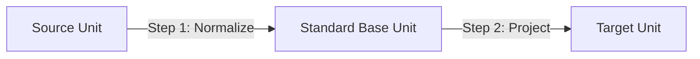
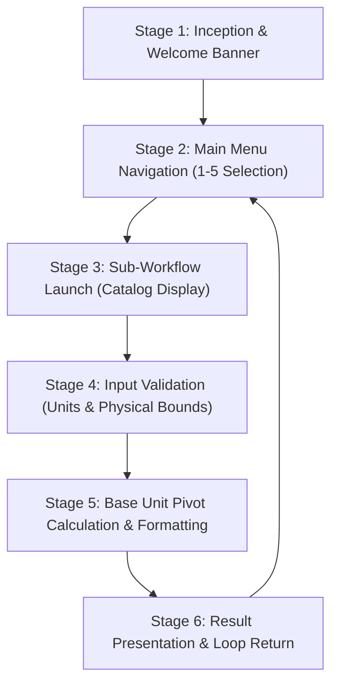

<u>**PROJECT 5 (Beginner)**</u>

# Multi-Unit & Currency Converter CLI

Build an interactive, multi-module conversion suite supporting 4 essential conversion categories: international currencies (USD, EUR, GBP, INR, JPY, CAD), distance and length (meters, kilometers, miles, feet, inches), mass and weight (kilograms, grams, pounds, ounces), and temperature scales (Celsius, Fahrenheit, Kelvin). Master the Base Unit Pivot design pattern, dictionary/map lookup tables, non-linear algebraic conversions, robust numeric input validation, and loop-driven CLI menus. Language-agnostic — code it in **Python**, **C++**, or **Java**.

---

### Curriculum Outline & Learning Roadmap

- **Chapter 1: Introduction**

  - `1.1 Getting Started`

    - `[CONCEPT]` Meet Your Project

    - `[CONCEPT]` What You Will Learn

    - `[CONCEPT]` What You Need

  - `1.2 Starting with Small Steps`

    - `[CONCEPT]` First Steps into Code: The Welcome Banner

    - `[TASK 1]` Create the entry file and print welcome header

    - `[CHECKPOINT]` Milestone Checkpoint: Environment Operational & Greeting Verified!

    - `[CONCEPT]` The Currency Exchange Rate Table (Base: USD)

    - `[TASK 2]` Define Currency rates table (Base: USD)

    - `[CHECKPOINT]` Milestone Checkpoint: Currency Rates Lookup Table Configured!

- **Chapter 2: Rules & Design Plan**

  - `2.1 Understanding the Project`

    - `[CONCEPT]` Project Overview & Categories

    - `[CONCEPT]` The Base Unit Pivot Architecture (O(N) vs O(N^2))

    - `[CONCEPT]` Physical Boundaries & Absolute Zero

  - `2.2 Planning the Project`

    - `[CONCEPT]` Chronological Execution Flow

    - `[CONCEPT]` Thinking in OOP (Component Responsibility Table)

- **Chapter 3: Linear Pivot Conversion Engines**

  - `3.1 Financial Conversions`

    - `[CONCEPT]` Calculating Normalized Currency Exchange

    - `[TASK 3]` Implement Currency conversion function

    - `[CHECKPOINT]` Milestone Checkpoint: Currency Conversion Engine Operational!

  - `3.2 Distance & Spatial Measurement`

    - `[CONCEPT]` Metric & Imperial Distance Conversions (Base: Meters)

    - `[TASK 4]` Define Length conversion ratios (Base: Meters)

    - `[CHECKPOINT]` Milestone Checkpoint: Distance Ratios Configured!

    - `[CONCEPT]` Transforming Length Across Measurement Scales

    - `[TASK 5]` Implement Length conversion function

    - `[CHECKPOINT]` Milestone Checkpoint: Distance Transformation Operational!

  - `3.3 Mass & Weight Measurement`

    - `[CONCEPT]` Gravitational Mass Ratios (Base: Kilograms)

    - `[TASK 6]` Define Weight conversion ratios (Base: Kilograms)

    - `[CHECKPOINT]` Milestone Checkpoint: Mass Ratios Configured!

    - `[CONCEPT]` Converting Between Metric and Avoirdupois Mass

    - `[TASK 7]` Implement Weight conversion function

    - `[CHECKPOINT]` Milestone Checkpoint: Mass Transformation Operational!

- **Chapter 4: Non-Linear Temperature Mathematics**

  - `4.1 Offset-Based Algebraic Transformations`

    - `[CONCEPT]` Non-Linear Thermodynamics & Absolute Zero

    - `[TASK 8]` Implement Temperature conversion function (Base: Celsius)

    - `[CHECKPOINT]` Milestone Checkpoint: Thermodynamic Engine & Physical Safeguards Verified!

- **Chapter 5: Input Sanitation & Interactive Modules**

  - `5.1 Robust Numeric Parsing`

    - `[CONCEPT]` Defensive Programming: Numeric Boundary Traps

    - `[TASK 9]` Validate numeric input

    - `[CHECKPOINT]` Milestone Checkpoint: Numeric Input Sanitizer Operational!

  - `5.2 Case-Insensitive Unit Selection`

    - `[CONCEPT]` Flexible User Experience: Case-Insensitive Matching

    - `[TASK 10]` Validate unit selections

    - `[CHECKPOINT]` Milestone Checkpoint: Unit Selector Validation Complete!

  - `5.3 Modular Sub-Workflows`

    - `[CONCEPT]` Single Responsibility Interactive Handlers

    - `[TASK 11]` Build interactive conversion handlers

    - `[CHECKPOINT]` Milestone Checkpoint: Interactive Conversion Sub-Workflows Verified!

- **Chapter 6: Session Operations & Application Assembly**

  - `6.1 Main Menu & Session Navigation`

    - `[CONCEPT]` Continuous Turn-Based Operation: The Navigation Loop

    - `[TASK 12]` Implement main menu loop and application assembly

    - `[CHECKPOINT]` Milestone Checkpoint: Full Multi-Unit Converter Application Complete!

- **Chapter 7: Reflect & Expand**

  - `7.1 What You Have Built` (Feature Summary & Skills Practiced Matrix)

  - `7.2 Extension Ideas`

  - `7.3 Share What You Built! Time to Showcase Your Project!`

- **Appendix: Full Pseudocode Reference**

  - `[REFERENCE]` Complete Tri-Language Algorithmic Logic

---

## Chapter 1: Introduction

### 1.1 Getting Started

**Meet Your Project**

You are about to build **Multi-Unit & Currency Converter CLI** — a comprehensive, practical terminal application that converts real-world values across four major measurement domains: global currencies, length/distance, mass/weight, and temperature scales.

Rather than building a brittle calculator with hardcoded pairwise formulas, this project teaches the architectural design used in professional measurement and finance software: the **Base Unit Pivot Pattern**. By converting every input into a standardized base reference unit (such as USD, Meters, Kilograms, or Celsius) before projecting into the desired target unit, your codebase remains compact, clean, and effortlessly extensible.

Once completed, you will have a versatile command-line utility capable of handling real-world exchange rates, micro- and macro-distances, imperial and metric masses, offset-based temperature math with physical boundary checks, and a resilient menu-driven interface that gracefully handles invalid user inputs.

**What You Will Learn**

You will construct this application from start to finish. By the end, you will have a production-grade utility you can run, explain, and expand.

You will learn how to:

- Design and utilize lookup tables using Hash Maps and Dictionaries (`dict` in Python, `map` in C++, `HashMap` in Java)

- Implement the **Base Unit Pivot Pattern** to eliminate combinatorial code explosion ($N \times (N - 1)$ formulas)

- Formulate linear ratio calculations for currencies, distances, and masses

- Implement non-linear algebraic conversions with additive offsets for temperature scales (Celsius, Fahrenheit, Kelvin)

- Enforce physical constraints and input validation, including preventing negative mass/distance and values below Absolute Zero

- Format high-precision numeric output (2 decimals for financial amounts and 4 decimals for scientific ratios)

- Build an intuitive, turn-based CLI menu navigation loop with case-insensitive unit code parsing

**What You Need**

Before you begin, make sure you are comfortable with:

- Printing formatted output and reading keyboard input

- Variables, conditionals (`if` / `else`), and loops (`while`, `for`)

- Working with key-value data structures (maps, dictionaries, or associative arrays)

- Floating-point arithmetic and numeric formatting

- Basic functions and subroutines

- String case manipulation and basic exception handling (`try` / `except` / `catch`)

This project is tailored specifically for beginners, guiding you step by step through every function and concept with clear, readable code.

---

### 1.2 Starting with Small Steps

**First Steps into Code: The Welcome Banner**

Every software project begins with a single step. Before constructing mathematical conversion tables or input validation loops, we first establish our project entry file and verify that our execution environment is properly wired.

To do this, we create our entry point and print a clean welcome banner to confirm that the application environment is operational.

#### Task 1 — Create the entry file and print welcome header

Create your project entry file and implement `print_welcome()` (or `printWelcome()`):

Think of turning on the power to a digital laboratory workbench.  
*Goal*: Establish the execution root and prepare the script environment.

<div class="step-card">
  <div class="step-header">
    <span class="step-badge">STEP 1</span>
    <span class="step-title">Entry File Setup</span>
  </div>
  <ul>
    <li>[ ] Create your project file (<code>Converter.py</code>, <code>Converter.cpp</code>, or <code>Converter.java</code>) and import required system modules.</li>
  </ul>
</div>

Think of displaying a digital greeting sign at a currency bureau.  
*Goal*: Provide immediate visual confirmation that the application is running.

<div class="step-card">
  <div class="step-header">
    <span class="step-badge">STEP 2</span>
    <span class="step-title">Welcome Banner Output</span>
  </div>
  <ul>
    <li>[ ] Print the welcome message string: <code>"Welcome to Multi-Unit &amp; Currency Converter CLI!"</code>.</li>
  </ul>
</div>

**Expected Terminal Interaction & Output:**

```text
Welcome to Multi-Unit & Currency Converter CLI!
```

---

### Milestone Checkpoint: Environment Operational & Greeting Verified!

You have established the project entry point:

- [x] **Entry File Created**: Initialized the project source file and confirmed compiler execution.

- [x] **Greeting Banner Verified**: Successfully printed the welcome banner to the terminal.

**Driver Verification Test**:  
Call `print_welcome()` (or `printWelcome()`) directly from your main execution block. Verify that `"Welcome to Multi-Unit & Currency Converter CLI!"` prints cleanly to the console.

---

**The Currency Exchange Rate Table (Base: USD)**

Foreign currency exchange operates relative to global benchmark currencies. In international finance, the United States Dollar (USD) frequently serves as the reference currency.

Instead of hardcoding individual exchange rates across multiple conversion functions, we store them in a centralized dictionary or hash map where 1.0 USD is the pivot base.

| Currency Code | Full Name | Value Relative to 1.0 USD |
|---|---|---|
| `USD` | United States Dollar (Base) | `1.0` |
| `EUR` | Euro | `0.92` |
| `GBP` | British Pound Sterling | `0.79` |
| `INR` | Indian Rupee | `83.0` |
| `JPY` | Japanese Yen | `155.0` |
| `CAD` | Canadian Dollar | `1.36` |

#### Task 2 — Define Currency rates table (Base: USD)

Declare the `CURRENCY_RATES` lookup table:

Think of posting the official morning currency exchange board in a bank lobby.  
*Goal*: Map each currency code to its fixed exchange rate relative to 1.0 USD.

<div class="step-card">
  <div class="step-header">
    <span class="step-badge">STEP 1</span>
    <span class="step-title">Declare Currency Rates Lookup Table</span>
  </div>
  <ul>
    <li>[ ] Declare dictionary or map <code>CURRENCY_RATES</code> mapping: <code>"USD": 1.0</code>, <code>"EUR": 0.92</code>, <code>"GBP": 0.79</code>, <code>"INR": 83.0</code>, <code>"JPY": 155.0</code>, <code>"CAD": 1.36</code>.</li>
  </ul>
</div>

---

### Milestone Checkpoint: Currency Rates Lookup Table Configured!

You have established the foreign exchange rate table:

- [x] **6 Currencies Registered**: Configured USD, EUR, GBP, INR, JPY, and CAD.

- [x] **Pivot Base Established**: Verified USD holds the reference value of 1.0.

**Driver Verification Test**:  
Lookup `CURRENCY_RATES["INR"]`. Verify that it evaluates to `83.0`.

---

## Chapter 2: Rules & Design Plan

### 2.1 Understanding the Project

**Project Overview & Categories**

The Multi-Unit and Currency Converter is an interactive command-line utility designed to perform fast, accurate conversions across four fundamental categories:
- **Currency**: 6 world currencies (USD, EUR, GBP, INR, JPY, CAD)
- **Length**: 5 distance units (meters, kilometers, miles, feet, inches)
- **Weight**: 4 mass units (kilograms, grams, pounds, ounces)
- **Temperature**: 3 thermal scales (Celsius, Fahrenheit, Kelvin)

**The Base Unit Pivot Architecture (O(N) vs O(N^2))**

A naive approach to unit conversion is writing dedicated pairwise formulas for every possible source and target pair. For 6 currencies, pairwise conversions require:

$$\text{Pairs} = N \times (N - 1) = 6 \times 5 = 30 \text{ separate formulas}$$

Adding 4 more units would escalate this requirement to 90 separate formulas. This combinatorial explosion creates unmaintainable, bug-prone code.

The industry-standard solution is the **Base Unit Pivot Pattern**. We designate a single reference base unit for each measurement category and express all units within that category relative to that single standard:



With this pattern, supporting $N$ units requires only defining $N$ ratios in a lookup table. Adding a new unit requires only a single new entry!

**Summary of Conversion Categories & Operations**

| Category | Base Unit | Supported Units | Mathematical Operation |
|---|---|---|---|
| **Currency** | `USD` | `USD`, `EUR`, `GBP`, `INR`, `JPY`, `CAD` | $\text{Target} = (\text{Amount} / \text{Source Rate}) \times \text{Target Rate}$ |
| **Length** | `Meter (m)` | `m`, `km`, `mi`, `ft`, `in` | $\text{Target} = (\text{Amount} \times \text{Source Ratio}) / \text{Target Ratio}$ |
| **Weight** | `Kilogram (kg)` | `kg`, `g`, `lbs`, `oz` | $\text{Target} = (\text{Amount} \times \text{Source Ratio}) / \text{Target Ratio}$ |
| **Temperature** | `Celsius (C)` | `C`, `F`, `K` | Non-linear algebraic offsets ($\pm 32.0$, $\pm 273.15$) |

**Physical Boundaries & Absolute Zero**

Lengths, weights, and currency amounts cannot be negative in physical reality. Temperature, however, can legitimately take negative values. Physics establishes an absolute lower bound: **Absolute Zero** (0 K, -273.15 °C, -459.67 °F). Our application enforces strict physical boundary checks to reject temperatures below absolute zero and negative quantities for distance, weight, and currency.

---

### 2.2 Planning the Project

**Chronological Execution Flow**

An execution session of the converter progresses through 6 clear stages from initial menu launch to termination:



**Thinking in OOP (Component Responsibility Table)**

Structuring our code into clean, single-responsibility components ensures high maintainability:

| Component | Responsibility |
|---|---|
| Unit Ratios / Catalogs | Stores conversion ratios relative to base units (USD, Meter, Kilogram). |
| Mathematical Engines | Executes linear pivot transformations (`convert_currency`, `convert_length`, `convert_weight`). |
| Thermodynamic Engine | Computes offset-based temperature math and evaluates Absolute Zero boundary checks. |
| Defensive Input Parser | Sanitizes numeric inputs against negative bounds and matches unit codes case-insensitively. |
| Interactive Handlers | Prompts user, gathers inputs, invokes calculation, and renders formatted result cards. |
| Main Navigation Loop | Orchestrates the top-level CLI menu, handles user routing, and executes graceful termination. |

---

## Chapter 3: Linear Pivot Conversion Engines

### 3.1 Financial Conversions

**Calculating Normalized Currency Exchange**

Currency conversion follows a 2-step normalized ratio:
1. **Normalize to Base (USD)**: Divide the input amount by the source currency rate.
2. **Project to Target**: Multiply the USD amount by the target currency rate.

$$\text{USD Amount} = \frac{\text{Amount}}{\text{CURRENCY\_RATES}[\text{from\_unit}]}$$

$$\text{Target Amount} = \text{USD Amount} \times \text{CURRENCY\_RATES}[\text{to\_unit}]$$

#### Task 3 — Implement Currency conversion function

Implement `convert_currency(amount, from_unit, to_unit)` (or `convertCurrency(amount, fromUnit, toUnit)`):

Think of exchanging foreign banknotes into US Dollars at an international airport terminal.  
*Goal*: Normalize the input amount into the universal base currency (USD).

<div class="step-card">
  <div class="step-header">
    <span class="step-badge">STEP 1</span>
    <span class="step-title">Pivot Input Amount to Standard Base (USD)</span>
  </div>
  <ul>
    <li>[ ] Compute <code>amount_in_usd = amount / CURRENCY_RATES[from_unit]</code>.</li>
  </ul>
</div>

Think of exchanging US Dollars into local cash upon arriving in your destination country.  
*Goal*: Multiply the normalized USD amount by the target currency rate.

<div class="step-card">
  <div class="step-header">
    <span class="step-badge">STEP 2</span>
    <span class="step-title">Project Base Amount to Target Currency</span>
  </div>
  <ul>
    <li>[ ] Return <code>amount_in_usd * CURRENCY_RATES[to_unit]</code>.</li>
  </ul>
</div>

---

### Milestone Checkpoint: Currency Conversion Engine Operational!

You have completed the foreign exchange calculation engine:

- [x] **Base Normalization**: Scaled input currencies cleanly through USD.

- [x] **Target Projection**: Computed exact cross-currency exchange without pairwise tables.

**Driver Verification Test**:  
Test `convert_currency(100.0, "EUR", "USD")`. Since EUR is 0.92, $100 / 0.92 \approx 108.70$ USD.

---

### 3.2 Distance & Spatial Measurement

**Metric & Imperial Distance Conversions (Base: Meters)**

In the metric system, the **Meter (m)** is the base unit of length. All distance units can be defined by how many meters 1 unit contains:
- `m` (Meters): `1.0`
- `km` (Kilometers): `1000.0`
- `mi` (Miles): `1609.344`
- `ft` (Feet): `0.3048`
- `in` (Inches): `0.0254`

#### Task 4 — Define Length conversion ratios (Base: Meters)

Declare the `LENGTH_RATIOS` lookup table:

Think of an architect's master reference tape calibrated strictly in meters.  
*Goal*: Map distance abbreviations to their meter multipliers.

<div class="step-card">
  <div class="step-header">
    <span class="step-badge">STEP 1</span>
    <span class="step-title">Declare Length Ratios Lookup Table</span>
  </div>
  <ul>
    <li>[ ] Declare dictionary or map <code>LENGTH_RATIOS</code> mapping: <code>"m": 1.0</code>, <code>"km": 1000.0</code>, <code>"mi": 1609.344</code>, <code>"ft": 0.3048</code>, <code>"in": 0.0254</code>.</li>
  </ul>
</div>

---

### Milestone Checkpoint: Distance Ratios Configured!

You have established distance conversion constants:

- [x] **5 Distance Units Defined**: Mapped metric and imperial units to meters.

- [x] **High Precision Ratios**: Mapped miles to 1609.344 and feet to 0.3048.

**Driver Verification Test**:  
Lookup `LENGTH_RATIOS["km"]`. Verify it equals `1000.0`.

---

**Transforming Length Across Measurement Scales**

Length conversion multiplies the input amount by the source ratio to get meters, then divides by the target ratio to get the target unit:

$$\text{Meters} = \text{Amount} \times \text{LENGTH\_RATIOS}[\text{from\_unit}]$$

$$\text{Target Distance} = \frac{\text{Meters}}{\text{LENGTH\_RATIOS}[\text{to\_unit}]}$$

#### Task 5 — Implement Length conversion function

Implement `convert_length(amount, from_unit, to_unit)` (or `convertLength(amount, fromUnit, toUnit)`):

Think of unrolling a surveyor's measuring tape to measure total meters.  
*Goal*: Convert the input distance into base meters.

<div class="step-card">
  <div class="step-header">
    <span class="step-badge">STEP 1</span>
    <span class="step-title">Normalize Distance to Base Metric (Meters)</span>
  </div>
  <ul>
    <li>[ ] Compute <code>amount_in_meters = amount * LENGTH_RATIOS[from_unit]</code>.</li>
  </ul>
</div>

Think of cutting the measured meters into segments matching your target unit.  
*Goal*: Divide total meters by the target unit's meter ratio.

<div class="step-card">
  <div class="step-header">
    <span class="step-badge">STEP 2</span>
    <span class="step-title">Project Base Distance to Target Unit</span>
  </div>
  <ul>
    <li>[ ] Return <code>amount_in_meters / LENGTH_RATIOS[to_unit]</code>.</li>
  </ul>
</div>

---

### Milestone Checkpoint: Distance Transformation Operational!

You have implemented universal distance conversion:

- [x] **Metric & Imperial Bridges**: Seamlessly converted across kilometers, miles, and feet.

- [x] **Bidirectional Accuracy**: Verified that converting meters to miles and back yields identical values.

**Driver Verification Test**:  
Test `convert_length(1.0, "km", "m")`. Verify it returns `1000.0`.

---

### 3.3 Mass & Weight Measurement

**Gravitational Mass Ratios (Base: Kilograms)**

For mass and weight, the standard base unit is the **Kilogram (kg)**:
- `kg` (Kilograms): `1.0`
- `g` (Grams): `0.001`
- `lbs` (Pounds): `0.45359237`
- `oz` (Ounces): `0.028349523125`

#### Task 6 — Define Weight conversion ratios (Base: Kilograms)

Declare the `WEIGHT_RATIOS` lookup table:

Think of setting standard calibration brass weights on an analytical scale.  
*Goal*: Map mass abbreviations to their kilogram multipliers.

<div class="step-card">
  <div class="step-header">
    <span class="step-badge">STEP 1</span>
    <span class="step-title">Declare Weight Ratios Lookup Table</span>
  </div>
  <ul>
    <li>[ ] Declare dictionary or map <code>WEIGHT_RATIOS</code> mapping: <code>"kg": 1.0</code>, <code>"g": 0.001</code>, <code>"lbs": 0.45359237</code>, <code>"oz": 0.028349523125</code>.</li>
  </ul>
</div>

---

### Milestone Checkpoint: Mass Ratios Configured!

You have established mass conversion constants:

- [x] **4 Mass Units Configured**: Mapped kg, g, lbs, and oz to kilograms.

- [x] **Standard Scientific Definitions**: Stored the exact international avoirdupois pound definition ($0.45359237\text{ kg}$).

**Driver Verification Test**:  
Lookup `WEIGHT_RATIOS["g"]`. Verify it equals `0.001`.

---

**Converting Between Metric and Avoirdupois Mass**

Mass conversion follows the identical multiplication-division pivot formula as distance:

$$\text{Kilograms} = \text{Amount} \times \text{WEIGHT\_RATIOS}[\text{from\_unit}]$$

$$\text{Target Weight} = \frac{\text{Kilograms}}{\text{WEIGHT\_RATIOS}[\text{to\_unit}]}$$

#### Task 7 — Implement Weight conversion function

Implement `convert_weight(amount, from_unit, to_unit)` (or `convertWeight(amount, fromUnit, toUnit)`):

Think of setting the bulk merchandise onto a warehouse floor scale calibrated in kilograms.  
*Goal*: Convert input mass into base kilograms.

<div class="step-card">
  <div class="step-header">
    <span class="step-badge">STEP 1</span>
    <span class="step-title">Normalize Mass to Base Metric (Kilograms)</span>
  </div>
  <ul>
    <li>[ ] Compute <code>amount_in_kg = amount * WEIGHT_RATIOS[from_unit]</code>.</li>
  </ul>
</div>

Think of repackaging the bulk goods into smaller retail boxes sized in pounds or ounces.  
*Goal*: Divide total kilograms by the target unit's kilogram ratio.

<div class="step-card">
  <div class="step-header">
    <span class="step-badge">STEP 2</span>
    <span class="step-title">Project Base Mass to Target Unit</span>
  </div>
  <ul>
    <li>[ ] Return <code>amount_in_kg / WEIGHT_RATIOS[to_unit]</code>.</li>
  </ul>
</div>

---

### Milestone Checkpoint: Mass Transformation Operational!

You have implemented universal mass conversion:

- [x] **Dual Standard Support**: Supported both metric (g, kg) and imperial (lbs, oz) scales.

- [x] **Precision Ratio Math**: Evaluated fractional ratios without integer truncation.

**Driver Verification Test**:  
Test `convert_weight(1.0, "kg", "g")`. Verify it returns `1000.0`.

---

## Chapter 4: Non-Linear Temperature Mathematics

### 4.1 Offset-Based Algebraic Transformations

**Non-Linear Thermodynamics & Absolute Zero**

Unlike currency, distance, or weight, temperature scales do not share a common zero point:
- Water freezes at $0^\circ\text{C}$, $32^\circ\text{F}$, and $273.15\text{ K}$.
- Because of these additive shifts, temperature cannot be solved with pure scalar ratios.

Furthermore, physics mandates that nothing can be colder than **Absolute Zero** ($0\text{ K} = -273.15^\circ\text{C} = -459.67^\circ\text{F}$). Our application strictly prevents calculations below this physical floor.

**The 2-Step Temperature Pivot**:
1. **To Celsius**:
   - If from `F`: $\text{celsius} = (\text{amount} - 32.0) \times \frac{5}{9}$
   - If from `K`: $\text{celsius} = \text{amount} - 273.15$
   - If from `C`: $\text{celsius} = \text{amount}$
2. **From Celsius to Target**:
   - If to `F`: $\text{target} = (\text{celsius} \times \frac{9}{5}) + 32.0$
   - If to `K`: $\text{target} = \text{celsius} + 273.15$
   - If to `C`: $\text{target} = \text{celsius}$

#### Task 8 — Implement Temperature conversion function (Base: Celsius)

Implement `is_below_absolute_zero()` and `convert_temperature()`:

Think of a laboratory safety interlock that prevents setting a freezer below physical absolute zero.  
*Goal*: Reject temperatures below Absolute Zero (0 K, -273.15 C, -459.67 F).

<div class="step-card">
  <div class="step-header">
    <span class="step-badge">STEP 1</span>
    <span class="step-title">Validate Absolute Zero Physical Boundary</span>
  </div>
  <ul>
    <li>[ ] In <code>is_below_absolute_zero(amount, unit)</code>, return <code>True</code> if <code>(unit == "C" and amount &lt; -273.15)</code> or <code>(unit == "F" and amount &lt; -459.67)</code> or <code>(unit == "K" and amount &lt; 0.0)</code>; else <code>False</code>.</li>
  </ul>
</div>

Think of calibrating an unfamiliar thermometer against a standard Celsius mercury tube.  
*Goal*: Normalize input temperature to Celsius using appropriate offset algebra.

<div class="step-card">
  <div class="step-header">
    <span class="step-badge">STEP 2</span>
    <span class="step-title">Convert Input Scale to Base Celsius</span>
  </div>
  <ul>
    <li>[ ] If <code>from_unit == "C"</code>, <code>celsius = amount</code>; if <code>"F"</code>, <code>celsius = (amount - 32.0) * 5.0 / 9.0</code>; if <code>"K"</code>, <code>celsius = amount - 273.15</code>.</li>
  </ul>
</div>

Think of adjusting the temperature dial to the customer's desired regional scale.  
*Goal*: Project Celsius temperature into target scale (C, F, or K).

<div class="step-card">
  <div class="step-header">
    <span class="step-badge">STEP 3</span>
    <span class="step-title">Project Base Celsius to Target Scale</span>
  </div>
  <ul>
    <li>[ ] If <code>to_unit == "C"</code>, return <code>celsius</code>; if <code>"F"</code>, return <code>(celsius * 9.0 / 5.0) + 32.0</code>; if <code>"K"</code>, return <code>celsius + 273.15</code>.</li>
  </ul>
</div>

---

### Milestone Checkpoint: Thermodynamic Engine & Physical Safeguards Verified!

You have implemented thermodynamic conversion and physical boundary validation:

- [x] **Absolute Zero Safeguard**: Prevented impossible temperatures below Absolute Zero.

- [x] **Non-Linear Transformations**: Evaluated additive offsets accurately across C, F, and K.

**Driver Verification Test**:  
Test `convert_temperature(100.0, "C", "F")` -> returns `212.0`.  
Test `convert_temperature(0.0, "C", "K")` -> returns `273.15`.  
Test `is_below_absolute_zero(-300.0, "C")` -> returns `True`.

---

## Chapter 5: Input Sanitation & Interactive Modules

### 5.1 Robust Numeric Parsing

**Defensive Programming: Numeric Boundary Traps**

A command-line tool must never crash when a user types letters, symbols, or negative quantities where positive amounts are required.

We construct two dedicated validation helpers:
1. `get_positive_number(prompt)`: Guarantees input is a valid non-negative float.
2. `get_temperature_number(prompt, unit)`: Allows negative numbers but rejects values below Absolute Zero for that unit.

#### Task 9 — Validate numeric input

Implement `get_positive_number(prompt)` and `get_temperature_number(prompt, unit)`:

Think of a turnstile coin slot that rejects bent coins or negative tokens.  
*Goal*: Continually prompt until a valid non-negative float is entered.

<div class="step-card">
  <div class="step-header">
    <span class="step-badge">STEP 1</span>
    <span class="step-title">Read and Validate Non-Negative Number</span>
  </div>
  <ul>
    <li>[ ] In <code>get_positive_number(prompt)</code>, run a loop parsing float input. If negative, print error and re-prompt; if non-numeric, catch error, print message, and re-prompt.</li>
  </ul>
</div>

Think of a smart thermostat rejecting temperatures colder than deep space.  
*Goal*: Continually prompt until a temperature at or above Absolute Zero is entered.

<div class="step-card">
  <div class="step-header">
    <span class="step-badge">STEP 2</span>
    <span class="step-title">Read and Validate Bounded Temperature</span>
  </div>
  <ul>
    <li>[ ] In <code>get_temperature_number(prompt, unit)</code>, parse float input and check <code>is_below_absolute_zero()</code>. If below bound, print error and re-prompt; otherwise return value.</li>
  </ul>
</div>

---

### Milestone Checkpoint: Numeric Input Sanitizer Operational!

You have implemented defensive numeric parsing:

- [x] **Crash Prevention**: Trapped `ValueError` / parse exceptions gracefully.

- [x] **Domain Bounds Enforced**: Guarded against negative quantities and sub-absolute zero inputs.

**Driver Verification Test**:  
Call `get_positive_number("Enter: ")`. Enter `"abc"` followed by `"-5"` followed by `"10"`. Verify it cleanly re-prompts and returns `10.0`.

---

### 5.2 Case-Insensitive Unit Selection

**Flexible User Experience: Case-Insensitive Matching**

Users may enter units in lowercase (`"usd"`), uppercase (`"USD"`), or mixed case (`"Usd"`). A robust CLI tool accepts any casing and matches it to the canonical unit identifier.

#### Task 10 — Validate unit selections

Implement `get_valid_unit(prompt, allowed_units)`:

Think of an automated flight ticket scanner that accepts airport codes in either capital or lowercase letters.  
*Goal*: Normalize user input and return the canonical unit string.

<div class="step-card">
  <div class="step-header">
    <span class="step-badge">STEP 1</span>
    <span class="step-title">Normalize Case and Match Against Allowed Units</span>
  </div>
  <ul>
    <li>[ ] In a loop, read input, strip whitespace, and check if lowercase input equals lowercase of any item in <code>allowed_units</code>. If match found, return canonical original string; else print allowed list and re-prompt.</li>
  </ul>
</div>

---

### Milestone Checkpoint: Unit Selector Validation Complete!

You have implemented case-insensitive unit validation:

- [x] **Case Tolerance**: Allowed user to type in lowercase, uppercase, or mixed case.

- [x] **Canonical Return**: Guaranteed return value matches the exact dictionary key casing.

**Driver Verification Test**:  
Call `get_valid_unit("Unit: ", ["USD", "EUR"])`. Enter `"usd"`. Verify it returns `"USD"`.

---

### 5.3 Modular Sub-Workflows

**Single Responsibility Interactive Handlers**

Each conversion category has its own interactive sub-workflow:
1. `handle_currency()`: Prompts for currencies, reads amount, displays exchange result and 1-unit exchange rate.
2. `handle_length()`: Prompts for distance units, displays converted length and unit ratio.
3. `handle_weight()`: Prompts for weight units, displays converted mass and unit ratio.
4. `handle_temperature()`: Prompts for thermal scales, validates absolute zero, displays converted temperature.

#### Task 11 — Build interactive conversion handlers

Implement the 4 category handler functions:

Think of opening the Currency Exchange teller window.  
*Goal*: Coordinate unit inputs, conversion calculation, and formatted currency output.

<div class="step-card">
  <div class="step-header">
    <span class="step-badge">STEP 1</span>
    <span class="step-title">Build Currency Conversion Handler</span>
  </div>
  <ul>
    <li>[ ] In <code>handle_currency()</code>, prompt source and target currencies, read positive amount, compute result and rate, and print formatted to 2 and 4 decimal places.</li>
  </ul>
</div>

Think of opening the Distance & Land Surveying desk.  
*Goal*: Coordinate distance inputs, conversion calculation, and formatted length output.

<div class="step-card">
  <div class="step-header">
    <span class="step-badge">STEP 2</span>
    <span class="step-title">Build Length Conversion Handler</span>
  </div>
  <ul>
    <li>[ ] In <code>handle_length()</code>, prompt source and target units, read distance, compute result and ratio, and print formatted to 4 decimal places.</li>
  </ul>
</div>

Think of opening the Freight & Cargo scale station.  
*Goal*: Coordinate weight inputs, conversion calculation, and formatted mass output.

<div class="step-card">
  <div class="step-header">
    <span class="step-badge">STEP 3</span>
    <span class="step-title">Build Weight Conversion Handler</span>
  </div>
  <ul>
    <li>[ ] In <code>handle_weight()</code>, prompt source and target units, read mass, compute result and ratio, and print formatted to 4 decimal places.</li>
  </ul>
</div>

Think of opening the Scientific Thermal Laboratory station.  
*Goal*: Coordinate temperature inputs, validate bounds, and display converted temperature.

<div class="step-card">
  <div class="step-header">
    <span class="step-badge">STEP 4</span>
    <span class="step-title">Build Temperature Conversion Handler</span>
  </div>
  <ul>
    <li>[ ] In <code>handle_temperature()</code>, prompt source and target scales, read temperature bounded by Absolute Zero, compute conversion, and print formatted to 2 decimal places.</li>
  </ul>
</div>

**Expected Terminal Interaction & Output:**

```text
--- CURRENCY CONVERTER ---
Supported Currencies: USD, EUR, GBP, INR, JPY, CAD
Enter Source Currency: USD
Enter Target Currency: EUR
Enter amount in USD: 100

>> RESULT: 100.00 USD = 92.00 EUR
   (Exchange Rate: 1 USD = 0.9200 EUR)
```

---

### Milestone Checkpoint: Interactive Conversion Sub-Workflows Verified!

You have implemented all 4 category sub-workflows:

- [x] **4 Specialized Handlers**: Structured clean interactive flows for Currency, Length, Weight, and Temperature.

- [x] **Precision Formatting**: Formatted currency/temperature to 2 decimals and ratios/distances/masses to 4 decimals.

**Driver Verification Test**:  
Run `handle_currency()`, enter `USD`, `EUR`, and `100`. Verify the result prints `$92.00 EUR`.

---

## Chapter 6: Session Operations & Application Assembly

### 6.1 Main Menu & Session Navigation

**Continuous Turn-Based Operation: The Navigation Loop**

The application lifecycle is governed by a persistent `while True` main loop that displays a clear category menu, accepts choices 1 through 5, routes execution to the appropriate handler, and exits cleanly upon option 5.

#### Task 12 — Implement main menu loop and application assembly

Implement `main()` with interactive menu routing and exit workflow:

Think of illuminating a digital navigation kiosk in a train station.  
*Goal*: Print the formatted category menu header.

<div class="step-card">
  <div class="step-header">
    <span class="step-badge">STEP 1</span>
    <span class="step-title">Render Interactive Menu Banner</span>
  </div>
  <ul>
    <li>[ ] Print the framed header with options 1: Currency, 2: Length, 3: Weight, 4: Temperature, 5: Exit.</li>
  </ul>
</div>

Think of pressing a button on the kiosk to select your desired service.  
*Goal*: Read choice string and branch execution to the matching handler.

<div class="step-card">
  <div class="step-header">
    <span class="step-badge">STEP 2</span>
    <span class="step-title">Prompt and Route User Selection</span>
  </div>
  <ul>
    <li>[ ] Prompt user for choice: if <code>"1"</code> call <code>handle_currency()</code>; if <code>"2"</code> call <code>handle_length()</code>; if <code>"3"</code> call <code>handle_weight()</code>; if <code>"4"</code> call <code>handle_temperature()</code>.</li>
  </ul>
</div>

Think of a friendly clerk wishing you safe travels as you leave the bureau.  
*Goal*: Handle option 5 by displaying farewell message and breaking loop.

<div class="step-card">
  <div class="step-header">
    <span class="step-badge">STEP 3</span>
    <span class="step-title">Handle Exit and Farewell</span>
  </div>
  <ul>
    <li>[ ] If choice is <code>"5"</code>, print <code>"\nThank you for using Multi-Unit &amp; Currency Converter CLI. Goodbye!"</code> and break loop. If invalid, print warning and re-prompt.</li>
  </ul>
</div>

Think of wiring the main power switch to initialize the system when turned on.  
*Goal*: Wrap main execution inside standard script execution entry point guard.

<div class="step-card">
  <div class="step-header">
    <span class="step-badge">STEP 4</span>
    <span class="step-title">Assemble Main Entry Point Guard</span>
  </div>
  <ul>
    <li>[ ] Call <code>print_welcome()</code> at the start of <code>main()</code> and protect execution with <code>if __name__ == "__main__": main()</code> (or standard C++/Java <code>main</code> conventions).</li>
  </ul>
</div>

**Expected Terminal Interaction & Output:**

```text
Welcome to Multi-Unit & Currency Converter CLI!

========================================
   MULTI-UNIT & CURRENCY CONVERTER CLI   
========================================
1. Currency Converter (USD, EUR, GBP, INR, JPY, CAD)
2. Length Converter (m, km, mi, ft, in)
3. Weight Converter (kg, g, lbs, oz)
4. Temperature Converter (C, F, K)
5. Exit
----------------------------------------
Enter your choice (1-5): 5

Thank you for using Multi-Unit & Currency Converter CLI. Goodbye!
```

---

### Milestone Checkpoint: Full Multi-Unit Converter Application Complete!

You have completed the entire Multi-Unit and Currency Converter project:

- [x] **End-to-End Navigation**: Successfully navigated between menu categories, conversion runs, and clean exit.

- [x] **Architectural Completeness**: Unified linear base pivoting, thermodynamic mathematics, and defensive input parsing.

**Driver Verification Test**:  
Run your application executable (`python Converter.py`, `./Converter`, or `java Converter`). Test converting currency, then length, and finally exit cleanly via option 5.

---

## Chapter 7: Reflect & Expand

### 7.1 What You Have Built

You have engineered a production-ready, extensible Multi-Unit and Currency Conversion suite. Let us review the foundational engineering patterns and computer science concepts you practiced:

| Feature Area | Architectural Concept | Practical Skill Practiced |
|---|---|---|
| **Architectural Normalization** | Base Unit Pivot Pattern | Reduced conversion complexity from combinatorial $O(N^2)$ pairwise formulas to an elegant $O(N)$ normalized ratio model. |
| **Associative Data Structures** | Hash Maps / Dictionaries | Utilized key-value lookup tables for instantaneous $O(1)$ unit ratio retrieval. |
| **Domain Constraints** | Physical Boundary Enforcement | Guarded numeric calculations with thermodynamic laws (Absolute Zero) and non-negative physical bounds. |
| **Non-Linear Transformations** | Algebraic Offset Math | Managed thermal scale conversion requiring both multiplication factors and additive degree offsets. |
| **Defensive Programming** | Resilient Input Parsing | Shielded the CLI from malformed strings, case variations, and negative inputs using defensive retry loops. |
| **Session Architecture** | Multi-Level Menu Systems | Structured clean hierarchical navigation routing across 4 distinct measurement sub-workflows. |

---

### 7.2 Extension Ideas

Now that you have constructed a solid, modular conversion architecture, consider expanding your project with these advanced capabilities:

1. **Live Foreign Exchange REST API**:
   Connect your currency engine to a public live exchange rate API (such as Open Exchange Rates or Frankfurter API) using HTTP requests to fetch real-time market rates dynamically.

2. **Liquid Volume & Culinary Measurements**:
   Add a 5th module supporting volume units: Liters (`L`), Milliliters (`mL`), Gallons (`gal`), Quarts (`qt`), Pints (`pt`), and Cups.

3. **Speed & Velocity Calculations**:
   Implement a velocity converter connecting meters per second (`m/s`), kilometers per hour (`km/h`), miles per hour (`mph`), and nautical knots (`kn`).

4. **Persistent Transaction History**:
   Maintain an audit log tracking every conversion performed during the session, with an option in the main menu to display a formatted summary table or export to CSV.

---

### 7.3 Share What You Built! Time to Showcase Your Project!

Your Multi-Unit and Currency Converter is an impressive demonstration of practical, clean software engineering. Share your work with the engineering community:

- **Create a GitHub Repository**: Push your code with clear commit messages matching each task milestone.

- **Write a Professional README**: Include a project overview, conversion formulas, ASCII/Mermaid architecture diagrams, and sample CLI transcripts.

- **Cross-Language Showcase**: Demonstrate polyglot software engineering by maintaining synchronized reference implementations in Python, C++, and Java in the same repository.

---

## Appendix: Full Pseudocode Reference

Below is the complete, language-neutral algorithmic pseudocode for the entire Multi-Unit and Currency Converter application, matching the exact chronological order of Tasks 1 through 12:

```text
// Task 1 - Create the entry file and print welcome header
FUNCTION printWelcome():
    // Step 2: Welcome Banner Output
    PRINT "Welcome to Multi-Unit & Currency Converter CLI!"


// Task 2 - Define Currency rates table (Base: USD)
// Step 1: Declare Currency Rates Lookup Table
CONSTANT CURRENCY_RATES = {
    "USD": 1.0,
    "EUR": 0.92,
    "GBP": 0.79,
    "INR": 83.0,
    "JPY": 155.0,
    "CAD": 1.36
}


// Task 3 - Implement Currency conversion function
FUNCTION convertCurrency(amount, fromUnit, toUnit):
    // Step 1: Pivot Input Amount to Standard Base (USD)
    amountInUsd = amount / CURRENCY_RATES[fromUnit]

    // Step 2: Project Base Amount to Target Currency
    RETURN amountInUsd * CURRENCY_RATES[toUnit]


// Task 4 - Define Length conversion ratios (Base: Meters)
// Step 1: Declare Length Ratios Lookup Table
CONSTANT LENGTH_RATIOS = {
    "m": 1.0,
    "km": 1000.0,
    "mi": 1609.344,
    "ft": 0.3048,
    "in": 0.0254
}


// Task 5 - Implement Length conversion function
FUNCTION convertLength(amount, fromUnit, toUnit):
    // Step 1: Normalize Distance to Base Metric (Meters)
    amountInMeters = amount * LENGTH_RATIOS[fromUnit]

    // Step 2: Project Base Distance to Target Unit
    RETURN amountInMeters / LENGTH_RATIOS[toUnit]


// Task 6 - Define Weight conversion ratios (Base: Kilograms)
// Step 1: Declare Weight Ratios Lookup Table
CONSTANT WEIGHT_RATIOS = {
    "kg": 1.0,
    "g": 0.001,
    "lbs": 0.45359237,
    "oz": 0.028349523125
}


// Task 7 - Implement Weight conversion function
FUNCTION convertWeight(amount, fromUnit, toUnit):
    // Step 1: Normalize Mass to Base Metric (Kilograms)
    amountInKg = amount * WEIGHT_RATIOS[fromUnit]

    // Step 2: Project Base Mass to Target Unit
    RETURN amountInKg / WEIGHT_RATIOS[toUnit]


// Task 8 - Implement Temperature conversion function (Base: Celsius)
FUNCTION isBelowAbsoluteZero(amount, unit):
    // Step 1: Validate Absolute Zero Physical Boundary
    IF unit == "C" AND amount < -273.15: RETURN TRUE
    IF unit == "F" AND amount < -459.67: RETURN TRUE
    IF unit == "K" AND amount < 0.0: RETURN TRUE
    RETURN FALSE

FUNCTION convertTemperature(amount, fromUnit, toUnit):
    // Step 2: Convert Input Scale to Base Celsius
    IF fromUnit == "C":
        celsius = amount
    ELSE IF fromUnit == "F":
        celsius = (amount - 32.0) * 5.0 / 9.0
    ELSE IF fromUnit == "K":
        celsius = amount - 273.15
    ELSE:
        RETURN 0.0

    // Step 3: Project Base Celsius to Target Scale
    IF toUnit == "C":
        RETURN celsius
    ELSE IF toUnit == "F":
        RETURN (celsius * 9.0 / 5.0) + 32.0
    ELSE IF toUnit == "K":
        RETURN celsius + 273.15
    RETURN 0.0


// Task 9 - Validate numeric input
FUNCTION getPositiveNumber(prompt):
    // Step 1: Read and Validate Non-Negative Number
    LOOP:
        PROMPT prompt
        val = PARSE_FLOAT(READ_INPUT())
        IF val IS VALID AND val >= 0.0:
            RETURN val
        ELSE IF val IS VALID AND val < 0.0:
            PRINT "Error: Amount cannot be negative. Please enter a positive value."
        ELSE:
            PRINT "Error: Invalid numeric input. Please enter a valid number."

FUNCTION getTemperatureNumber(prompt, unit):
    // Step 2: Read and Validate Bounded Temperature
    LOOP:
        PROMPT prompt
        val = PARSE_FLOAT(READ_INPUT())
        IF val IS VALID:
            IF isBelowAbsoluteZero(val, unit):
                PRINT "Error: Temperature cannot be below Absolute Zero."
            ELSE:
                RETURN val
        ELSE:
            PRINT "Error: Invalid numeric input. Please enter a valid number."


// Task 10 - Validate unit selections
FUNCTION getValidUnit(prompt, allowedUnits):
    // Step 1: Normalize Case and Match Against Allowed Units
    LOOP:
        PROMPT prompt
        inputStr = TRIM(READ_INPUT())
        FOR EACH original IN allowedUnits:
            IF TO_LOWER(inputStr) == TO_LOWER(original):
                RETURN original
        PRINT "Error: Invalid unit. Allowed options: " + JOIN(allowedUnits, ", ")


// Task 11 - Build interactive conversion handlers
FUNCTION handleCurrency():
    // Step 1: Build Currency Conversion Handler
    PRINT "\n--- CURRENCY CONVERTER ---"
    units = ["USD", "EUR", "GBP", "INR", "JPY", "CAD"]
    PRINT "Supported Currencies: " + JOIN(units, ", ")
    fromCurr = getValidUnit("Enter Source Currency: ", units)
    toCurr = getValidUnit("Enter Target Currency: ", units)
    amount = getPositiveNumber("Enter amount in " + fromCurr + ": ")

    result = convertCurrency(amount, fromCurr, toCurr)
    rate = convertCurrency(1.0, fromCurr, toCurr)

    PRINT ">> RESULT: " + FORMAT_2_DECIMALS(amount) + " " + fromCurr + " = " + FORMAT_2_DECIMALS(result) + " " + toCurr
    PRINT "   (Exchange Rate: 1 " + fromCurr + " = " + FORMAT_4_DECIMALS(rate) + " " + toCurr + ")"

FUNCTION handleLength():
    // Step 2: Build Length Conversion Handler
    PRINT "\n--- LENGTH CONVERTER ---"
    units = ["m", "km", "mi", "ft", "in"]
    PRINT "Supported Units: m, km, mi, ft, in"
    fromU = getValidUnit("Enter Source Unit: ", units)
    toU = getValidUnit("Enter Target Unit: ", units)
    amount = getPositiveNumber("Enter distance in " + fromU + ": ")

    result = convertLength(amount, fromU, toU)
    rate = convertLength(1.0, fromU, toU)

    PRINT ">> RESULT: " + FORMAT_4_DECIMALS(amount) + " " + fromU + " = " + FORMAT_4_DECIMALS(result) + " " + toU
    PRINT "   (Ratio: 1 " + fromU + " = " + FORMAT_4_DECIMALS(rate) + " " + toU + ")"

FUNCTION handleWeight():
    // Step 3: Build Weight Conversion Handler
    PRINT "\n--- WEIGHT CONVERTER ---"
    units = ["kg", "g", "lbs", "oz"]
    PRINT "Supported Units: kg, g, lbs, oz"
    fromU = getValidUnit("Enter Source Unit: ", units)
    toU = getValidUnit("Enter Target Unit: ", units)
    amount = getPositiveNumber("Enter weight in " + fromU + ": ")

    result = convertWeight(amount, fromU, toU)
    rate = convertWeight(1.0, fromU, toU)

    PRINT ">> RESULT: " + FORMAT_4_DECIMALS(amount) + " " + fromU + " = " + FORMAT_4_DECIMALS(result) + " " + toU
    PRINT "   (Ratio: 1 " + fromU + " = " + FORMAT_4_DECIMALS(rate) + " " + toU + ")"

FUNCTION handleTemperature():
    // Step 4: Build Temperature Conversion Handler
    PRINT "\n--- TEMPERATURE CONVERTER ---"
    units = ["C", "F", "K"]
    PRINT "Supported Scales: C, F, K"
    fromU = getValidUnit("Enter Source Scale: ", units)
    toU = getValidUnit("Enter Target Scale: ", units)
    amount = getTemperatureNumber("Enter temperature in " + fromU + ": ", fromU)

    result = convertTemperature(amount, fromU, toU)

    PRINT ">> RESULT: " + FORMAT_2_DECIMALS(amount) + " " + fromU + " = " + FORMAT_2_DECIMALS(result) + " " + toU


// Task 12 - Implement main menu loop and application assembly
FUNCTION main():
    // Step 4: Assemble Main Entry Point Guard
    printWelcome()

    LOOP:
        // Step 1: Render Interactive Menu Banner
        PRINT "\n========================================"
        PRINT "   MULTI-UNIT & CURRENCY CONVERTER CLI   "
        PRINT "========================================"
        PRINT "1. Currency Converter (USD, EUR, GBP, INR, JPY, CAD)"
        PRINT "2. Length Converter (m, km, mi, ft, in)"
        PRINT "3. Weight Converter (kg, g, lbs, oz)"
        PRINT "4. Temperature Converter (C, F, K)"
        PRINT "5. Exit"
        PRINT "----------------------------------------"

        // Step 2: Prompt and Route User Selection
        choice = TRIM(READ_INPUT("Enter your choice (1-5): "))

        IF choice == "1":
            handleCurrency()
        ELSE IF choice == "2":
            handleLength()
        ELSE IF choice == "3":
            handleWeight()
        ELSE IF choice == "4":
            handleTemperature()
        ELSE IF choice == "5":
            // Step 3: Handle Exit and Farewell
            PRINT "\nThank you for using Multi-Unit & Currency Converter CLI. Goodbye!"
            BREAK
        ELSE:
            PRINT "Invalid choice. Please enter a number between 1 and 5."
```
